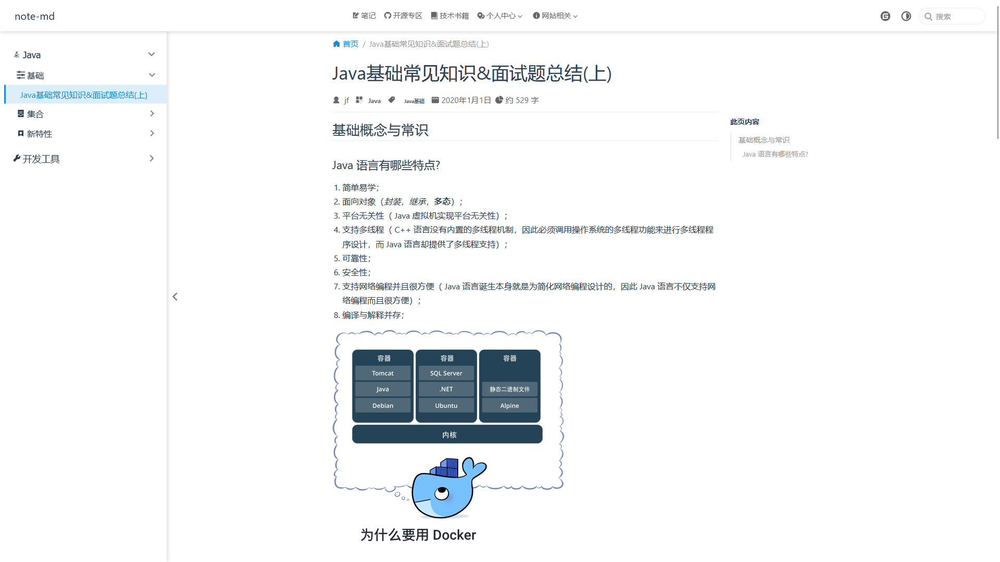
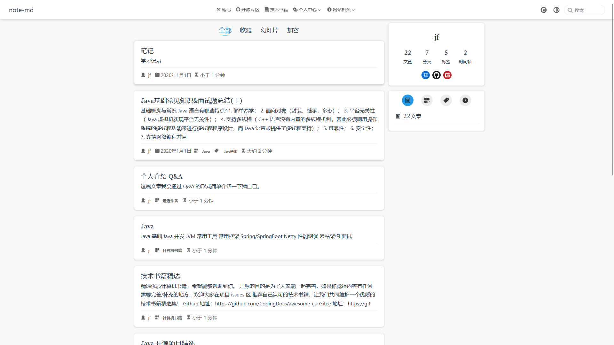

## md笔记

访问地址：<a href="https://note-jf.github.io/" target="_blank">note-jf.github.io</a>

<a href="https://github.com/note-jf/note-jf.github.io" target="_blank">github发布仓库</a>

<a href="https://gitee.com/cps007/note-jf/" target="_blank">gitee仓库</a>

添加新文件步骤：

1、newFile `./docs/java/demo.md`

2、添加路由 `.vuepress/sidebar.ts` 或 `.vuepress/sidebars/java.ts`

```json
{
  text: "Java",
  icon: "java",
  prefix: "java/",
  collapsable: true,
  children: [
    "demo",
  ]
}
```

## 目录结构

```text
├─ docs //md 文件系统 
│  ├─ .vuepress             // vuepress 项目 
│  │  ├─ sidebar            // vuepress 侧边栏json数据设置 
│  │  │  └─ xx.ts 
│  │  ├─ styles             // vuepress css样式配置 
│  │  │  └─ xx.scss 
│  │  ├─ navbar.ts          // vuepress 导航栏配置 
│  │  ├─ sidebar.ts         // vuepress 侧边栏、路由配置 
│  │  ├─ themeConfig.ts     // vuepress 主题配置 
│  │  └─ config.ts          // vuepress 项目配置 
│  │   
│  │  ===================下面开始就是md文件，可以包含多级目录，是导航栏目录的添加 README.md 首页介绍=================== 
│  ├─ java 
│  │  ├─ basis              // java 基础笔记 
│  │  │  └─ basis.md 
│  │  ├─ jvm                // jvm 
│  │  │  └─ jvm.md 
│  │  └─ README.md              // java 首页
│  │  
│  ├─ database 
│  │  ├─ mysql 
│  │  │  └─ README.md              // mysql 首页
│  │  ├─ redis 
│  │  │  └─ README.md              // redis 首页
│  │  ├─ oracle
│  │  │  └─ README.md              // oracle 首页
│  │  └─ README.md              // database 首页
│  │  
│  ├─ linux                 // linux 笔记 
│  │  └─ README.md              // linux 首页
│  │  
│  ├─ web                   // 前端笔记 
│  │  └─ README.md              // 首页
│  └─ README.md             // index 首页
│
├─ .gitignore               //git 配置 
└─ package.json             // 依赖

```






## 技术选型

<a href="https://www.npmjs.com/" target="_blank">npm 版本查找</a>

<a href="https://vuepress-theme-hope.github.io/v2/zh/" target="_blank">vuepress-theme-hope</a>

创建项目：npm create vuepress-theme-hope@next docs

| 技术                      | 版本                                                                                                 |
|-------------------------|----------------------------------------------------------------------------------------------------|
| vue                     | <a href="https://www.npmjs.com/package/vue" target="_blank">^3.2.36</a>                            |
| vuepress                | <a href="https://www.npmjs.com/package/vuepress" target="_blank">2.0.0-beta.49</a>                 |
| vuepress-theme-hope     | <a href="https://www.npmjs.com/package/vuepress-theme-hope" target="_blank">^2.0.0-beta.91</a>     |
| @vuepress/plugin-search | <a href="https://www.npmjs.com/package/@vuepress/plugin-search" target="_blank">^2.0.0-beta.49</a> |
| @vuepress/client        | <a href="https://www.npmjs.com/package/@vuepress/client" target="_blank">^2.0.0-beta.49</a>        |

