# 一、K8S 基础搭建

中文社区: https://www.kubernetes.org.cn/

官方文档:https://kubernetes.io/zh/docs/home/

社区文档:http://docs.kubernetes.org.cn/

https://feisky.gitbooks.io/kubernetes/content/

[历史版本 Release History](https://kubernetes.io/releases/)

[客户端下载 github](https://github.com/kubernetes/kubernetes/tree/master/CHANGELOG)


## 1）、概念

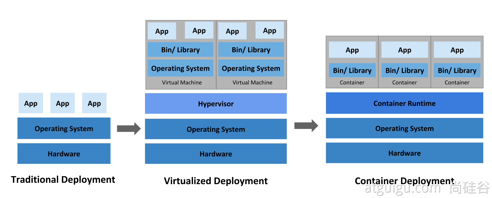

**传统部署时代

**虚拟化部署时代

**容器部署时代

好处：

- 敏捷应用程序的创建和部署：与使用 VM 镜像相比，提高了容器镜像创建的简便性和效率。
- 持续开发、集成和部署：通过快速简单的回滚(由于镜像不可变性)，提供可靠且频繁的容器镜像构建和部署。
- 关注开发与运维的分离：在构建/发布时而不是在部署时创建应用程序容器镜像，从而将应用程序与基础架构分离。
- 可观察性不仅可以显示操作系统级别的信息和指标，还可以显示应用程序的运行状况和其他指标信号。
- 跨开发、测试和生产的环境一致性：在便携式计算机上与在云中相同地运行。
- 云和操作系统分发的可移植性：可在 Ubuntu、RHEL、CoreOS、本地、Google Kubernetes Engine 和其他任何地方运行。
- 以应用程序为中心的管理：提高抽象级别，从在虚拟硬件上运行 OS 到使用逻辑资源在 OS 上运行应用程序。
- 松散耦合、分布式、弹性、解放的微服务：应用程序被分解成较小的独立部分，并且可以动态部署和管理 - 而不是在一台大型单机上整体运行。
- 资源隔离：可预测的应用程序性能。
- 资源利用：高效率和高密度

### [为什么需要 Kubernetes，它能做什么?](https://v1-18.docs.kubernetes.io/zh/docs/concepts/overview/what-is-kubernetes/#为什么需要-kubernetes-它能做什么)

### 简介：调度、自动修复、水平伸缩


### 组件架构


#### kube-apiserver

API 服务器是 Kubernetes [控制面](https://kubernetes.io/zh/docs/reference/glossary/?all=true#term-control-plane)的组件， 该组件公开了 Kubernetes API。

#### etcd

etcd 是兼具一致性和高可用性的键值数据库，可以作为保存 Kubernetes 所有集群数据的后台数据库。

#### kube-scheduler

控制平面组件，负责监视新创建的、未指定运行[节点（node）](https://kubernetes.io/zh/docs/concepts/architecture/nodes/)的 [Pods](https://kubernetes.io/docs/concepts/workloads/pods/pod-overview/)，选择节点让 Pod 在上面运行。

#### kube-controller-manager

在主节点上运行 [控制器](https://kubernetes.io/zh/docs/concepts/architecture/controller/) 的组件

> 这些控制器包括:
>
> - 节点控制器（Node Controller）: 负责在节点出现故障时进行通知和响应
> - 任务控制器（Job controller）: 监测代表一次性任务的 Job 对象，然后创建 Pods 来运行这些任务直至完成
> - 端点控制器（Endpoints Controller）: 填充端点(Endpoints)对象(即加入 Service 与 Pod)
> - 服务帐户和令牌控制器（Service Account & Token Controllers）: 为新的命名空间创建默认帐户和 API 访问令牌

#### cloud-controller-manager

云控制器管理器是指嵌入特定云的控制逻辑的 [控制平面](https://kubernetes.io/zh/docs/reference/glossary/?all=true#term-control-plane)组件

> 下面的控制器都包含对云平台驱动的依赖：
>
> - 节点控制器（Node Controller）: 用于在节点终止响应后检查云提供商以确定节点是否已被删除
> - 路由控制器（Route Controller）: 用于在底层云基础架构中设置路由
> - 服务控制器（Service Controller）: 用于创建、更新和删除云提供商负载均衡器

### Node 组件

#### kubelet

一个在集群中每个节点（node）上运行的代理。 它保证容器containers都 运行在 Pod 中。

#### kube-proxy

是集群中每个节点上运行的网络代理

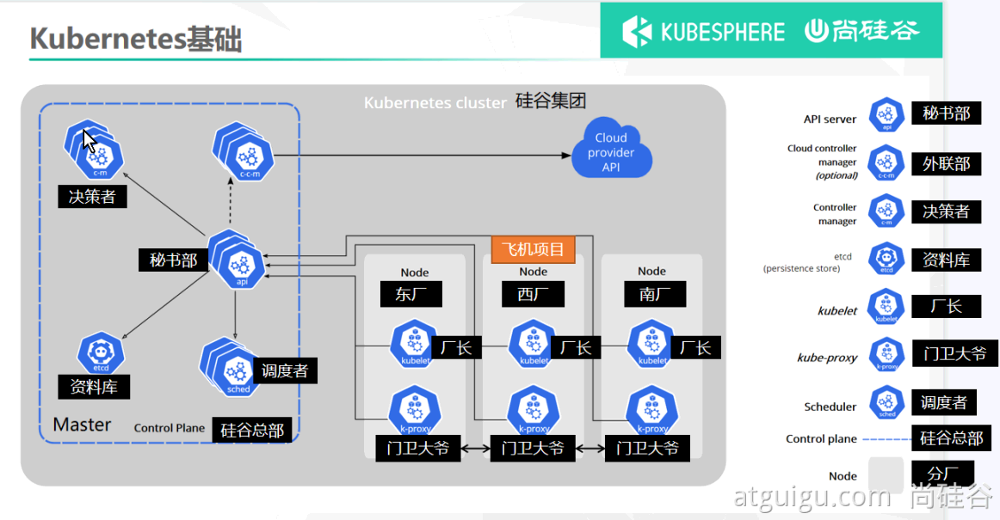

## 3）、集群安装+环境配置搭建

### kubectl 快捷键（alias）

#### k8s<a name="k8s-alias"></a>

  vim ~/.bashrc

```shell
########k8s############
###########k8s-创建与删除
alias k='kubectl'
alias kaf='kubectl apply -f' #使用yaml创建apps
alias kdf='kubectl delete -f' #删除yaml创建apps
###########k8s-资源信息
alias kg='kubectl get'
alias kgnodes='kubectl get nodes -o wide' #获取node资源信息
alias kgpods='kubectl get pods -o wide' #获取pods资源信息
###########k8s-名称空间
alias kgns='kubectl get ns' #获取所有名称空间
alias kgall='kubectl get all -o wide' #获取所有apps-pod-service
###########k8s-svc服务信息
alias kgsvc='kubectl get svc'
alias kgsvc-n='kubectl get svc -n $1' #自定义名称空间的svc查询
alias kgsvc-k8s='kubectl get svc -n kube-system -o wide' #获取k8s服务
alias kgsvc-ing='kubectl get svc -n ingress-nginx -o wide' #获取ingress服务
###########k8s-pod信息
alias kgpod='kubectl get pod --show-labels' #查看k8s的pod信息
alias kgpodw='watch kubectl get pod -n kube-system -o wide'	#监控k8s-pod的kube-system进度
###########k8s-pods信息
alias kgpodsallns='kubectl get pods --all-namespaces -o wide' #获取pods所有名称空间
alias kgpodsn='kubectl get pods -o wide -n $1' #查看输入的【kgpodsallns】名称空间信息
alias kgpodsn-k8s='kubectl get pods -n kube-system -o wide' #查看名称空间kube-system的信息
alias kgpodsn-ingressnginx='kubectl get pods -n ingress-nginx -o wide' #查看名称空间ingress-nginx的信息
alias kgpodsn-node='kubectl get pods -n kube-system -o wide | grep $1' #查看node子节点的pod信息
###########k8s-describe信息
alias kdesc-node='kubectl describe node $1' #传入node主机名称
alias kdesc-pod='kubectl describe pod -n $1' #传入名称空间
###########k8s-log信息
alias klog='kubectl logs -n $1' #传入名称空间
###########k8s-系统操作部分
alias ks='kubectl set' #设置应用资源
alias ke='kubectl edit' #编辑资源
alias kc='kubectl create' #创建资源
alias kd='kubectl delete' #删除
alias krollout='kubectl rollout' #输出、查看、回滚
alias klabel='kubectl label' #更新资源对象的label
alias kpatch='kubectl patch' #更新资源对象字段
###########k8s-快捷键提示
source <(kubectl completion bash)
```

### 部署步骤

```ABAP
1.在所有节点上安装 Docker和 kubeadm
2.部署 Kubernetes Master
3.部署容器网络插件
4.部署 Kubernetes Node，将节点加入 Kubernetes集群中
5.部署可视化管理 Kubernetes 资源
6.部署程序
```


### 环境准备

#### VMware

#### 创建虚拟机

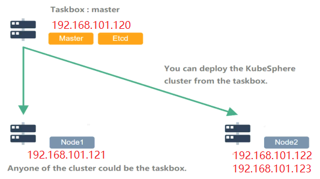

**具体设置&创建请参考：批量处理vagrant_vmware**


**bash :ifconf mmand not found**

>   yum install -y net-tools

本机添加hosts：C:\Windows\System32\drivers\etc

```
192.168.101.120 tomcat.k8s.com
192.168.101.120 nginx.k8s.com
192.168.101.120 ks.k8s.com
192.168.101.120 master
192.168.101.121 node1
192.168.101.122 node2
192.168.101.123 node3
```

在每个节点上添加   vim /etc/hosts

```
127.0.0.1   localhost localhost.localdomain localhost4 localhost4.localdomain4
::1         localhost localhost.localdomain localhost6 localhost6.localdomain6

192.168.101.120 master
192.168.101.121 node1
192.168.101.122 node2
192.168.101.123 node3
```

>   systemctl restart network.service //重启网络服务，
>
> ping -c 3 master-120 && ping -c 3 node-121 && ping -c 3 node-122 && ping -c 3 node-123

用户：a，密码：123456a，  hostnamectl set-hostname 

#### 开启 ssh 远程登录<a name="ssh"></a>

具体：https://blog.csdn.net/qq_42476834/article/details/124766896

```shell
sed -i 's/#PermitRootLogin yes/PermitRootLogin yes/g' /etc/ssh/sshd_config
登录master、node1、node2、node3
ssh-keygen -t rsa	（ssh-keygen这里一路回车就行）
    
ssh-copy-id -i ~/.ssh/id_rsa.pub root@192.168.101.120 && \
ssh-copy-id -i ~/.ssh/id_rsa.pub root@192.168.101.121 && \
ssh-copy-id -i ~/.ssh/id_rsa.pub root@192.168.101.122 && \
ssh-copy-id -i ~/.ssh/id_rsa.pub a@192.168.101.120 && \
ssh-copy-id -i ~/.ssh/id_rsa.pub a@192.168.101.121 && \
ssh-copy-id -i ~/.ssh/id_rsa.pub a@192.168.101.122
免密登录
ssh 192.168.101.120 
ssh 192.168.101.121
ssh 192.168.101.122
```

执行sh脚本：k8s-init.sh，k8s-docker.sh，k8s-install.sh

#### 开启IPVS支持

  vim /etc/sysconfig/modules/ipvs.modules

```shell
cat -s <<EOF > /etc/sysconfig/modules/ipvs.modules
#!/bin/bash
ipvs_modules="ip_vs ip_vs_lc ip_vs_wlc ip_vs_rr ip_vs_wrr ip_vs_lblc ip_vs_lblcr ip_vs_dh ip_vs_sh ip_vs_fo ip_vs_nq ip_vs_sed ip_vs_ftp nf_conntrack"
for kernel_module in ${ipvs_modules}; do
  /sbin/modinfo -F filename ${kernel_module} > /dev/null 2>&1
  if [ $? -eq 0 ]; then
    /sbin/modprobe ${kernel_module}
  fi
done
EOF
```

>   chmod 755 /etc/sysconfig/modules/ipvs.modules
>   sh /etc/sysconfig/modules/ipvs.modules
> lsmod | grep ip_vs

#### 将桥接的IPv4流量传递到iptables的链

```shell
cat -s <<EOF > /etc/modules-load.d/k8s.conf
br_netfilter
EOF

# cat /usr/lib/sysctl.d/00-system.conf 与之相同
cat -s <<EOF > /etc/sysctl.d/k8s.conf
# For binary values, 0 is disabled, 1 is enabled
net.bridge.bridge-nf-call-ip6tables = 1
net.bridge.bridge-nf-call-iptables = 1
net.ipv4.ip_forward = 1
vm.swappiness=0
EOF

cat -s <<EOF > /etc/sysctl.d/k8s.conf
net.bridge.bridge-nf-call-ip6tables = 1
net.bridge.bridge-nf-call-iptables = 1
net.ipv4.ip_forward = 1
vm.swappiness=0
EOF

modprobe br_netfilter
sysctl -p /etc/sysctl.d/k8s.conf
sysctl --system

#修改/etc/sysctl.d/10-network-security.conf
#与 /usr/lib/sysctl.d/50-default.conf 类似
cat -s <<EOF > /etc/sysctl.d/10-network-security.conf
net.ipv4.conf.default.rp_filter=1
net.ipv4.conf.all.rp_filter=1
EOF
#然后使之生效
sysctl --system
```

#### 时间同步

```shell
  yum install -y chrony
  systemctl enable chronyd
  systemctl start chronyd
  timedatectl set-ntp true
设置时区：timedatectl set-timezone Asia/Shanghai
timedatectl status
检查 ntp-server 是否可用：chronyc activity -v
---------------------------------------
  yum -y install ntpdate && yum install ntpsec-ntpdate
  ntpdate time.windows.com
```


### A、在所有节点上安装 Docker和 kubeadm、kubelet、kubectl

#### 准备

[安装工具](https://kubernetes.io/zh/docs/tasks/tools/)：[docker](https://docs.docker.com/engine/install/centos/)、kubeadm管理、kukelet代理、kubectl命令行

#### 1、安装docker

https://docs.docker.com/engine/install/centos/

卸载的旧版本

```shell
  yum remove docker docker-client docker-client-latest docker-common docker-latest docker-latest-logrotate docker-logrotate docker-engine
```

华为安装

```shell
1、若您安装过docker，需要先删掉，之后再安装依赖:
  yum remove docker docker-common docker-selinux docker-engine
  yum install -y yum-utils device-mapper-persistent-data lvm2
2、下载repo文件
  wget -O /etc/yum.repos.d/docker-ce.repo https://repo.huaweicloud.com/docker-ce/linux/centos/docker-ce.repo
替换为：
  sed -i 's+download.docker.com+repo.huaweicloud.com/docker-ce+' /etc/yum.repos.d/docker-ce.repo
3、更新索引文件并安装
  yum clean all &&   yum makecache fast
yum list docker-ce.x86_64 --showduplicates | sort -r
  yum install -y docker-ce
4、开启Docker服务
```

阿里安装

```shell
# step 1: 安装必要的一些系统工具
  yum install -y yum-utils device-mapper-persistent-data lvm2
# Step 2: 添加软件源信息
  yum-config-manager --add-repo https://mirrors.aliyun.com/docker-ce/linux/centos/docker-ce.repo
# Step 3
  sed -i 's+download.docker.com+mirrors.aliyun.com/docker-ce+' /etc/yum.repos.d/docker-ce.repo
# Step 4: 更新并安装Docker-CE
  yum clean all &&   yum makecache fast
yum list docker-ce.x86_64 --showduplicates | sort -r
  yum -y install docker-ce-[VERSION]
# Step 4: 开启Docker服务
  service docker start
```

systemctl docker
systemctl restart docker
systemctl stop docker
systemctl enable docker
systemctl disable docker
systemctl status docker

  usermod -aG docker a #非root用户

设置加速

```bash
cat -su <<EOF > /etc/docker/daemon.json
{
  "exec-opts": ["native.cgroupdriver=systemd"],
  "log-driver": "json-file",
  "log-opts": {
    "max-size": "100m"
  },
  "storage-driver": "overlay2",
  "registry-mirrors": [
    "https://04eo9xup.mirror.aliyuncs.com",
    "https://098cc8006500f4db0f2fc01937bbce40.mirror.swr.myhuaweicloud.com"
  ],
}
EOF
```

```shell
  systemctl daemon-reload
  systemctl restart docker
```

**docker配置http代理（可选）**

首先, 使用`systemctl status docker`命令查询`docker.service`文件的路径, 在我的环境中它的文件路径是`/lib/systemd/system/docker.service`; 然后编辑这个文件, 添加如下内容:

  vim /lib/systemd/system/docker.service

```shell
[Service]
Environment="HTTP_PROXY=http://127.0.0.1:10809"
Environment="HTTPS_PROXY=http://127.0.0.1:10809" 
Environment="NO_PROXY=localhost,127.0.0.0/8,192.168.0.0/16,10.0.0.0/8"
```

--------

------------

#### 2、添加 阿里kubernetes 仓库源（推荐）

```shell
cat -s <<EOF > /etc/yum.repos.d/kubernetes.repo
[kubernetes]
name=Kubernetes
baseurl=https://mirrors.aliyun.com/kubernetes/yum/repos/kubernetes-el7-x86_64/
enabled=1
gpgcheck=1
repo_gpgcheck=0
gpgkey=https://mirrors.aliyun.com/kubernetes/yum/doc/yum-key.gpg https://mirrors.aliyun.com/kubernetes/yum/doc/rpm-package-key.gpg
EOF
```

#### 3、添加 华为kubernetes 仓库源（仓库维护太慢了）

```shell
cat -s <<EOF > /etc/yum.repos.d/kubernetes.repo
[kubernetes]
name=Kubernetes
baseurl=https://repo.huaweicloud.com/kubernetes/yum/repos/kubernetes-el7-x86_64
enabled=1
gpgcheck=1
repo_gpgcheck=0
gpgkey=https://repo.huaweicloud.com/kubernetes/yum/doc/yum-key.gpg https://repo.huaweicloud.com/kubernetes/yum/doc/rpm-package-key.gpg
EOF
```

#### 4、更新索引文件并安装 **kubernetes**

```shell
yum clean all && yum makecache && yum -y update && yum repolist all
yum list kubelet	yum list kube*
```

`failure: repodata/repomd.xml from kubernetes: [Errno 256] No more mirrors to try.`

暂时禁用存储库：yum --disablerepo=kubernetes

永久禁用存储库：yum-config-manager --disable kubernetes or subscription-manager repos --disable=kubernetes

如果不可用，则跳过：yum-config-manager --save --setopt=kubernetes.skip_if_unavailable=true

#### 5、master 安装

**升级0，新安装0，降级3，删除0，未升级25**

```ABAP
apt-get install -y kubeadm=1.21.5-00 kubelet=1.21.5-00 kubectl=1.21.5-00

yum install kubeadm-1.22.9-0 kubelet-1.22.9-0 kubectl-1.22.9-0
yum install --nogpgcheck kubelet-1.22.9-0 kubeadm-1.22.9-0 kubectl-1.22.9-0
华为：yum install kubeadm-1.22.9-0 kubelet-1.22.9-0 kubectl-1.22.9-0 --disableexcludes=kubernetes
阿里：yum install kubeadm-1.22.9-0 kubelet-1.22.9-0 kubectl-1.22.9-0
```

#### 5、node 安装

node` 节点一般不需要安装 `kubectl

>   yum install -y kubeadm-1.22.9-0 kubelet-1.22.9-0

执行：**cp /usr/bin/kube* /usr/local/bin/**

#### 卸载


#### 启动 k8s

>   systemctl enable kubelet	  systemctl disable kubelet
>
>   systemctl start kubelet		  systemctl stop kubelet
>
>   systemctl status kubelet
>
> 发现：kubelet.service - kubelet: The Kubernetes Node Agent，属于正常，k8s还没有配置

[版本 History](https://kubernetes.io/releases/)	https://github.com/kubernetes/kubernetes/tree/master/CHANGELOG

### B、Master 部署 Kubernetes 

编辑 master_images.sh：设置需要的镜像，仓库地址,[官网docker镜像搜索](https://hub.docker.com/)

> https://hub.docker.com/u/aiotceo	、https://hub.docker.com/u/mirrorgooglecontainers
>
> swr.myhuaweicloud.com/iivey
>
> registry.cn-chengdu.aliyuncs.com/jinfang
>
> registry.aliyuncs.com/google_containers

#### 镜像拉取

kubeadm config print init-defaults #查看安装k8s的相关信息
kubeadm config images list #查询需要的镜像

```
------------官方许哟啊
kube-apiserver:v1.22.9（有）
kube-controller-manager:v1.22.9（有）
kube-scheduler:v1.22.9（有）
kube-proxy:v1.22.9（有）
pause:3.5（有）
etcd:3.5.0-0（有）
coredns:v1.8.4（有）
------------其他需要
ks-installer:v3.2.1（有）
flannel:v0.16.3
flannelcni-flannel-cni-plugin:v1.0.1
kube-webhook-certgen:v1.5.2
nginx-ingress-controller:v1.1.0

docker rmi registry.aliyuncs.com/google_containers/
docker push registry.cn-chengdu.aliyuncs.com/jinfang/
```

```shell
docker login --username=小牛程序app registry.cn-chengdu.aliyuncs.com
```

#### master -> kubeadm 初始化<a name="kubeadm init"></a>

```shell
kubeadm config print init-defaults #查看安装k8s的相关信息
kubeadm config images list #查询需要的镜像
------------------
kubeadm config images list --kubernetes-version=v1.22.9 --image-repository registry.cn-chengdu.aliyuncs.com/jinfang #设置k8s镜像仓库为
```

```shell
kubeadm init \
--apiserver-advertise-address=192.168.101.120 \
--control-plane-endpoint=192.168.101.120 \
--image-repository registry.cn-chengdu.aliyuncs.com/jinfang \
--kubernetes-version v1.22.9 \
--service-cidr=10.96.0.0/16 \
--pod-network-cidr=10.244.0.0/16
```

#### 得到 kubeadm join

```shell
您的Kubernetes控制平面已成功初始化！
要开始使用群集，您需要以普通用户身份运行以下命令：
    mkdir -p $HOME/.kube
    sudo cp -i /etc/kubernetes/admin.conf $HOME/.kube/config
    sudo chown $(id -u):$(id -g) $HOME/.kube/config

或者，如果您是root用户，则可以运行：
  export KUBECONFIG=/etc/kubernetes/admin.conf
  
您现在应该在集群上部署一个pod网络。
使用下列选项之一运行“kubectl apply-f[podnetwork].yaml”：
https://kubernetes.io/docs/concepts/cluster-administration/addons/

##### master
现在，您可以通过复制证书颁发机构来加入任意数量的控制平面节点
和每个节点上的服务帐户密钥，然后以root用户身份运行以下操作：

kubeadm join 192.168.101.120:6443 --token 7yjap0.zrq216lw4tj3jhnz \
        --discovery-token-ca-cert-hash sha256:735d57dd43fad0851902c749d8e15d2e9c41e6ec8eec5916fdfb7f739895093b \
        --control-plane

然后，在每个节点上以root身份运行以下操作，可以加入任意数量的工作节点：
###### node
su root
kubeadm join 192.168.101.120:6443 --token 7yjap0.zrq216lw4tj3jhnz \
        --discovery-token-ca-cert-hash sha256:735d57dd43fad0851902c749d8e15d2e9c41e6ec8eec5916fdfb7f739895093b
```

#### kubectl 命令的自动补全功能（所有的节点）

> echo "source <(kubectl completion bash)" >> ~/.bashrc

#### 重启后出现：`The connection to the server localhost:8080 was refused - did you specify the right host or port?`

> 解决：https://blog.csdn.net/qq_42476834/article/details/124730955
>
> [ssh免密登录访问](#ssh)

#### 将主节点（master）中的“/etc/kubernetes/admin.conf”文件拷贝到从节点（node）相同目录下

> ```
> scp /etc/kubernetes/admin.conf root@192.168.101.121:/etc/kubernetes/ && \
> scp /etc/kubernetes/admin.conf root@192.168.101.122:/etc/kubernetes/
> 
> echo "export KUBECONFIG=/etc/kubernetes/admin.conf" >> ~/.bash_profile
> scp ~/.bash_profile root@192.168.101.121:/root/ && \
> scp ~/.bash_profile root@192.168.101.122:/root/
> 
> source ~/.bash_profile
> ```
>

#### 解决端口占用：kubeadm reset

### C、将从节点（node）加入 Kubernetes （Master）集群中

su root	在每个根节点上运行以下操作：

[查看 kubeadm init](#kubeadm init)

```shell
su root
kubeadm join 192.168.101.120:6443 --token yz5tlv.fwg52dzz0g4w6eyk \
        --discovery-token-ca-cert-hash sha256:4acb1c30f7cd2c1dab84de2dd7d9768e931ed3e2cfc8798171fd2dd3260a9e81
```

```shell
[root@node-121 ~]# kubeadm join 192.168.101.120:6443 --token 971p07.4h9ljb93kcm471bd --discovery-token-ca-cert-hash sha256:2f02b1e11049f9cbe3784ed6a78f1f7f4fc794d421eabe642335bc55393ea61b

[preflight] 进行飞行前检查
[preflight] 从集群中读取配置...
[preflight] 仅供参考：您可以查看此配置文件'kubectl -n kube-system get cm kubeadm-config -o yaml'
[kubelet-start] 将 kubelet 配置写入文件 "/var/lib/kubelet/config.yaml"
[kubelet-start] 将带有标志的 kubelet 环境文件写入文件 "/var/lib/kubelet/kubeadm-flags.env"
[kubelet-start] 启动 kubelet
[kubelet-start] 等待 kubelet 执行 TLS Bootstrap...

此节点已加入集群：
* 证书签名请求已发送到 apiserver 并收到响应。
* Kubelet  被告知新的安全连接细节。

Run 'kubectl get nodes' 在控制平面上查看该节点加入集群。
```

#### kubeadm-config（略过 嘿嘿嘿）

kubectl -n kube-system get cm kubeadm-config -o yaml

```json
apiVersion: v1
data:
  ClusterConfiguration: |
    apiServer:
      extraArgs:
        authorization-mode: Node,RBAC
      timeoutForControlPlane: 4m0s
    apiVersion: kubeadm.k8s.io/v1beta3
    certificatesDir: /etc/kubernetes/pki
    clusterName: kubernetes
    controlPlaneEndpoint: 192.168.101.120:6443
    controllerManager: {}
    dns: {}
    etcd:
      local:
        dataDir: /var/lib/etcd
    imageRepository: registry.cn-chengdu.aliyuncs.com/jinfang
    kind: ClusterConfiguration
    kubernetesVersion: v1.22.9
    networking:
      dnsDomain: cluster.local
      podSubnet: 10.244.0.0/16
      serviceSubnet: 10.96.0.0/16
    scheduler: {}
kind: ConfigMap
metadata:
  creationTimestamp: "2022-05-12T03:07:48Z"
  name: kubeadm-config
  namespace: kube-system
  resourceVersion: "197"
  uid: b4929ea8-6f0d-4a20-a24c-ef1a2e104360
```

#### token过期，重新设置

> kubeadm token list
>
> kubeadm token create --print-join-command
>
> kubeadm token create --ttl 0 --print-join-command

### D、master 部署容器网络插件 Flannel

参考：https://kubernetes.io/zh/docs/concepts/cluster-administration/addons/

#### 配置网络策略 Flannel

root用户：使用[Flannel](https://github.com/flannel-io/flannel#deploying-flannel-manually) 配置，执行：

>https://gitee.com/k8s_s/flannel/blob/master/Documentation/kube-flannel.yml
>
>https://gitee.com/k8s_s/flannel/blob/v0.17.0/Documentation/kube-flannel.yml
>
>kubectl apply -f kube-flannel-0.17.0.yml
>
>删除：kubectl delete -f kube-flannel-0.17.0.yml

##### kube-flannel.yml 内容

```yaml
### v0.15.1-v0.16.1：：：：：：v1.0.0、v0.15.1
### v0.16.2-v0.16.3：：：：：：v1.0.1、v0.16.1
### v0.17.0：：：：：：v1.0.1、v0.16.3

dkpull rancher/mirrored-flannelcni-flannel-cni-plugin:v1.0.1
dkpull rancher/mirrored-flannelcni-flannel:v0.16.3
image修改：
registry.cn-chengdu.aliyuncs.com/jinfang/flannelcni-flannel-cni-plugin:v1.0.1
registry.cn-chengdu.aliyuncs.com/jinfang/flannel:v0.16.3
```

#### [kubectl 命令基础](https://blog.csdn.net/qq_42476834/article/details/121781274)

#### 查看

列出所有运行的Pod信息

列出Pod以及运行Pod节点信息。

```shell
[root@master-120 kubelet]# kubectl get pods
No resources found in default namespace.
[root@master-120 ~]# kubectl get pods -o wide
No resources found in default namespace.
```

查看所以节点 kg nodes

```shell
[root@master-120 kubelet]# kg nodes
NAME         STATUS   ROLES                  AGE   VERSION
master-120   Ready    control-plane,master   63m   v1.22.9
node-121     Ready    <none>                 58m   v1.22.9
node-122     Ready    <none>                 58m   v1.22.9
node-123     Ready    <none>                 58m   v1.22.9
```

查看命名空间 kubectl get ns

```shell
[root@master-120 kubelet]# kubectl get ns
NAME              STATUS   AGE
default           Active   63m
kube-node-lease   Active   63m
kube-public       Active   63m
kube-system       Active   63m
```

查看 pod 命名空间 kubectl get pods --all-namespaces

```shell
[root@master-120 kubelet]# kubectl get pods --all-namespaces
NAMESPACE     NAME                                 READY   STATUS    RESTARTS   AGE
kube-system   coredns-687d9f64f-dlqq9              1/1     Running   0          63m
kube-system   coredns-687d9f64f-hqch5              1/1     Running   0          63m
kube-system   etcd-master-120                      1/1     Running   0          63m
kube-system   kube-apiserver-master-120            1/1     Running   0          63m
kube-system   kube-controller-manager-master-120   1/1     Running   0          63m
kube-system   kube-flannel-ds-44l8g                1/1     Running   0          47m
kube-system   kube-flannel-ds-cf2zd                1/1     Running   0          47m
kube-system   kube-flannel-ds-tkbnh                1/1     Running   0          47m
kube-system   kube-flannel-ds-wxhk4                1/1     Running   0          47m
kube-system   kube-proxy-4rt2z                     1/1     Running   0          63m
kube-system   kube-proxy-86jzc                     1/1     Running   0          58m
kube-system   kube-proxy-dmz5t                     1/1     Running   0          58m
kube-system   kube-proxy-sz9q2                     1/1     Running   0          58m
kube-system   kube-scheduler-master-120            1/1     Running   0          63m
```

kubectl get pods -n kube-system

```shell
[root@master-120 kubelet]# kubectl get pods -n kube-system
NAME                                 READY   STATUS    RESTARTS   AGE
coredns-687d9f64f-dlqq9              1/1     Running   0          63m
coredns-687d9f64f-hqch5              1/1     Running   0          63m
etcd-master-120                      1/1     Running   0          63m
kube-apiserver-master-120            1/1     Running   0          63m
kube-controller-manager-master-120   1/1     Running   0          63m
kube-flannel-ds-44l8g                1/1     Running   0          48m
kube-flannel-ds-cf2zd                1/1     Running   0          48m
kube-flannel-ds-tkbnh                1/1     Running   0          48m
kube-flannel-ds-wxhk4                1/1     Running   0          48m
kube-proxy-4rt2z                     1/1     Running   0          63m
kube-proxy-86jzc                     1/1     Running   0          59m
kube-proxy-dmz5t                     1/1     Running   0          59m
kube-proxy-sz9q2                     1/1     Running   0          59m
kube-scheduler-master-120            1/1     Running   0          63m
```

kubectl get pods -n kube-system -o wide

```shell
[root@master-120 kubelet]# kubectl get pods -n kube-system -o wide
NAME                                 READY   STATUS    RESTARTS   AGE   IP                NODE         NOMINATED NODE   READINESS GATES
coredns-687d9f64f-dlqq9              1/1     Running   0          65m   10.244.0.2        master-120   <none>           <none>
coredns-687d9f64f-hqch5              1/1     Running   0          65m   10.244.0.3        master-120   <none>           <none>
etcd-master-120                      1/1     Running   0          65m   192.168.101.120   master-120   <none>           <none>
kube-apiserver-master-120            1/1     Running   0          65m   192.168.101.120   master-120   <none>           <none>
kube-controller-manager-master-120   1/1     Running   0          65m   192.168.101.120   master-120   <none>           <none>
kube-flannel-ds-44l8g                1/1     Running   0          49m   192.168.101.123   node-123     <none>           <none>
kube-flannel-ds-cf2zd                1/1     Running   0          49m   192.168.101.121   node-121     <none>           <none>
kube-flannel-ds-tkbnh                1/1     Running   0          49m   192.168.101.120   master-120   <none>           <none>
kube-flannel-ds-wxhk4                1/1     Running   0          49m   192.168.101.122   node-122     <none>           <none>
kube-proxy-4rt2z                     1/1     Running   0          65m   192.168.101.120   master-120   <none>           <none>
kube-proxy-86jzc                     1/1     Running   0          60m   192.168.101.123   node-123     <none>           <none>
kube-proxy-dmz5t                     1/1     Running   0          60m   192.168.101.122   node-122     <none>           <none>
kube-proxy-sz9q2                     1/1     Running   0          60m   192.168.101.121   node-121     <none>           <none>
kube-scheduler-master-120            1/1     Running   0          65m   192.168.101.120   master-120   <none>           <none>
```


**kube-flannel-ds-xxxx 必须运行OK**

###  E、可视化查看 Kubernetes资源

文档：https://kuboard.cn/install/install-k8s-dashboard.html

#### 1、dashboard（不推荐）

>https://github.com/kubernetes/dashboard/releases/tag/v2.4.0
>
>kubectl apply -f https://gitee.com/k8s_s/dashboard1/blob/v2.4.0/aio/deploy/recommended.yaml -o yaml > dashboard.yaml

#### 2、KubeSphere（推荐）

[跳转到 KubeSphere 安装](#KubeSphere)

[github kubesphere](https://github.com/kubesphere/kubesphere)，star: 9.8+K

#### 3、Kuboard

https://kuboard.cn/overview/

[Github kuboard](https://github.com/eip-work/kuboard-press) stars 14.5+K

#### 4、KubeOperator


---------------------

------------------

## 4）、k8s 入门

后期直接到这里开始吧：[ 使用 [apps +暴露Service port] 的 yaml 格式 ](#apps+expose-port)

### 资源包括(不区分大小写)：pod（po），service（svc），replication controller（rc），deployment（deploy），replica set（rs）

具体命令请看：[k8s-alias](#k8s-alias)

### kubectl get po

```bash
[root@master-120 ~]# kubectl get po
NAME                      READY   STATUS    RESTARTS      AGE
nginx-689b55fcd-2c8v8     1/1     Running   1 (19h ago)   19h
nginx-689b55fcd-5qpkp     1/1     Running   1 (19h ago)   19h
nginx-689b55fcd-gpdqz     1/1     Running   1 (19h ago)   19h
tomcat-549f8d66bc-bln66   1/1     Running   1 (19h ago)   19h
tomcat-549f8d66bc-rqhvm   1/1     Running   1 (19h ago)   19h
tomcat-549f8d66bc-zkc94   1/1     Running   1 (19h ago)   19h
```

### kubectl get svc

```bash
[root@master-120 ~]# kubectl get svc
NAME         TYPE        CLUSTER-IP     EXTERNAL-IP   PORT(S)    AGE
kubernetes   ClusterIP   10.96.0.1      <none>        443/TCP    29h
nginx        ClusterIP   10.96.99.230   <none>        8000/TCP   19h
tomcat       ClusterIP   10.96.102.96   <none>        8001/TCP   19h
```

### kubectl get rc

```bash
No resources found in default namespace.
```

### kubectl get deploy

```bash
[root@master-120 ~]# kubectl get deploy
NAME     READY   UP-TO-DATE   AVAILABLE   AGE
nginx    3/3     3            3           19h
tomcat   3/3     3            3           19h
```

### kubectl get rs

```bash
[root@master-120 ~]# kubectl get rs
NAME                DESIRED   CURRENT   READY   AGE
nginx-689b55fcd     3         3         3       19h
tomcat-549f8d66bc   3         3         3       19h
```


### A、基本命令

#### 1、创建apps：create deployment

master安装tomcat

##### kubectl create deployment tomcat6 --image=tomcat:6.0.53-jre8

#### 2、查看 kg all

```shell
a1@node01:~/k8s$ kubectl get all
NAME                           READY   STATUS              RESTARTS  		 AGE
pod/tomcat6-56fcc999cb-47vfm   0/1     ContainerCreating      0      		 23s
NAME                 TYPE        CLUSTER-IP   EXTERNAL-IP   PORT(S)   		 AGE
service/kubernetes   ClusterIP   10.96.0.1    <none>        443/TCP  		 115m
NAME                      READY   UP-TO-DATE   AVAILABLE   					AGE
deployment.apps/tomcat6   0/1     	 1             0           				23s
NAME                                 DESIRED   CURRENT   READY  			AGE
replicaset.apps/tomcat6-56fcc999cb   1         1         0      			23s
```

#### 3、查看详细 kg all -o wide

tomcat6在节点node2---docker下载镜像ok

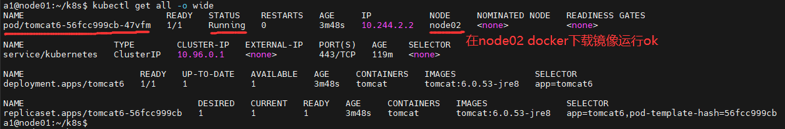

在node2查看

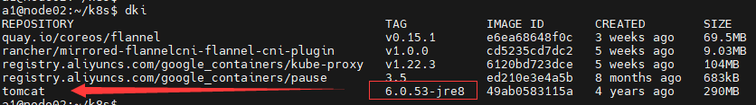

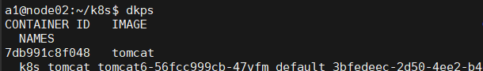

#### 4、查看 kg pod -o wide


##### node02模拟宕机，看看k8s怎么处理（dkstop与node02关机）

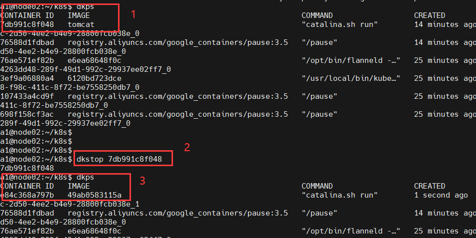

发现node2节点已经不行了，全部压力到了node3

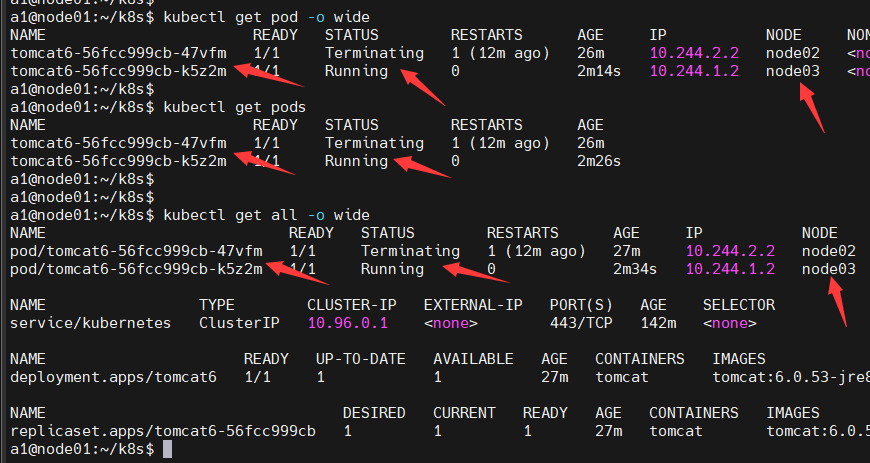


##### 重启 node02


#### 5、暴露 port ：expose


> expose (-f FILENAME | TYPE NAME) [--port=port] [--protocol=TCP|UDP] [--target-port=number-or-name] [--name=name] [--external-ip=external-ip-of-service] [--type=type]

```shell
kubectl expose rc nginx --port=80 --target-port=8080
kubectl expose deploy tomcat6 --port=80 --target-port=8080 --type=NodePort
```


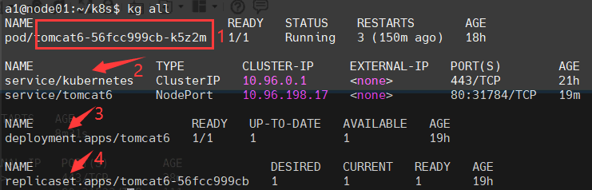

http://192.168.101.121:31002/ 

#### 6、修改 port：edit

> kubectl edit svc tomcat6	###修改app应用服务的port
>
> kubectl edit deploy tomcat6	### 修改app应用

#### 7、扩容或缩容：scale

>scale [--resource-version=version] [--current-replicas=count] --replicas=COUNT (-f FILENAME | TYPE NAME)

将名为tomcat6中的pod副本数设置为3。

```
kubectl scale --replicas=3 deployment tomcat6
kg pods -o wide
```

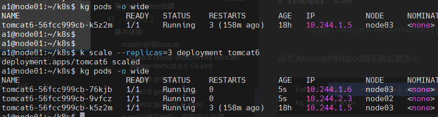

如果当前副本数为2，则将其扩展至3。

```
kubectl scale --current-replicas=2 --replicas=3 deployment/tomcat6
```

#### 8、删除以 create deployment 部署的(apps、service) delete

> kubectl  get all
>
> kubectl delete deployment.apps/tomcat6 
>
> kubectl delete service/tomcat6

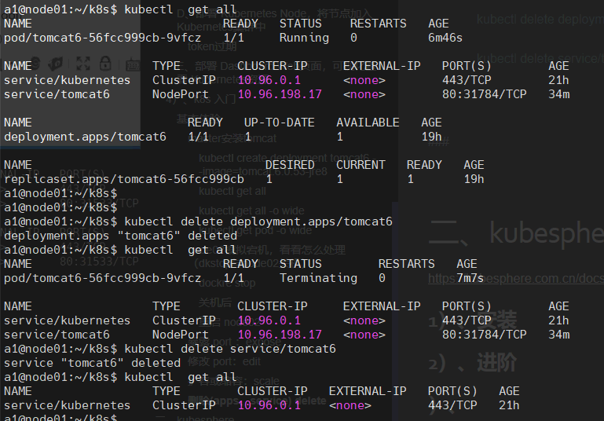

#### 9、部署&删除以 yaml 部署的实例

[查看 xxx.yaml](#xxx.yaml)

##### kubectl apply -f xxx.yaml

##### kubectl delete -f xxx.yaml

--------------------

---------------------

### B、yaml & 基本使用

https://kubernetes.io/zh/docs/reference/kubectl/overview/

后期使用：[# apps+expose-port](#apps+expose-port)，而不是使用 [# 初级使用yaml创建apps](#初级使用yaml创建apps)

#### Pod 模版

一般不会自己创建

```yaml
apiVersion: v1
kind: Pod
metadata:
  labels:
    app: tomcat9-02
  name: tomcat9-02
  namespace: default
spec:
  containers:
  - image: tomcat:6.0.53-jre8
    imagePullPolicy: IfNotPresent
    name: tomcat9-02
  - image: nginx
    imagePullPolicy: IfNotPresent
    name: nginx
```

#### Deployment 模版 

```yaml
apiVersion: apps/v1
kind: Deployment
metadata:
  labels:
    app: tomcat601
  name: tomcat601-deployment
spec:
  #replicas复制几份
  replicas: 2 
  selector:
    matchLabels:
      app: tomcat601
  template:
    #Pod模板
    metadata:
      labels:
        app: tomcat601
    spec:
      containers:
      - image: tomcat:6.0.53-jre8
        name: tomcat601
        imagePullPolicy: IfNotPresent
```

```yaml
apiVersion: apps/v1
kind: Deployment
metadata:
  name: nginx-deployment
  labels:
    app: nginx
spec:
  replicas: 3
  selector:
    matchLabels:
      app: nginx
  template:
  #Pod模板
    metadata:
      labels:
        app: nginx
 	#Pod模板规约：spec-指示 Pods 运行一个 nginx 容器
    spec:
      containers:
      - name: nginx
        image: nginx:1.14.2
        imagePullPolicy: IfNotPresent
        ports:
        - containerPort: 80
```


#### Service 模版 

```yaml
apiVersion: v1
kind: Service
metadata:
  labels:
    app: tomcat601
  name: tomcat601-xxx-jp3sk
  namespace: default
spec:
  ports:
  #- NodePort: 30965
  - port: 80
    protocol: TCP
    targetPort: 8080
  selector:
    app: tomcat601
  type: NodePort
```


#### 1、初级使用yaml创建apps<a name="初级使用yaml创建apps"></a>（后期不使用这种方式）

```shell
# 使用 example-service.yaml 中的定义创建服务。
kubectl apply -f example-service.yaml

# 使用 example-controller.yaml 中的定义创建 replication controller。
kubectl apply -f example-controller.yaml

# 使用 <directory> 路径下的任意 .yaml, .yml, 或 .json 文件 创建对象。
kubectl apply -f <directory>
```

查看并保存 Deployment 的 yaml 文件（--dry-run）

> --dry-run：仅查看不运行
>
> kubectl create deployment 服务名称--image=镜像名称 --dry-run -o yaml > 保存目标
>
> kubectl create deployment tomcat6 --image=tomcat:6.0.53-jre8 --dry-run -o yaml > tomcat6.yaml

```yaml
apiVersion: apps/v1
kind: Deployment
metadata:
  labels:
    app: tomcat6
  name: tomcat6
spec:
  replicas: 2
  selector:
    matchLabels:
      app: tomcat6
  template:
    metadata:
      labels:
        app: tomcat6
    spec:
      containers:
      - image: tomcat:6.0.53-jre8
        name: tomcat
```

创建 Deployment apps：kubectl apply -f tomcat6.yaml

kubectl get deployments

更新 Deployment

```shell
kubectl set image deployment.v1.apps/tomcat6 tomcat=tomcat:9.0.53-jre8
或
kubectl set image deployment/tomcat6 tomcat=tomcat:9.0.53-jre8
```

回滚 Deployment

```shell
kubectl set image deployment/tomcat6 tomcat=tomcat:9.0.53-jre8 --record=true
```

暴露 service 端口：kubectl expose deploy tomcat6 --port=80 --target-port=8080 --type=NodePort

查看 Pod（kg all ，kg pods -o wide，kg pod xx -o yaml）

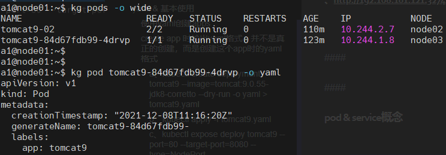

```yaml
apiVersion: v1
kind: Pod
metadata:
  labels:
    app: tomcat6
    pod-template-hash: 56fcc999cb
  name: tomcat6-56fcc999cb-nm2nx
  namespace: default
  ownerReferences:
  - apiVersion: apps/v1
    blockOwnerDeletion: true
    controller: true
    kind: ReplicaSet
    name: tomcat6-56fcc999cb
    uid: 28633fd6-b3ee-45aa-93d5-fb8931735029
  resourceVersion: "47929"
  uid: 59333abe-6a24-4995-888b-88577fef9559
spec:
  containers:
  - image: tomcat:6.0.53-jre8
    imagePullPolicy: IfNotPresent
    name: tomcat
... ...
```

自己创建 pod（.yaml）文件

Pod 通常不是直接创建的，而是使用工作负载资源创建的。

```yaml
apiVersion: v1
kind: Pod
metadata:
  labels:
  	#实例名称
    app: tomcat601
  #容器名称  
  name:  tomcat6-xxx-wzfj2
  #命名空间
  namespace: default
spec:
  #容器
  containers:
  - image: tomcat:6.0.53-jre8
    imagePullPolicy: IfNotPresent
    name: tomcat601
  - image: nginx
    imagePullPolicy: IfNotPresent
    name: nginx
```

kubectl apply -f myPod.yaml

查看 Service（kg svc tomcat6 -o  yaml）

```yaml
apiVersion: v1
kind: Service
metadata:
  creationTimestamp: "2021-12-08T13:41:18Z"
  labels:
    app: tomcat6
  name: tomcat6
  namespace: default
  resourceVersion: "48461"
  uid: b4ebfb65-4e0c-478a-8e85-f03acef2d166
spec:
  clusterIP: 10.96.126.87
  clusterIPs:
  - 10.96.126.87
  externalTrafficPolicy: Cluster
  internalTrafficPolicy: Cluster
  ipFamilies:
  - IPv4
  ipFamilyPolicy: SingleStack
  ports:
  - nodePort: 31005 #暴露给外部使用port
    port: 80
    protocol: TCP
    targetPort: 8080
  selector:
    app: tomcat6
  sessionAffinity: None
  type: NodePort
status:
  loadBalancer: {}
```

查看 Deployment-apps（kg deploy tomcat6 -o  yaml）

```yaml
apiVersion: apps/v1
kind: Deployment
metadata:
  labels:
    app: tomcat6
  name: tomcat6
  namespace: default
  ...
spec:
  replicas: 2
  selector:
    matchLabels:
      app: tomcat6
  template:
    metadata:
      labels:
        app: tomcat6
    spec:
      containers:
      - image: tomcat:6.0.53-jre8
        imagePullPolicy: IfNotPresent
        name: tomcat
        terminationMessagePath: /dev/termination-log
        terminationMessagePolicy: File
   ....
status:
    ...
```

查看 Deployment 上线状态`kubectl rollout status deployment/nginx-deployment`

校验：http://192.168.101.120:80/

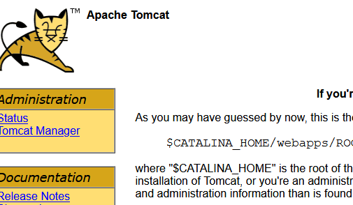

#### 2、使用 [apps +暴露Service port] 的 yaml 格式（使用这个，不使用[# 初级使用yaml创建apps](#初级使用yaml创建apps)）=========推荐==========<a name="apps+expose-port"></a>

=========推荐==========

##### 安装 Deployment（apps ）与暴露Service（expose-port ）在同一个yaml文件里设置，通过`---`分隔

=========推荐==========

xxx.yaml<a name="xxx.yaml"></a>

```yaml
apiVersion: apps/v1
kind: Deployment
metadata:
  labels:
    app: tomcat
  name: tomcat
spec:
  replicas: 3
  selector:
    matchLabels:
      app: tomcat
  template:
    metadata:
      labels:
        app: tomcat
    spec:
      containers:
      - name: tomcat
        image: registry.cn-chengdu.aliyuncs.com/jinfang/tomcat:9.0.62-jre11-temurin-focal
        ports:
        - containerPort: 8080
        imagePullPolicy: IfNotPresent
---
apiVersion: v1
kind: Service
metadata:
  labels:
    app: tomcat
  name: tomcat
  namespace: default
spec:
  ports:
  - port: 80
    protocol: TCP
    targetPort: 8080
  selector:
    app: tomcat
  type: NodePort
```

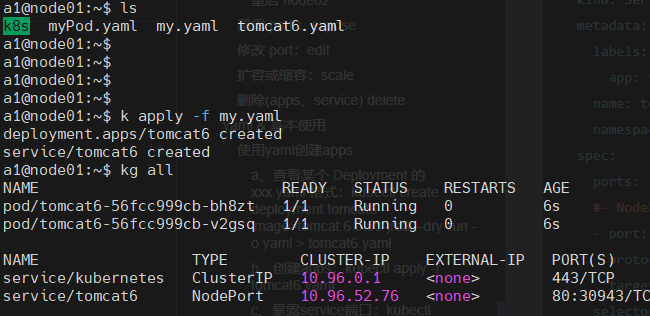

### tomcat 404<a name="tomcat404"></a>

查看日志： kubectl logs tomcat-xx

进入容器中查看:

```shell
[a@master ~]$ kg pod -o wide
NAME                     READY   STATUS    RESTARTS   AGE   IP            NODE    NOMINATED NODE   READINESS GATES
tomcat-b8cdc6f6b-7ngdx   1/1     Running   0          8m    10.244.3.12   node3   <none>           <none>
tomcat-b8cdc6f6b-97g7f   1/1     Running   0          8m    10.244.1.14   node2   <none>           <none>
tomcat-b8cdc6f6b-r2w26   1/1     Running   0          8m    10.244.1.13   node2   <none>           <none>

[a@master ~]$ kubectl exec xx -it -- /bin/bash
[a@master ~]$ kubectl exec xx -it -- /bin/bash
[a@master ~]$ kubectl exec xx -it -- /bin/bash

root@tomcat-xx-8sdxp:/usr/local/tomcat# ls
    BUILDING.txt	 LICENSE  README.md	 RUNNING.txt  conf  logs	    temp     webapps.dist
    CONTRIBUTING.md  NOTICE   RELEASE-NOTES  bin	      lib   native-jni-lib  webapps  work
root@tomcat-xx-8sdxp:/usr/local/tomcat# cp -R webapps.dist/. webapps/
```


### C、Deployment & service 概念


#### pod & service


将一组pod公开为网络服务，通过service代理，可以实现负载均衡


#### ClusterIP

此方式只能在集群内访问


#### label & selector


通讯1

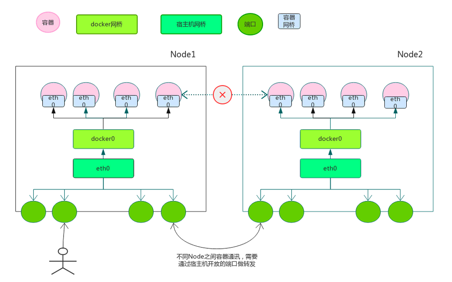

通讯2

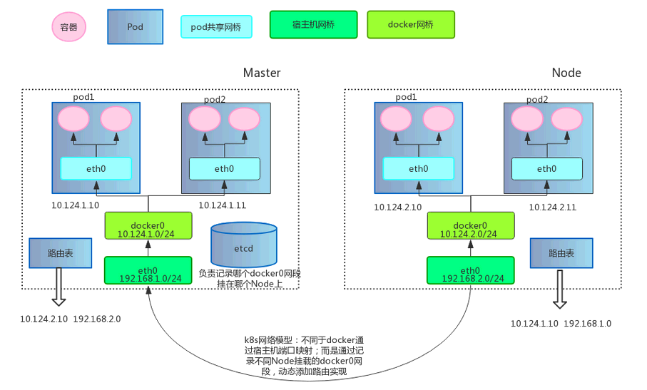

#### 说明：

> 一个集群后多台mster、node，一个节点node，里面有多个Pod，一个Pod里可能有多个服务，各个Pod通过service暴露port给其他Pod、node之间是互通，通过controller来管理使用Pod资源。

node -> pod ->  service -> controller

### D、Ingress 基于域名访问，不需要通过ip：port访问服务

ingress：通过域名、负载均衡<a name="ingress"></a>

ingress 底层是nginx

> 通过Service 发现Pod进行关联。基于域名访问。
>
> 通过Ingress Controller 实现Pod负载均衡。
>
> 支持TCP/UDP 4层负载均衡和HTTP 7层负载均衡。

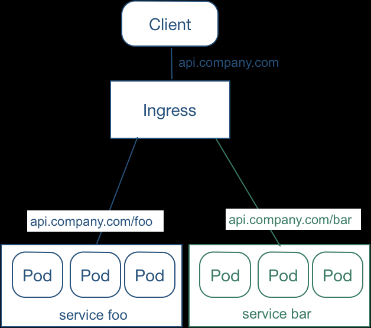

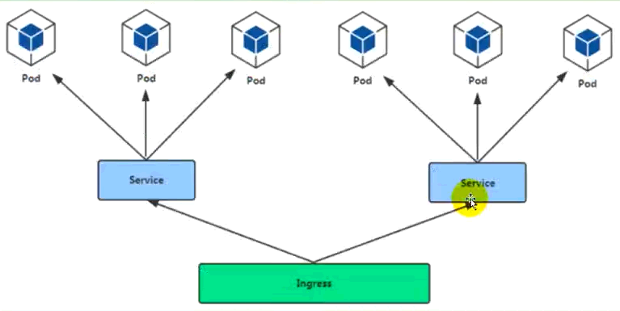

---

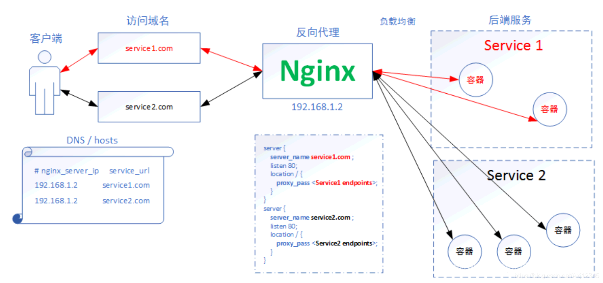

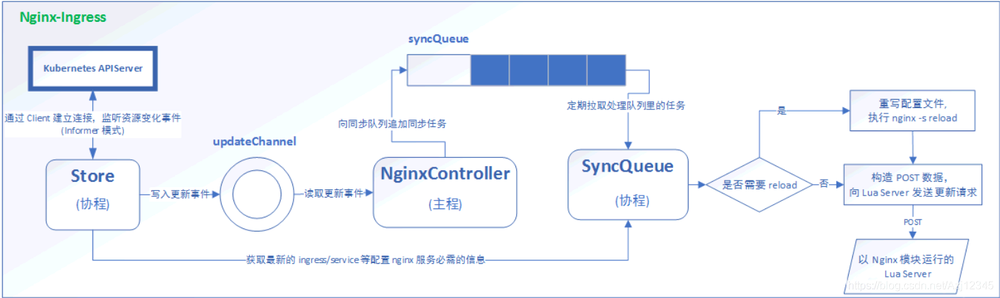

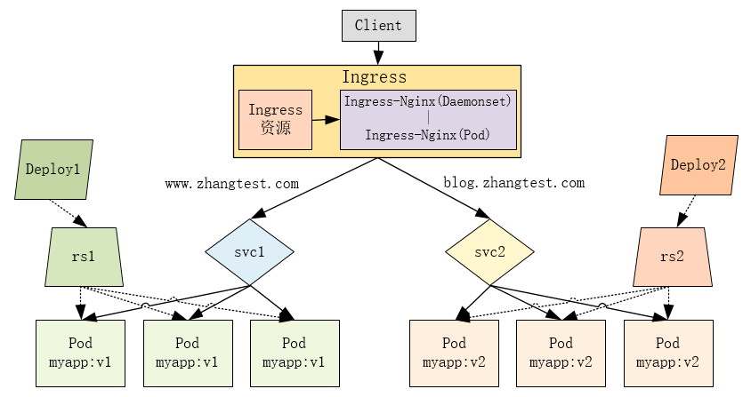


----

#### 执行流程

> ingress-nginx-controller 对外提供80（NodePort）端口，外部访问80转到内部service的pod【k8s内部端口（ClusterIP）】
>
> web -》 ingress -》node：service -》 pod -》 具体程序app

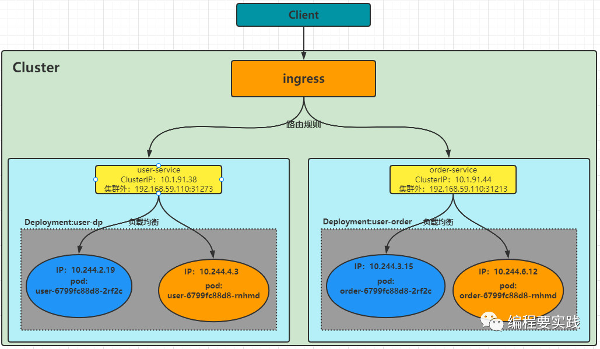

#### Ingress 是什么？

https://kubernetes.io/zh/docs/concepts/services-networking/ingress/


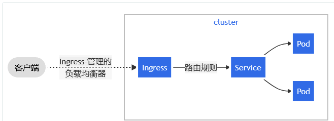

```yaml
apiVersion: networking.k8s.io/v1
kind: Ingress
metadata:
  name: ingress-wildcard-host
spec:
  rules:
  - host: "foo.bar.com"
    http:
      paths:
      - pathType: Prefix
        path: "/bar"
        backend:
          service:
            name: service1
            port:
              number: 80
  - host: "*.foo.com"
    http:
      paths:
      - pathType: Prefix
        path: "/foo"
        backend:
          service:
            name: service2
            port:
              number: 80
```


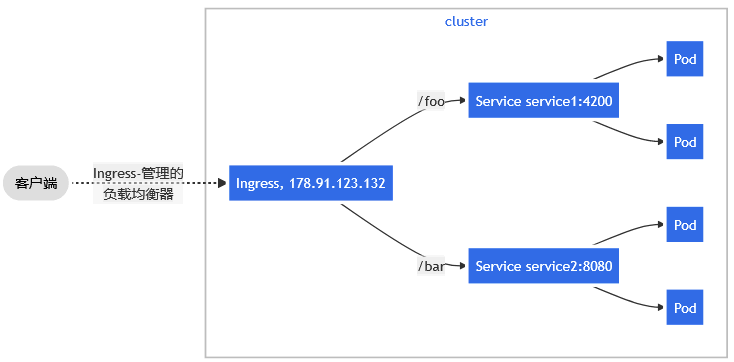

```yaml
apiVersion: networking.k8s.io/v1
kind: Ingress
metadata:
  name: simple-fanout-example
spec:
  rules:
  - host: foo.bar.com
    http:
      paths:
      - path: /foo
        pathType: Prefix
        backend:
          service:
            name: service1
            port:
              number: 4200
      - path: /bar
        pathType: Prefix
        backend:
          service:
            name: service2
            port:
              number: 8080
```

当你使用 `kubectl apply -f` 创建 Ingress 时：

```shell
kubectl describe ingress simple-fanout-example
```


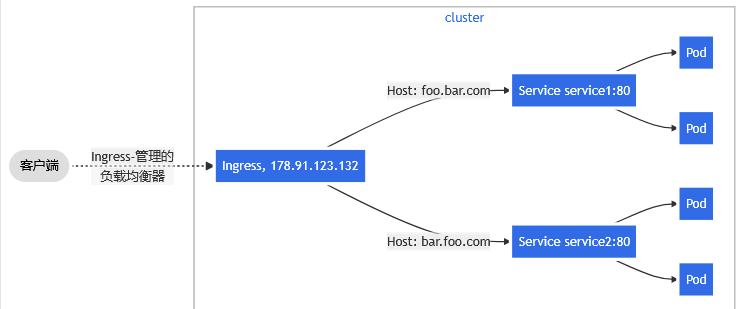

```yaml
apiVersion: networking.k8s.io/v1
kind: Ingress
metadata:
  name: name-virtual-host-ingress
spec:
  rules:
  - host: foo.bar.com
    http:
      paths:
      - pathType: Prefix
        path: "/"
        backend:
          service:
            name: service1
            port:
              number: 80
  - host: bar.foo.com
    http:
      paths:
      - pathType: Prefix
        path: "/"
        backend:
          service:
            name: service2
            port:
              number: 80
              
apiVersion: networking.k8s.io/v1
kind: Ingress
metadata:
  name: name-virtual-host-ingress-no-third-host
spec:
  rules:
  - host: first.bar.com
    http:
      paths:
      - pathType: Prefix
        path: "/"
        backend:
          service:
            name: service1
            port:
              number: 80
  - host: second.bar.com
    http:
      paths:
      - pathType: Prefix
        path: "/"
        backend:
          service:
            name: service2
            port:
              number: 80
  - http:
      paths:
      - pathType: Prefix
        path: "/"
        backend:
          service:
            name: service3
            port:
              number: 80
```


#### 版本关系

https://kubernetes.github.io/ingress-nginx/

https://github.com/kubernetes/ingress-nginx/、https://gitee.com/k8s_s/ingress-nginx/

| Ingress-NGINX version | k8s supported version        | Alpine Version | Nginx Version |
| --------------------- | ---------------------------- | -------------- | ------------- |
| v1.2.0                | 1.23, 1.22, 1.21, 1.20, 1.19 | 3.14.6         | 1.19.10†      |
| v1.1.3                | 1.23, 1.22, 1.21, 1.20, 1.19 | 3.14.4         | 1.19.10†      |
| v1.1.2                | 1.23, 1.22, 1.21, 1.20, 1.19 | 3.14.2         | 1.19.9†       |
| v1.1.1                | 1.23, 1.22, 1.21, 1.20, 1.19 | 3.14.2         | 1.19.9†       |
| v1.1.0                | 1.22, 1.21, 1.20, 1.19       | 3.14.2         | 1.19.9†       |
| v1.0.5                | 1.22, 1.21, 1.20, 1.19       | 3.14.2         | 1.19.9†       |
| v1.0.4                | 1.22, 1.21, 1.20, 1.19       | 3.14.2         | 1.19.9†       |
| v1.0.3                | 1.22, 1.21, 1.20, 1.19       | 3.14.2         | 1.19.9†       |
| v1.0.2                | 1.22, 1.21, 1.20, 1.19       | 3.14.2         | 1.19.9†       |
| v1.0.1                | 1.22, 1.21, 1.20, 1.19       | 3.14.2         | 1.19.9†       |
| v1.0.0                | 1.22, 1.21, 1.20, 1.19       | 3.13.5         | 1.20.1        |

**Ingress-nginx 版本选择**

>https://gitee.com/k8s_s/ingress-nginx/blob/controller-v1.1.3/deploy/static/provider/baremetal/1.22/deploy.yaml
>
>https://gitee.com/k8s_s/ingress-nginx/blob/controller-v1.2.0/deploy/static/provider/baremetal/1.22/deploy.yaml

**yaml文件需要的镜像2个**

> docker push registry.cn-chengdu.aliyuncs.com/jinfang/kube-webhook-certgen:v1.5.2
>
> docker push registry.cn-chengdu.aliyuncs.com/jinfang/nginx-ingress-controller:1.2.0

1.2.0

[nginx-ingress-controller](https://hub.docker.com/r/bitnami/nginx-ingress-controller/tags)、[kube-webhook-certgen:1.5.2](https://hub.docker.com/search?q=kube-webhook-certgen)

#### Ingress注意事项

```
apiVersion: networking.k8s.io/v1
import "k8s.io/api/networking/v1"
```

#### 文档教程：

https://kubesphere.io/zh/learn/level_2/lesson_9/content/、https://www.yuque.com/leifengyang/oncloud/ctiwgo#JEtqN

#### 1、部署&删除 ingress 服务

kubectl apply -f ingress-controller-1.2.0.yaml

kubectl delete -f ingress-controller-1.2.0.yaml

#### 2、创建 svc、deploy（nginx、tomcat）

##### tomcat

以 [tomcat6 ](#xxx.yaml)为例 

kapp tomcat6-deploy.yaml

```yaml
apiVersion: apps/v1
kind: Deployment
metadata:
  labels:
    app: tomcat
  name: tomcat
spec:
  replicas: 3
  selector:
    matchLabels:
      app: tomcat
  template:
    metadata:
      labels:
        app: tomcat
    spec:
      containers:
      - image: registry.cn-chengdu.aliyuncs.com/jinfang/tomcat:9.0.62-jre11-temurin-focal-final
        name: tomcat
        ports:
        - containerPort: 8080
        imagePullPolicy: IfNotPresent
---
apiVersion: v1
kind: Service
metadata:
  labels:
    app: tomcat
  name: tomcat
  namespace: default
spec:
  ports:
  - port: 8002
    protocol: TCP
    targetPort: 8080
  selector:
    app: tomcat
  type: ClusterIP
```

##### nginx

kapp nginx-deploy.yaml

```yaml
apiVersion: apps/v1
kind: Deployment
metadata:
  labels:
    app: nginx
  name: nginx
spec:
  replicas: 3
  selector:
    matchLabels:
      app: nginx
  template:
    metadata:
      labels:
        app: nginx
    spec:
      containers:
      - image: registry.cn-chengdu.aliyuncs.com/jinfang/nginx:1.21.6-alpine
        name: nginx
        ports:
        - containerPort: 80
        imagePullPolicy: IfNotPresent
---
apiVersion: v1
kind: Service
metadata:
  labels:
    app: nginx
  name: nginx
  namespace: default
spec:
  ports:
  - port: 8001
    protocol: TCP
    targetPort: 80
  selector:
    app: nginx
  type: ClusterIP

```


#### 3、创建 ingress 规则

https://v1-22.docs.kubernetes.io/zh/docs/concepts/services-networking/ingress/

##### tomcat

kapp ingress-tomcat.yaml

```yaml
apiVersion: networking.k8s.io/v1
kind: Ingress
metadata: 
  name: ingress-tomcat
  namespace: default
  annotations:
    # 重写配置
    nginx.ingress.kubernetes.io/rewrite-target: /$2
    # 限流
    nginx.ingress.kubernetes.io/limit-rps: "1"
    # 跨域
    nginx.ingress.kubernetes.io/enable-cors: "true"    
spec:
  ingressClassName: nginx
  rules:
  - host: "tomcat.k8s.com"
    http:
      paths:
      - pathType: Prefix
        path: "/"
        backend:
          service:
            name: tomcat
            port:
              number: 8002
  - host: "tomcat.k8s.com"
    http:
      paths:
      - pathType: Prefix
        path: "/nginx(/|$)(.*)"
        backend:
          service:
            name: nginx
            port:
              number: 8001
```

##### nginx + 限流+跨域

kapp ingress-nginx.yaml

```yaml
apiVersion: networking.k8s.io/v1
kind: Ingress
metadata: 
  name: ingress-nginx
  namespace: default
  annotations:
    # 重写配置 # 
    nginx.ingress.kubernetes.io/rewrite-target: /$2
    # 限流
    nginx.ingress.kubernetes.io/limit-rps: "1"
    # 跨域
    nginx.ingress.kubernetes.io/enable-cors: "true"
spec:
  ingressClassName: nginx
  rules:
  - host: "nginx.k8s.com"
    http:
      paths:
      - pathType: Prefix
        path: "/"
        backend:
          service:
            name: nginx
            port:
              number: 8001
  - host: "nginx.k8s.com"
    http:
      paths:
      - pathType: Prefix
        path: "/tomcat(/|$)(.*)"
        backend:
          service:
            name: tomcat
            port:
              number: 8002
```

http://test.nginx.com:

#### 报错：validate.nginx.ingress.kubernetes.io

error when creating "ingress-nginx.yaml": Internal error occurred: failed calling webhook "validate.nginx.ingress.kubernetes.io": Post "https://ingress-nginx-controller-admission.ingress-nginx.svc:443/networking/v1/ingresses?timeout=10s": x509: certificate signed by unknown authority

```
kg validatingwebhookconfigurations     --》		ingress-nginx-admission

删除：kubectl delete -A ValidatingWebhookConfiguration ingress-nginx-admission
```

#### 补充

补充：另外需要在 ingress-controller-1.2.0.yaml 部署配置中

- 将 `rbac.authorization.k8s.io/v1beta1` 改为 `rbac.authorization.k8s.io/v1`
- 将 `image: quay.io/kubernetes-ingress-controller/nginx-ingress-controller:0.29.0` 改为 `image: docker.io/bitnami/nginx-ingress-controller:latest`

4、更新 Ingress

```shell
kubectl describe ingress $Name
kubectl edit ingress $Name
```

#### n、查看状态：

更多命令：[k8s-alias](#k8s-alias)

空间名称：kg pods --all-namespaces -o wide

```shell
[root@master-120 ~]$ kg pods --all-namespaces -o wide
NAMESPACE       NAME                                        READY   STATUS      RESTARTS   AGE     IP                NODE         NOMINATED NODE   READINESS GATES
default         nginx-689b55fcd-6dp5r                       1/1     Running     0          30m     10.244.2.4        node-122     <none>           <none>
default         nginx-689b55fcd-n7fg4                       1/1     Running     0          30m     10.244.1.4        node-123     <none>           <none>
default         nginx-689b55fcd-r7bxt                       1/1     Running     0          30m     10.244.3.4        node-121     <none>           <none>
default         tomcat-549f8d66bc-fcjfp                     1/1     Running     0          30m     10.244.1.5        node-123     <none>           <none>
default         tomcat-549f8d66bc-msfvd                     1/1     Running     0          30m     10.244.2.5        node-122     <none>           <none>
default         tomcat-549f8d66bc-w85zm                     1/1     Running     0          30m     10.244.3.5        node-121     <none>           <none>
ingress-nginx   ingress-nginx-admission-create--1-hbsxj     0/1     Completed   0          33m     10.244.2.3        node-122     <none>           <none>
ingress-nginx   ingress-nginx-controller-5898458b5c-5wwxs   1/1     Running     0          33m     10.244.1.3        node-123     <none>           <none>
```

kg pod -n ingress-nginx -o wide

```shell
[a@master ~]$ kg pod -n ingress-nginx -o wide
NAME                                        READY   STATUS      RESTARTS   AGE   IP            NODE    NOMINATED NODE   READINESS GATES
ingress-nginx-admission-create-h6wmw        0/1     Completed   0          47m   10.244.3.22   node3   <none>           <none>
ingress-nginx-admission-patch-27bm2         0/1     Completed   0          47m   10.244.1.21   node2   <none>           <none>
ingress-nginx-controller-5898458b5c-x98tl   1/1     Running     0          47m   10.244.3.23   node3   <none>           <none>
```

查看ingress-nginx所有服务：kg all -n ingress-nginx -o wide

##### （用）kg ingress -owide、kg pod --show-labels

```shell
[root@master-120 ~]# kg ingress -owide
NAME            CLASS   HOSTS                           ADDRESS           PORTS   AGE
ingress-nginx   nginx   test.nginx.com,test.nginx.com   192.168.101.122   80      20h
[root@master-120 ~]# kg pod --show-labels
NAME                      READY   STATUS    RESTARTS      AGE   LABELS
nginx-689b55fcd-2c8v8     1/1     Running   1 (19h ago)   20h   app=nginx,pod-template-hash=689b55fcd
nginx-689b55fcd-5qpkp     1/1     Running   1 (19h ago)   20h   app=nginx,pod-template-hash=689b55fcd
nginx-689b55fcd-gpdqz     1/1     Running   1 (19h ago)   20h   app=nginx,pod-template-hash=689b55fcd
tomcat-549f8d66bc-bln66   1/1     Running   1 (19h ago)   20h   app=tomcat,pod-template-hash=549f8d66bc
tomcat-549f8d66bc-rqhvm   1/1     Running   1 (19h ago)   20h   app=tomcat,pod-template-hash=549f8d66bc
tomcat-549f8d66bc-zkc94   1/1     Running   1 (19h ago)   20h   app=tomcat,pod-template-hash=549f8d66bc
```

##### （用）查看svc服务：kg svc -n ingress-nginx

```shell
[a@master ~]$ kg svc -n ingress-nginx
NAME                                 TYPE        CLUSTER-IP      EXTERNAL-IP   PORT(S)                      AGE
ingress-nginx-controller             NodePort    10.96.123.65    <none>        80:31861/TCP,443:31236/TCP   48m
ingress-nginx-controller-admission   ClusterIP   10.96.166.101   <none>        443/TCP                      48m
```

查看 pod 描述：k describe pod  -n ingress-nginx 

```shell
[a@master ~]$ k describe pod  -n ingress-nginx
Name:         ingress-nginx-admission-create-h6wmw
Namespace:    ingress-nginx
Priority:     0
Node:         node3/192.168.101.123
Start Time:   Fri, 06 May 2022 03:30:55 +0800
IP:           10.244.3.22
IPs:
  IP:           10.244.3.22
Name:         ingress-nginx-admission-patch-27bm2
Namespace:    ingress-nginx
Priority:     0
Node:         node2/192.168.101.122
IP:           10.244.1.21
IPs:
  IP:           10.244.1.21
```

##### （用）查看 ingress 描述：kubectl describe ingress

```
[a@master ~]$ kubectl describe ingress ingress-nginx
Name:             ingress-nginx
Namespace:        default
Address:          192.168.101.123
Default backend:  default-http-backend:80 (<error: endpoints "default-http-backend" not found>)
Rules:
  Host            Path  Backends
  ----            ----  --------
  test.nginx.com
                  /   nginx:8000 (10.244.1.30:80,10.244.1.31:80,10.244.3.28:80)
  test.nginx.com
                  /nginx(/|$)(.*)   nginx:8000 (10.244.1.30:80,10.244.1.31:80,10.244.3.28:80)
```

```
[a@master ~]$ kubectl describe ingress ingress-tomcat
Name:             ingress-tomcat
Namespace:        default
Address:          192.168.101.123
Default backend:  default-http-backend:80 (<error: endpoints "default-http-backend" not found>)
Rules:
  Host             Path  Backends
  ----             ----  --------
  test.tomcat.com
                      tomcat:8001 (10.244.1.32:8080,10.244.1.33:8080,10.244.3.30:8080)
```

k logs  ingress-nginx

#### 5、访问

http://tomcat.k8s.com:31839、http://nginx.k8s.com:31839

if [tomcat 404](#tomcat404)

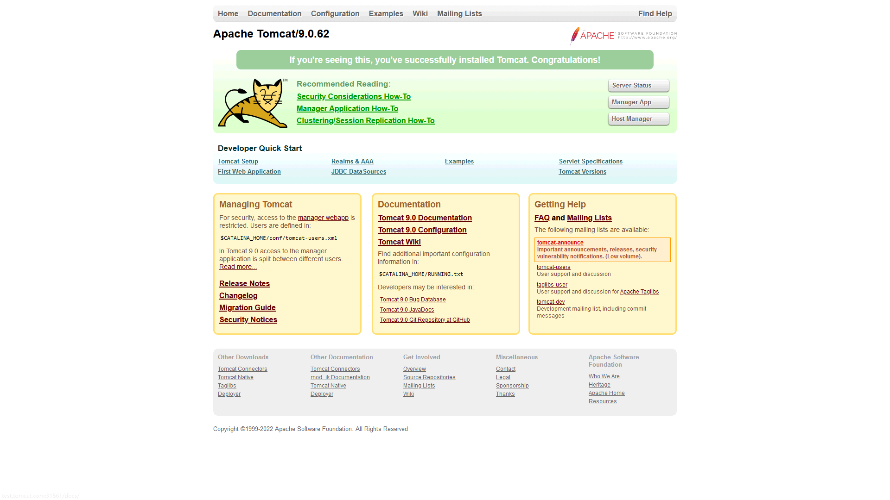

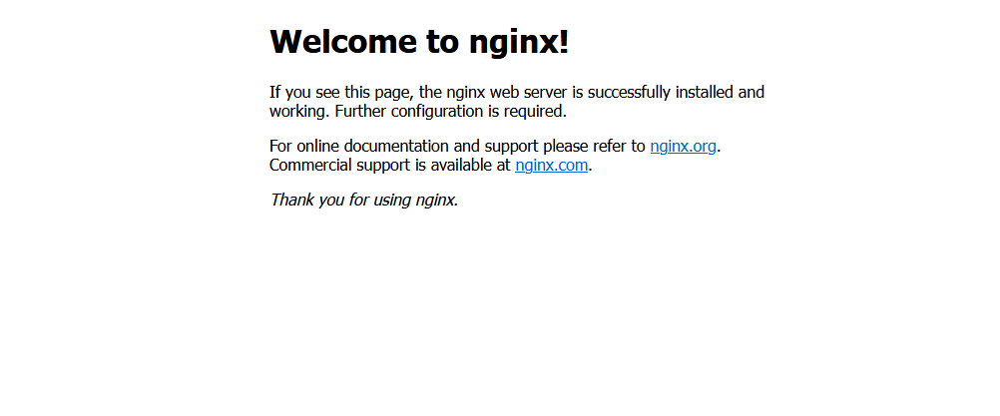

-------------

--------------

# 二、KubeSphere -> master<a name="KubeSphere"></a>

官网：https://kubesphere.com.cn/zh/	

教程：https://github.com/kubesphere/ks-installer/blob/master/README_zh.md

https://gitee.com/k8s_s/kubesphere、https://gitee.com/k8s_s/ks-installer

## KubeSphere 版本选择

| KubeSphere |            支持的 Kubernetes 版本             |
| :--------: | :-------------------------------------------: |
|   3.3.x    | 1.19.x, 1.20.x, 1.21.x, 1.22.x (experimental) |
|   3.2.x    | 1.19.x, 1.20.x, 1.21.x, 1.22.x (experimental) |
|   3.1.x    |        1.17.x, 1.18.x, 1.19.x, 1.20.x         |
|   3.0.x    |        1.15.x, 1.16.x, 1.17.x, 1.18.x         |

## 1、设置存储类型（nfs文件系统）

在安装之前，需要配置 Kubernetes 集群中的**默认**存储类型。

安装nfs:https://zhuanlan.zhihu.com/p/411489781

storageclass存储方法:https://blog.csdn.net/weixin_43384009/article/details/105958068

nfs文件系统:https://www.yuque.com/leifengyang/oncloud/gz1sls

### 1、nfs文件系统

#### a、安装nfs文件系统
```
#在每个机器。
yum install -y nfs-utils

#在master 执行以下命令 
echo "/nfs/data/ *(insecure,rw,sync,no_root_squash)" > /etc/exports

#执行以下命令，启动 nfs 服务;创建共享目录
mkdir -p /nfs/data

#在master执行
systemctl enable rpcbind
systemctl enable nfs-server
systemctl start rpcbind
systemctl start nfs-server
systemctl status rpcbind
systemctl status nfs-server

#使配置生效
exportfs -r
#检查配置是否生效
exportfs
```
#### b、配置nfs-client（选做）
```
showmount -e 192.168.101.120
mkdir -p /nfs/data
mount -t nfs 192.168.101.120:/nfs/data /nfs/data
```

#### c、配置默认存储
创建一个文件 vim ./nfs.yaml
```yaml
apiVersion: storage.k8s.io/v1
kind: StorageClass
metadata:
  name: nfs-storage
  annotations:
    storageclass.kubernetes.io/is-default-class: "true"
provisioner: k8s-sigs.io/nfs-subdir-external-provisioner
parameters:
  archiveOnDelete: "true"  ## 删除pv的时候，pv的内容是否要备份

---
apiVersion: apps/v1
kind: Deployment
metadata:
  name: nfs-client-provisioner
  labels:
    app: nfs-client-provisioner
  # replace with namespace where provisioner is deployed
  namespace: default
spec:
  replicas: 1
  strategy:
    type: Recreate
  selector:
    matchLabels:
      app: nfs-client-provisioner
  template:
    metadata:
      labels:
        app: nfs-client-provisioner
    spec:
      serviceAccountName: nfs-client-provisioner
      containers:
        - name: nfs-client-provisioner
          image: registry.cn-chengdu.aliyuncs.com/jinfang/nfs:v4.0.2
          # resources:
          #    limits:
          #      cpu: 10m
          #    requests:
          #      cpu: 10m
          volumeMounts:
            - name: nfs-client-root
              mountPath: /persistentvolumes
          env:
            - name: PROVISIONER_NAME
              value: k8s-sigs.io/nfs-subdir-external-provisioner
            - name: NFS_SERVER
              value: 192.168.101.120 ## 指定自己nfs服务器地址
            - name: NFS_PATH  
              value: /nfs/data  ## nfs服务器共享的目录
      volumes:
        - name: nfs-client-root
          nfs:
            server: 192.168.101.120
            path: /nfs/data
---
apiVersion: v1
kind: ServiceAccount
metadata:
  name: nfs-client-provisioner
  # replace with namespace where provisioner is deployed
  namespace: default
---
kind: ClusterRole
apiVersion: rbac.authorization.k8s.io/v1
metadata:
  name: nfs-client-provisioner-runner
rules:
  - apiGroups: [""]
    resources: ["nodes"]
    verbs: ["get", "list", "watch"]
  - apiGroups: [""]
    resources: ["persistentvolumes"]
    verbs: ["get", "list", "watch", "create", "delete"]
  - apiGroups: [""]
    resources: ["persistentvolumeclaims"]
    verbs: ["get", "list", "watch", "update"]
  - apiGroups: ["storage.k8s.io"]
    resources: ["storageclasses"]
    verbs: ["get", "list", "watch"]
  - apiGroups: [""]
    resources: ["events"]
    verbs: ["create", "update", "patch"]
---
kind: ClusterRoleBinding
apiVersion: rbac.authorization.k8s.io/v1
metadata:
  name: run-nfs-client-provisioner
subjects:
  - kind: ServiceAccount
    name: nfs-client-provisioner
    # replace with namespace where provisioner is deployed
    namespace: default
roleRef:
  kind: ClusterRole
  name: nfs-client-provisioner-runner
  apiGroup: rbac.authorization.k8s.io
---
kind: Role
apiVersion: rbac.authorization.k8s.io/v1
metadata:
  name: leader-locking-nfs-client-provisioner
  # replace with namespace where provisioner is deployed
  namespace: default
rules:
  - apiGroups: [""]
    resources: ["endpoints"]
    verbs: ["get", "list", "watch", "create", "update", "patch"]
---
kind: RoleBinding
apiVersion: rbac.authorization.k8s.io/v1
metadata:
  name: leader-locking-nfs-client-provisioner
  # replace with namespace where provisioner is deployed
  namespace: default
subjects:
  - kind: ServiceAccount
    name: nfs-client-provisioner
    # replace with namespace where provisioner is deployed
    namespace: default
roleRef:
  kind: Role
  name: leader-locking-nfs-client-provisioner
  apiGroup: rbac.authorization.k8s.io
```

kubectl apply -f nfs.yaml

#### d、确认配置是否生效

kubectl get sc

### 2、metrics-server

vim metrics-server.yaml

kubectl apply -f metrics-server.yaml

```yaml
apiVersion: v1
kind: ServiceAccount
metadata:
  labels:
    k8s-app: metrics-server
  name: metrics-server
  namespace: kube-system
---
apiVersion: rbac.authorization.k8s.io/v1
kind: ClusterRole
metadata:
  labels:
    k8s-app: metrics-server
    rbac.authorization.k8s.io/aggregate-to-admin: "true"
    rbac.authorization.k8s.io/aggregate-to-edit: "true"
    rbac.authorization.k8s.io/aggregate-to-view: "true"
  name: system:aggregated-metrics-reader
rules:
- apiGroups:
  - metrics.k8s.io
  resources:
  - pods
  - nodes
  verbs:
  - get
  - list
  - watch
---
apiVersion: rbac.authorization.k8s.io/v1
kind: ClusterRole
metadata:
  labels:
    k8s-app: metrics-server
  name: system:metrics-server
rules:
- apiGroups:
  - ""
  resources:
  - pods
  - nodes
  - nodes/stats
  - namespaces
  - configmaps
  verbs:
  - get
  - list
  - watch
---
apiVersion: rbac.authorization.k8s.io/v1
kind: RoleBinding
metadata:
  labels:
    k8s-app: metrics-server
  name: metrics-server-auth-reader
  namespace: kube-system
roleRef:
  apiGroup: rbac.authorization.k8s.io
  kind: Role
  name: extension-apiserver-authentication-reader
subjects:
- kind: ServiceAccount
  name: metrics-server
  namespace: kube-system
---
apiVersion: rbac.authorization.k8s.io/v1
kind: ClusterRoleBinding
metadata:
  labels:
    k8s-app: metrics-server
  name: metrics-server:system:auth-delegator
roleRef:
  apiGroup: rbac.authorization.k8s.io
  kind: ClusterRole
  name: system:auth-delegator
subjects:
- kind: ServiceAccount
  name: metrics-server
  namespace: kube-system
---
apiVersion: rbac.authorization.k8s.io/v1
kind: ClusterRoleBinding
metadata:
  labels:
    k8s-app: metrics-server
  name: system:metrics-server
roleRef:
  apiGroup: rbac.authorization.k8s.io
  kind: ClusterRole
  name: system:metrics-server
subjects:
- kind: ServiceAccount
  name: metrics-server
  namespace: kube-system
---
apiVersion: v1
kind: Service
metadata:
  labels:
    k8s-app: metrics-server
  name: metrics-server
  namespace: kube-system
spec:
  ports:
  - name: https
    port: 443
    protocol: TCP
    targetPort: https
  selector:
    k8s-app: metrics-server
---
apiVersion: apps/v1
kind: Deployment
metadata:
  labels:
    k8s-app: metrics-server
  name: metrics-server
  namespace: kube-system
spec:
  selector:
    matchLabels:
      k8s-app: metrics-server
  strategy:
    rollingUpdate:
      maxUnavailable: 0
  template:
    metadata:
      labels:
        k8s-app: metrics-server
    spec:
      containers:
      - args:
        - --cert-dir=/tmp
        - --kubelet-insecure-tls
        - --secure-port=4443
        - --kubelet-preferred-address-types=InternalIP,ExternalIP,Hostname
        - --kubelet-use-node-status-port
        image: registry.cn-chengdu.aliyuncs.com/jinfang/metrics-server:v0.4.3
        imagePullPolicy: IfNotPresent
        livenessProbe:
          failureThreshold: 3
          httpGet:
            path: /livez
            port: https
            scheme: HTTPS
          periodSeconds: 10
        name: metrics-server
        ports:
        - containerPort: 4443
          name: https
          protocol: TCP
        readinessProbe:
          failureThreshold: 3
          httpGet:
            path: /readyz
            port: https
            scheme: HTTPS
          periodSeconds: 10
        securityContext:
          readOnlyRootFilesystem: true
          runAsNonRoot: true
          runAsUser: 1000
        volumeMounts:
        - mountPath: /tmp
          name: tmp-dir
      nodeSelector:
        kubernetes.io/os: linux
      priorityClassName: system-cluster-critical
      serviceAccountName: metrics-server
      volumes:
      - emptyDir: {}
        name: tmp-dir
---
apiVersion: apiregistration.k8s.io/v1
kind: APIService
metadata:
  labels:
    k8s-app: metrics-server
  name: v1beta1.metrics.k8s.io
spec:
  group: metrics.k8s.io
  groupPriorityMinimum: 100
  insecureSkipTLSVerify: true
  service:
    name: metrics-server
    namespace: kube-system
  version: v1beta1
  versionPriority: 100
```

## 2、PV&PVC

> PV：持久卷（Persistent Volume），将应用需要持久化的数据保存到指定位置
>
> PVC：持久卷申明（**Persistent Volume Claim**），申明需要使用的持久卷规格

### 1、创建pv池 pv.yaml

静态供应

```yaml
#nfs主节点
mkdir -p /nfs/data/01 && \
mkdir -p /nfs/data/02 && \
mkdir -p /nfs/data/03
```

创建PV

pv.yaml

kaf pv.yaml

```yaml
apiVersion: v1
kind: PersistentVolume
metadata:
  name: pv01-10m
spec:
  capacity:
    storage: 10M
  accessModes:
    - ReadWriteMany
  storageClassName: nfs
  nfs:
    path: /nfs/data/01
    server: 192.168.101.120
---
apiVersion: v1
kind: PersistentVolume
metadata:
  name: pv02-1gi
spec:
  capacity:
    storage: 1Gi
  accessModes:
    - ReadWriteMany
  storageClassName: nfs
  nfs:
    path: /nfs/data/02
    server: 192.168.101.120
---
apiVersion: v1
kind: PersistentVolume
metadata:
  name: pv03-3gi
spec:
  capacity:
    storage: 3Gi
  accessModes:
    - ReadWriteMany
  storageClassName: nfs
  nfs:
    path: /nfs/data/03
    server: 192.168.101.120
```

### 2、PVC创建与绑定 pvc.yaml

创建PVC

pvc.yaml

kaf pvc.yaml

```yaml
kind: PersistentVolumeClaim
apiVersion: v1
metadata:
  name: nginx-pvc
spec:
  accessModes:
    - ReadWriteMany
  resources:
    requests:
      storage: 200Mi
  storageClassName: nfs
```

### 3、创建Pod绑定PVC pvc-deploy.yaml

pvc-deploy.yaml

kaf pvc-deploy.yaml

```yaml
apiVersion: apps/v1
kind: Deployment
metadata:
  labels:
    app: nginx-deploy-pvc
  name: nginx-deploy-pvc
spec:
  replicas: 3
  selector:
    matchLabels:
      app: nginx-deploy-pvc
  template:
    metadata:
      labels:
        app: nginx-deploy-pvc
    spec:
      containers:
      - image: registry.cn-chengdu.aliyuncs.com/jinfang/nginx:1.21.6-alpine
        name: nginx
        volumeMounts:
        - name: html
          mountPath: /usr/share/nginx/html
      volumes:
        - name: html
          persistentVolumeClaim:
            claimName: nginx-pvc
```

## 3、ConfigMap 

> 抽取应用配置，并且可以自动更新

### 1、redis示例

#### 1、把之前的配置文件创建为配置集

创建配置，redis保存到k8s的etcd；

```yaml
kubectl create cm redis-conf --from-file=redis.conf
```

redis.yaml

kaf redis.yaml

```yaml
apiVersion: v1
kind: ConfigMap
metadata:
  name: redis-conf
  namespace: default
data:    #data是所有真正的数据，key：默认是文件名   value：配置文件的内容
  redis.conf: |
    appendonly yes
```

#### 2、创建Pod

redis-pod.yaml

kaf redis-pod.yaml

```yaml
apiVersion: v1
kind: Pod
metadata:
  name: redis
spec:
  containers:
  - name: redis
    image: registry.cn-chengdu.aliyuncs.com/jinfang/redis:6.2.6.1
    command:
      - redis-server
      - "/redis-master/redis.conf"  #指的是redis容器内部的位置
    ports:
    - containerPort: 6379
    volumeMounts:
    - mountPath: /data
      name: data
    - mountPath: /redis-master
      name: config
  volumes:
    - name: data
      emptyDir: {}
    - name: config
      configMap:
        name: redis-conf
        items:
        - key: redis.conf
          path: redis.conf
```

#### 3、检查默认配置

```yaml
kubectl exec -it redis -- redis-cli

127.0.0.1:6379> CONFIG GET appendonly
127.0.0.1:6379> CONFIG GET requirepass
```

#### 4、修改ConfigMap

redis.yaml

```yaml
apiVersion: v1
kind: ConfigMap
metadata:
  name: example-redis-config
data:		#data是所有真正的数据，key：默认是文件名   value：配置文件的内容
  redis-config: |
    maxmemory 2mb
    maxmemory-policy allkeys-lru 
```

#### 5、检查配置是否更新

```yaml
kubectl exec -it redis -- redis-cli

127.0.0.1:6379> CONFIG GET maxmemory
127.0.0.1:6379> CONFIG GET maxmemory-policy
```

> 检查指定文件内容是否已经更新
>
> 修改了CM。Pod里面的配置文件会跟着变


> 配置值未更改，因为需要重新启动 Pod 才能从关联的 ConfigMap 中获取更新的值。
>
> 原因：我们的Pod部署的中间件自己本身没有热更新能力

## 4、secret

>Secret 对象类型用来保存敏感信息，例如密码、OAuth 令牌和 SSH 密钥。 将这些信息放在 secret 中比放在 [Pod](https://kubernetes.io/docs/concepts/workloads/pods/pod-overview/) 的定义或者 [容器镜像](https://kubernetes.io/zh/docs/reference/glossary/?all=true#term-image) 中来说更加安全和灵活。

```yaml
##命令格式
kubectl create secret docker-registry jinfang-docker \
  --docker-server=registry.cn-chengdu.aliyuncs.com/jinfang \
  --docker-username=小牛程序app \
  --docker-password=yujinhua66 \
  --docker-email=iskong9@163.com
```

secret-pod.yaml

kaf secret-pod.yaml

```yaml
apiVersion: v1
kind: Pod
metadata:
  name: private-nginx
spec:
  containers:
  - name: private-nginx
    image: registry.cn-chengdu.aliyuncs.com/jinfang/redis:6.2.6.1
  imagePullSecrets:
  - name: jinfang-docker
```

## 需要的镜像：

> kubesphere/pause:3.4.1
>
> kubesphere/kube-apiserver:v1.22.9
>
> kubesphere/kube-proxy:v1.22.9
>
> kubesphere/kube-controller-manager:v1.22.9
>
> kubesphere/kube-proxy:v1.22.9
>
> kubesphere/kube-scheduler:v1.22.9
>
> kubesphere/k8s-dns-node-cache:1.15.12
>
> kubesphere/k8s-dns-node-cache:1.15.12
>
> coredns/coredns:v1.8.4
>
> calico/kube-controllers:v3.20.0
>
> calico/cni:v3.20.0
>
> calico/kube-controllers:v3.20.0
>
> calico/node:v3.20.0
>
> calico/cni:v3.20.0
>
> calico/pod2daemon-flexvol:v3.20.0

dkpush registry.cn-chengdu.aliyuncs.com/jinfang/ks-apiserver:v3.2.1 && \

dkpush registry.cn-chengdu.aliyuncs.com/jinfang/ks-console:v3.2.1 && \

dkpush registry.cn-chengdu.aliyuncs.com/jinfang/fluent-bit:v1.8.3 && \

dkpush registry.cn-chengdu.aliyuncs.com/jinfang/kube-rbac-proxy:v0.8.0 && \

dkpush registry.cn-chengdu.aliyuncs.com/jinfang/openldap:1.3.0 && \

dkpush registry.cn-chengdu.aliyuncs.com/jinfang/node-exporter:v0.18.1


## 1）、环境安装

### A、Helm

**Helm 是 Kubernetes 的包管理器，适用于 kubeSphere2.x 版本，kubeSphere3.x 使用** [# KubeKey](#KubeKey)

#### Helm 版本选择

| Helm 版本 | 支持的 Kubernetes 版本 |
| :-------: | :--------------------: |
|   3.8.x   |    1.23.x - 1.20.x     |
|   3.7.x   |    1.22.x - 1.19.x     |
|   3.6.x   |    1.21.x - 1.18.x     |
|   3.5.x   |    1.20.x - 1.17.x     |
|   3.4.x   |    1.19.x - 1.16.x     |

#### [安装 Helm3.6.3](https://devopscube.com/install-configure-helm-kubernetes/)

说明文档：https://docs.helm.sh/zh/	https://v3.helm.sh/zh/docs/

下载：https://github.com/helm/helm、https://gitee.com/k8s_s/helm

> tar:	https://github.com/helm/helm/releases/v3.6.3
>

##### a、从sh文件安装 helm 3

**第一步：** 下载最新的 helm 安装脚本。 get_helm.sh可以修改：downloadFile()方法的 ==DOWNLOAD_URL== ：指定可以下载的helm文件地址

```
curl -fsSL -o get_helm3.sh https://raw.githubusercontent.com/helm/helm/main/scripts/get-helm-3
```

```shell
checkDesiredVersion方法返回：TAG="v3.6.3"
helm-${TAG}-${OS}-${ARCH}.换成 helm-v3.6.3-linux-amd64.
HELM_TMP_ROOT="$(mktemp -dt helm-installer-XXXXXX)" 换成 HELM_TMP_ROOT="helm-installer-T53LxQ"
local github_release_url="https://github.com/helm/helm/releases/download/${TAG}" 换成 https://github.com/helm/
手动下载：
curl -SsL https://github.com/helm/helm-v3.6.3-linux-amd64.tar.gz.sha256 -o /tmp/helm-installer-T53LxQ/helm-v3.6.3-linux-amd64.tar.gz.sha256
curl -SsL https://github.com/helm/helm-v3.6.3-linux-amd64.tar.gz -o /tmp/helm-installer-T53LxQ/helm-v3.6.3-linux-amd64.tar.gz
```

```
chmod 777 get_helm3.sh	&& chmod +x get_helm3.sh
```

```
./get_helm3.sh
```

```
helm |  helm version
```

##### b、从二进制安装 Helm3<a name="从二进制安装 Helm3"></a>

**第 1 步：** 前往：https://github.com/helm/helm/releases/v3.6.3 或者上面的地址

**第 2 步：** 使用 wget 下载二进制文件。 

```
wget -O helm.tar.gz https://get.helm.sh/helm-v3.6.3-linux-amd64.tar.gz
```

**第 3 步：** 解压下载的文件。 

```shell
  chmod -R 777 helm-v3.6.3-linux-amd64.tar.gz && tar -zxvf helm-v3.6.3-linux-amd64.tar.gz &&   chmod +x /home/a/linux-amd64/helm &&   cp /home/a/linux-amd64/helm /usr/local/bin/ && rm -rf /home/a/linux-amd64 && ls /usr/local/bin/ && helm version
```

**第 6 步：** 添加repo

[添加稳定的 repo](#Repo)

**第 7 步：** 查看存储类型

> kg sc --all-namespaces

helm3 变化:

1. 去除Tiller 和 helm serve

2. 预定义仓库被移除，添加helm hub

helm search 现在区分 repo 和hub
 repo 是自己手动添加的源
 比如官方的有稳定版和在建设的

```shell
helm repo add stable https://kubernetes-charts.storage.googleapis.com
helm repo add incubator https://kubernetes-charts-incubator.storage.googleapis.com/
helm repo add ibmstable https://raw.githubusercontent.com/IBM/charts/master/repo/stable
# 此处 repo add 的时候，如果名称已存在了也不提醒，居然直接覆盖了，是bug吧
```

可以把 hub 和 google repo 配合起来食用，效果更佳

```
helm search hub mysql
```

3. Values 支持 JSON Schema 校验器

4. 代码复用 - Library Chart 支持

当一个 Chart 想要使用该 Library Chart内的一些模板时，可以在 Chart.yaml 的 dependencies 依赖项中指定

5. requirements.yaml 被整合到了 Chart.yaml 中，但格式保持不变

helm2/3 命令差异

###### 常用命令一览

| 命令          | Helm2 | Helm3 | 对应h3增强、区别 | 命令说明                                           |
| ------------- | ----- | ----- | ---------------- | -------------------------------------------------- |
| create        | 有    | 有    | 无               | 创建具有给定名称的新图表                           |
| delete        | 有    | 无    | -                | 给定发布名称，从Kubernetes中删除该发布             |
| dependency    | 有    | 有    | 无               | 管理图表的依赖项                                   |
| fetch         | 有    | 无    | - **pull**       | 从存储库下载图表，并（可选）将其解压缩到本地目录中 |
| get           | 有    | 有    | 有               | 下载命名版本                                       |
| history       | 有    | 有    | 无               | 获取发布历史记录                                   |
| home          | 有    | 无    | - **env**        | 显示HELM_HOME的位置                                |
| init          | 有    | 无    | -                | 在客户端和服务器上初始化Helm                       |
| inspect       | 有    | 无    | - **show**       | 查阅图表                                           |
| install       | 有    | 有    | 有               | 安装图表存档                                       |
| lint          | 有    | 有    | 无               | 检查图表中可能出现的问题                           |
| list          | 有    | 有    | 无               | 列表发布                                           |
| package       | 有    | 有    | 无               | 将图表目录打包到图表存档中                         |
| plugin        | 有    | 有    | 有               | 添加、列出或删除头盔插件                           |
| repo          | 有    | 有    | 无               | 添加、列出、删除、更新和索引图表存储库             |
| reset         | 有    | 无    | -                | 从集群卸载Tiller                                   |
| rollback      | 有    | 有    | 无               | 将发布回滚到以前的版本                             |
| search        | 有    | 有    | 无               | 在图表中搜索关键字                                 |
| serve         | 有    | 无    | -                | 启动本地http web服务器                             |
| status        | 有    | 有    | 无               | 显示命名版本的状态                                 |
| template      | 有    | 有    | 无               | 本地渲染模板                                       |
| test          | 有    | 有    | 有               | 测试发布                                           |
| upgrade       | 有    | 有    | 无               | 升级发行版                                         |
| verify        | 有    | 有    | 无               | 验证给定路径上的图表是否已签名且有效               |
| version       | 有    | 有    | 有               | 打印客户端/服务器版本信息                          |
| **env**       | 无    | 有    | -                | Helm客户端环境信息                                 |
| **help**      | 无    | 有    | -                | 关于任何命令的帮助                                 |
| **pull**      | 无    | 有    | -                | 从存储库下载图表，并（可选）将其解压缩到本地目录中 |
| **show**      | 无    | 有    | -                | 显示图表的信息                                     |
| **uninstall** | 无    | 有    | -                | 卸载发行版                                         |
|               |       |       |                  |                                                    |

- env是对被删除的命令home的强化
- pull是对被删除的命令fetch的替换
- show是对被删除的命令inspect的替换
- help命令本身在Helm 2时代就可以使用，只是helm --help里面没有显示，算是文档自包含的强化
- uninstall是功能特性的增强

Helm 3: 命令发生的变化

| 命令    | Helm 2 | Helm 3 | 命令说明区别 | Helm 2 命令说明           | Helm 3命令说明           |
| ------- | ------ | ------ | ------------ | ------------------------- | ------------------------ |
| get     | 有     | 有     | 有           | 下载命名版本              | 下载命名版本的扩展信息   |
| install | 有     | 有     | 有           | 安装图表存档              | 安装图表                 |
| plugin  | 有     | 有     | 有           | 添加、列出或删除头盔插件  | 安装、列出或卸载Helm插件 |
| test    | 有     | 有     | 有           | 测试发布                  | 为发布运行测试           |
| version | 有     | 有     | 有           | 打印客户端/服务器版本信息 | 打印客户端版本信息       |

安装 helm2

a、安装方法与 [helm3](#从二进制安装 Helm3) 相同

b、helm2 初始化安装(tiller服务) helm_rbac.yaml

```yaml
apiVersion: v1
kind: ServiceAccount
metadata:
  name: tiller
  namespace: kube-system
---
apiVersion: rbac.authorization.k8s.io/v1
kind: ClusterRoleBinding
metadata:
  name: tiller
roleRef:
  apiGroup: rbac.authorization.k8s.io
  kind: ClusterRole
  name: cluster-admin
subjects:
  - kind: ServiceAccount
    name: tiller
    namespace: kube-system
```

kubectl apply -f helm_rbac.yaml


c、初始化 Helm2：部署 Tiller 

```shell
helm init --service-account=tiller --tiller-image=registry.aliyuncs.com/google_containers/tiller:v2.16.12 --history-max 300
```

```shell
helm init -i registry.aliyuncs.com/google_containers/tiller:v2.16.12 --stable-repo-url http://mirror.azure.cn/kubernetes/charts/ --service-account tiller --override spec.selector.matchLabels.'name'='tiller',spec.selector.matchLabels.'app'='helm' --output yaml | sed 's@apiVersion: extensions/v1beta1@apiVersion: apps/v1@' | kubectl apply -f -
```

#### 添加稳定的 Helm Repo <a name="Repo"></a>

```shell
# 添加阿里云的 chart 仓库
helm repo add aliyun https://kubernetes.oss-cn-hangzhou.aliyuncs.com/charts
helm repo add stable http://mirror.azure.cn/kubernetes/charts/ 推荐
helm repo add bitnami https://charts.bitnami.com/bitnami
删除：helm repo remove aliyun
# 更新chart仓库
a@node1:~$ helm repo update

# 查看配置的 chart 仓库有哪些
a@node1:~$ helm repo list
NAME    URL
aliyun  https://kubernetes.oss-cn-hangzhou.aliyuncs.com/charts
stable  http://mirror.azure.cn/kubernetes/charts/
bitnami https://charts.bitnami.com/bitnami

# 从指定 chart 仓库地址搜索 chart
a@node1:~$ helm search repo aliyun | grep redis
aliyun/redis                    1.1.15          4.0.8           Open source, advanced key-value store. It is of...
aliyun/redis-ha                 2.0.1                           Highly available Redis cluster with multiple se...

a@node1:~$ helm search repo stable | grep redis
stable/prometheus-redis-exporter        3.5.1           1.3.4                   DEPRECATED Prometheus exporter for Redis metrics
stable/redis                            10.5.7          5.0.7                   DEPRECATED Open source, advanced key-value stor...
stable/redis-ha                         4.4.6           5.0.6                   DEPRECATED - Highly available Kubernetes implem...

a@node1:~$ helm search repo bitnami | grep redis
bitnami/redis                                   15.6.4          6.2.6           Open source, advanced key-value store. It is of...
bitnami/redis-cluster                           7.0.13          6.2.6           Open source, advanced key-value store. It is of...
```


### B、安装存储类 OpenEBS （仅适用于开发测试环境）<a name="OpenEBS"></a>

https://v2-1.docs.kubesphere.io/docs/zh-CN/appendix/install-openebs/

默认情况下，KubeKey 将安装 [OpenEBS](https://openebs.io/) 来为开发和测试环境配置 LocalPV

```text
helm search repo stable | grep openebs
helm install --namespace openebs -n --generate-name openebs stable/openebs --version 1.11.1
kubectl apply -f https://github.com/openebs/charts/blob/openebs-3.0.6/archive/1.9.x/openebs-operator-1.9.0.yaml
https://github.com/openebs/charts/blob/openebs-3.0.6/charts/openebs/Chart.yaml
```

### C、KubeKey-2.0.0（推荐）<a name="KubeKey"></a>

|   选项    | Kubernetes 版本 ≥ 1.18 | Kubernetes 版本 < 1.18 |
| :-------: | ---------------------- | ---------------------- |
|   socat   | 必须安装               | 可选，但推荐安装       |
| conntrack | 必须安装               | 可选，但推荐安装       |
| ebtables  | 可选，但推荐安装       | 可选，但推荐安装       |
|   ipset   | 可选，但推荐安装       | 可选，但推荐安装       |
|  ipvsadm  | 可选，但推荐安装       | 可选，但推荐安装       |

>   yum install -y socat conntrack ebtables ipset ipvsadm

默认情况下，KubeKey 将安装 [OpenEBS](#OpenEBS) 来为开发和测试环境配置 LocalPV

https://kubesphere.io/zh/

下载：https://github.com/kubesphere/kubekey/releases、https://gitee.com/k8s_s/kubekey/tags

https://github.com/kubesphere/kubekey/releases/download/v2.0.0/kubekey-v2.0.0-linux-amd64.tar.gz

或使用以下命令：

```shell
export KKZONE=cn

curl -sfL https://get-kk.kubesphere.io | VERSION=v1.2.0 sh -
curl -sfL https://get-kk.kubesphere.io | VERSION=v2.0.0 sh -
或
cd && wget https://github.com/kubesphere/kubekey/releases/download/v2.0.0/kubekey-v2.0.0-linux-amd64.tar.gz
```

安装 kk			安装docker+k8s环境、安装k8s、网关、安装kk、安装ks

```shell
chmod -R 777 kubekey-v2.1.0-linux-amd64.tar.gz && \
mkdir ./kubekey-v2.1.0 && \
tar -zxvf kubekey-v2.1.0-linux-amd64.tar.gz -C ./kubekey-v2.1.0 \
&& rm -rf ./kubekey-v2.1.0/README.md && \
  chmod +x ./kubekey-v2.1.0/kk && \
  cp ./kubekey-v2.1.0/kk /usr/local/bin/ && \
cp ./kubekey-v2.1.0/kk ./ && \
rm -rf ./kubekey-v2.1.0 && \
ls /usr/local/bin/ && kk version
```


## 2）、使用 KubeKey 手动配置安装<a name="使用 KubeKey 安装"></a>

### 查看支持的k8s版本：kk version --show-supported-k8s

2.0.0：https://gitee.com/k8s_s/kubekey/blob/v2.0.0/docs/kubernetes-versions.md

```
v1.19.0 v1.19.8 v1.19.9
v1.20.4 v1.20.6 v1.20.10
v1.21.4 v1.21.5
v1.22.1
v1.23.0
```

2.1.0：https://gitee.com/k8s_s/kubekey/blob/v2.1.0/docs/kubernetes-versions.md

```
v1.19.0 v1.19.8	v1.19.9
v1.20.4	v1.20.6	v1.20.10
v1.21.4	v1.21.5
v1.22.1	v1.22.9
v1.23.0	v1.23.6
v1.24.0
```

内置下载版本：【kubeadm v1.22.9、kubelet v1.22.9、kubectl v1.22.9、helm v3.6.3、kubecni v0.9.1、crictl v1.22.0、etcd v3.4.13、docker 20.10.8、、】

**init config 文件**

> ./kk create config --with-kubernetes v1.22.9 --with-kubesphere v3.2.1
>

config-sample.yaml 文件

> kk create config 会自动创建 config-sample.yaml

或者：https://gitee.com/k8s_s/kubekey/blob/v2.0.0/docs/config-example.md

主要内容：

```json
  - {name: master, address: 192.168.101.120, internalAddress: 192.168.101.120, user: root, password: "123456a"}
  - {name: node1, address: 192.168.101.121, internalAddress: 192.168.101.121, user: root, password: "123456a"}
  - {name: node2, address: 192.168.101.122, internalAddress: 192.168.101.122, user: root, password: "123456a"}

  - {name: master, address: 192.168.101.120, internalAddress: 192.168.101.120, privateKeyPath: "~/.ssh/id_rsa"}
  - {name: node1, address: 192.168.101.121, internalAddress: 192.168.101.121, privateKeyPath: "~/.ssh/id_rsa"}
  - {name: node2, address: 192.168.101.122, internalAddress: 192.168.101.122, privateKeyPath: "~/.ssh/id_rsa"}
```

```yaml

apiVersion: kubekey.kubesphere.io/v1alpha2
kind: Cluster
metadata:
  name: sample
spec:
  hosts:
  - {name: master, address: 192.168.101.120, internalAddress: 192.168.101.120, user: root, password: "123456a"}
  - {name: node1, address: 192.168.101.121, internalAddress: 192.168.101.121, user: root, password: "123456a"}
  - {name: node2, address: 192.168.101.122, internalAddress: 192.168.101.122, user: root, password: "123456a"}

  roleGroups:
    etcd:
    - master
    control-plane: 
    - master
    worker:
    - node1
    - node2
  controlPlaneEndpoint:
    ## Internal loadbalancer for apiservers 
    ##开启内置高可用模式
    # internalLoadbalancer: haproxy
    
clusterRole: host # host | member | none
privateRegistry: "registry.cn-beijing.aliyuncs.com/kubesphereio"
network.plugin: flannel
```

**初始化yaml**

```shell
./kk init os -f config-sample.yaml
```

[kubeadm init](#kubeadm init)

**开始安装：使用配置文件创建集群**

https://kubesphere.com.cn/docs/multicluster-management/enable-multicluster/direct-connection/

> export KKZONE=cn
>
> ./kk create cluster -f config-sample.yaml
>
> ./kk delete cluster -f config-sample.yaml

会自动创建：/home/a/kubekey/

登录：http://nginx.k8s.com:30880/	admin/P@88w0rd

http://ks.k8s.com:30880/

## 3）、 以 ks-installer 安装 kubesphere（推荐）

https://github.com/kubesphere/ks-installer/

```
wget https://github.com/kubesphere/ks-installer/releases/download/v3.2.1/kubesphere-installer.yaml && wget https://github.com/kubesphere/ks-installer/releases/download/v3.2.1/cluster-configuration.yaml
```

```
https://gitee.com/k8s_s/ks-installer/blob/v3.2.1/deploy/kubesphere-installer.yaml
https://gitee.com/k8s_s/ks-installer/blob/v3.2.1/deploy/cluster-configuration.yaml
```

最好先参照离线安装里的镜像下载下来.

kubectl apply -f ks-installer.yaml

kubectl apply -f ks-cluster.yaml

查看安装进度:

> kubectl logs -n kubesphere-system $(kubectl get pod -n kubesphere-system -l app=ks-install -o jsonpath='{.items[0].metadata.name}') -f


kubectl get svc/ks-console -n kubesphere-system

解决etcd监控证书找不到问题:

> kubectl -n kubesphere-monitoring-system create secret generic kube-etcd-client-certs  --from-file=etcd-client-ca.crt=/etc/kubernetes/pki/etcd/ca.crt  --from-file=etcd-client.crt=/etc/kubernetes/pki/apiserver-etcd-client.crt  --from-file=etcd-client.key=/etc/kubernetes/pki/apiserver-etcd-client.key


### ks-installer.yaml

```yaml
---
apiVersion: apiextensions.k8s.io/v1
kind: CustomResourceDefinition
metadata:
  name: clusterconfigurations.installer.kubesphere.io
spec:
  group: installer.kubesphere.io
  versions:
    - name: v1alpha1
      served: true
      storage: true
      schema:
        openAPIV3Schema:
          type: object
          properties:
            spec:
              type: object
              x-kubernetes-preserve-unknown-fields: true
            status:
              type: object
              x-kubernetes-preserve-unknown-fields: true
  scope: Namespaced
  names:
    plural: clusterconfigurations
    singular: clusterconfiguration
    kind: ClusterConfiguration
    shortNames:
      - cc

---
apiVersion: v1
kind: Namespace
metadata:
  name: kubesphere-system

---
apiVersion: v1
kind: ServiceAccount
metadata:
  name: ks-installer
  namespace: kubesphere-system

---
apiVersion: rbac.authorization.k8s.io/v1
kind: ClusterRole
metadata:
  name: ks-installer
rules:
- apiGroups:
  - ""
  resources:
  - '*'
  verbs:
  - '*'
- apiGroups:
  - apps
  resources:
  - '*'
  verbs:
  - '*'
- apiGroups:
  - extensions
  resources:
  - '*'
  verbs:
  - '*'
- apiGroups:
  - batch
  resources:
  - '*'
  verbs:
  - '*'
- apiGroups:
  - rbac.authorization.k8s.io
  resources:
  - '*'
  verbs:
  - '*'
- apiGroups:
  - apiregistration.k8s.io
  resources:
  - '*'
  verbs:
  - '*'
- apiGroups:
  - apiextensions.k8s.io
  resources:
  - '*'
  verbs:
  - '*'
- apiGroups:
  - tenant.kubesphere.io
  resources:
  - '*'
  verbs:
  - '*'
- apiGroups:
  - certificates.k8s.io
  resources:
  - '*'
  verbs:
  - '*'
- apiGroups:
  - devops.kubesphere.io
  resources:
  - '*'
  verbs:
  - '*'
- apiGroups:
  - monitoring.coreos.com
  resources:
  - '*'
  verbs:
  - '*'
- apiGroups:
  - logging.kubesphere.io
  resources:
  - '*'
  verbs:
  - '*'
- apiGroups:
  - jaegertracing.io
  resources:
  - '*'
  verbs:
  - '*'
- apiGroups:
  - storage.k8s.io
  resources:
  - '*'
  verbs:
  - '*'
- apiGroups:
  - admissionregistration.k8s.io
  resources:
  - '*'
  verbs:
  - '*'
- apiGroups:
  - policy
  resources:
  - '*'
  verbs:
  - '*'
- apiGroups:
  - autoscaling
  resources:
  - '*'
  verbs:
  - '*'
- apiGroups:
  - networking.istio.io
  resources:
  - '*'
  verbs:
  - '*'
- apiGroups:
  - config.istio.io
  resources:
  - '*'
  verbs:
  - '*'
- apiGroups:
  - iam.kubesphere.io
  resources:
  - '*'
  verbs:
  - '*'
- apiGroups:
  - notification.kubesphere.io
  resources:
  - '*'
  verbs:
  - '*'
- apiGroups:
  - auditing.kubesphere.io
  resources:
  - '*'
  verbs:
  - '*'
- apiGroups:
  - events.kubesphere.io
  resources:
  - '*'
  verbs:
  - '*'
- apiGroups:
  - core.kubefed.io
  resources:
  - '*'
  verbs:
  - '*'
- apiGroups:
  - installer.kubesphere.io
  resources:
  - '*'
  verbs:
  - '*'
- apiGroups:
  - storage.kubesphere.io
  resources:
  - '*'
  verbs:
  - '*'
- apiGroups:
  - security.istio.io
  resources:
  - '*'
  verbs:
  - '*'
- apiGroups:
  - monitoring.kiali.io
  resources:
  - '*'
  verbs:
  - '*'
- apiGroups:
  - kiali.io
  resources:
  - '*'
  verbs:
  - '*'
- apiGroups:
  - networking.k8s.io
  resources:
  - '*'
  verbs:
  - '*'
- apiGroups:
  - kubeedge.kubesphere.io
  resources:
  - '*'
  verbs:
  - '*'
- apiGroups:
  - types.kubefed.io
  resources:
  - '*'
  verbs:
  - '*'
- apiGroups:
  - monitoring.kubesphere.io
  resources:
  - '*'
  verbs:
  - '*'
- apiGroups:
  - application.kubesphere.io
  resources:
  - '*'
  verbs:
  - '*'


---
kind: ClusterRoleBinding
apiVersion: rbac.authorization.k8s.io/v1
metadata:
  name: ks-installer
subjects:
- kind: ServiceAccount
  name: ks-installer
  namespace: kubesphere-system
roleRef:
  kind: ClusterRole
  name: ks-installer
  apiGroup: rbac.authorization.k8s.io

---
apiVersion: apps/v1
kind: Deployment
metadata:
  name: ks-installer
  namespace: kubesphere-system
  labels:
    app: ks-install
spec:
  replicas: 1
  selector:
    matchLabels:
      app: ks-install
  template:
    metadata:
      labels:
        app: ks-install
    spec:
      serviceAccountName: ks-installer
      containers:
      - name: installer
        image: kubesphere/ks-installer:v3.2.1
        imagePullPolicy: "Always"
        resources:
          limits:
            cpu: "1"
            memory: 1Gi
          requests:
            cpu: 20m
            memory: 100Mi
        volumeMounts:
        - mountPath: /etc/localtime
          name: host-time
          readOnly: true
      volumes:
      - hostPath:
          path: /etc/localtime
          type: ""
        name: host-time

```

### ks-cluster.yaml

```yaml
---
apiVersion: installer.kubesphere.io/v1alpha1
kind: ClusterConfiguration
metadata:
  name: ks-installer
  namespace: kubesphere-system
  labels:
    version: v3.2.1
spec:
  persistence:
    storageClass: "" #如果您的集群中没有默认的 StorageClass，则需要在此处指定现有的 StorageClass。
  authentication:
    jwtSecret: ""           # 保持 jwtSecret 与主机集群一致。通过在主机集群上执行“kubectl -n kubesphere-system get cm kubesphere-config -o yaml | grep -v "apiVersion" | grep jwtSecret" 来检索 jwtSecret.
  local_registry: ""        # 如果需要，请添加您的私人注册地址。
  # dev_tag: ""               # 添加您要安装的 kubesphere 镜像标签，默认与 ks-install 发行版相同。
  etcd:
    monitoring: false       # 启用或禁用 etcd 监控仪表板安装。在启用之前，您必须为 etcd 创建一个 Secret。
    endpointIps: 192.168.101.120  # etcd 集群 EndpointIps。这里可以是一堆IP。
    port: 2379              # etcd 端口。
    tlsEnable: true
  common:
    core:
      console:
        enableMultiLogin: true  # 启用或禁用同时登录。它允许不同的用户同时使用同一个帐户登录。
        port: 30880
        type: NodePort
    # apiserver:            # 放大apiserver和controller manager对大集群的资源请求和限制
    #  resources: {}
    # controllerManager:
    #  resources: {}
    redis:
      enabled: true
      volumeSize: 2Gi # Redis PVC size.
    openldap:
      enabled: false
      volumeSize: 2Gi   # openldap PVC size.
    minio:
      volumeSize: 20Gi # Minio PVC size.
    monitoring:
      # type: external   # 是否指定外部prometheus栈，需要在下一行修改endpoint。
      endpoint: http://prometheus-operated.kubesphere-monitoring-system.svc:9090 # Prometheus 端点获取指标数据。
      GPUMonitoring:     # 启用或禁用与 GPU 相关的指标。如果启用此开关但没有 GPU 资源，Kubesphere 会将其设置为零。
        enabled: false
    gpu:                 # 安装 GPUKinds。默认 GPU 类型是 nvidia.comgpu。可以根据需要在此处添加其他 GPU 类型。
      kinds:         
      - resourceName: "nvidia.com/gpu"
        resourceType: "GPU"
        default: true
    es:   # 用于日志记录、事件和审计的存储后端。
      # master:
      #   volumeSize: 4Gi  # Elasticsearch 主节点的卷大小。
      #   replicas: 1      # 主节点的总数。不允许使用偶数
      #   resources: {}
      # data:
      #   volumeSize: 20Gi  # Elasticsearch 数据节点的卷大小。
      #   replicas: 1       #数据节点的总数。
      #   resources: {}
      logMaxAge: 7             # 内置 Elasticsearch 中的日志保留时间。默认为 7 天。
      elkPrefix: logstash      # 组成索引名称的字符串。索引名称将被格式化为 ks-<elk_prefix>-log。
      basicAuth:
        enabled: false
        username: ""
        password: ""
      externalElasticsearchUrl: ""
      externalElasticsearchPort: ""
  alerting:                # 它使用户能够自定义警报策略，以不同的时间间隔和警报级别及时向接收者发送消息以供选择。
    enabled: true         # 启用或禁用 KubeSphere 警报系统。
    # thanosruler:
    #   replicas: 1
    #   resources: {}
  auditing:                # 提供与安全相关的按时间顺序排列的记录集，记录平台上发生的由不同租户发起的活动的顺序
    enabled: true         # 启用或禁用 KubeSphere 审计日志系统。
    # operator:
    #   resources: {}
    # webhook:
    #   resources: {}
  devops:                  # 提供基于 Jenkins 的开箱即用 CICD 系统，以及 Source-to-Image & Binary-to-Image 等自动化工作流工具。
    enabled: true             # 启用或禁用 KubeSphere DevOps 系统。
    # resources: {}
    jenkinsMemoryLim: 2Gi      # Jenkins memory 限制.
    jenkinsMemoryReq: 1500Mi   # Jenkins memory 请求.
    jenkinsVolumeSize: 8Gi     # Jenkins volume size.
    jenkinsJavaOpts_Xms: 512m  # 以下三个字段是JVM参数
    jenkinsJavaOpts_Xmx: 512m
    jenkinsJavaOpts_MaxRAM: 2g
  events:                  # 为多租户 Kubernetes 集群中的 Kubernetes 事件导出、过滤和警报提供图形 Web 控制台。
    enabled: true         # 启用或禁用 KubeSphere 事件系统。
    # operator:
    #   resources: {}
    # exporter:
    #   resources: {}
    # ruler:
    #   enabled: true
    #   replicas: 2
    #   resources: {}
  logging:
    #提供灵活的日志功能，在统一控制台中进行日志查询、收集和管理。
    #可以添加额外的日志收集器，例如 Elasticsearch、Kafka 和 Fluentd。
    enabled: true         # 启用或禁用 KubeSphere 日志系统。
    containerruntime: docker
    logsidecar:
      enabled: true
      replicas: 2
      # resources: {}
  metrics_server:         # 它启用 HPA（Horizontal Pod Autoscaler）。
    enabled: true         # Enable or disable metrics-server.
  monitoring:
    storageClass: ""       # 如果普罗米修斯需要一个独立的StorageClass，可以在这里指定。默认情况下使用默认的StorageClass。
    # kube_rbac_proxy:
    #   resources: {}
    # kube_state_metrics:
    #   resources: {}
    # prometheus:
    #   replicas: 1  # 普罗米修斯副本负责监控数据源的不同部分，并提供高可用性。
    #   volumeSize: 20Gi  # Prometheus PVC size.
    #   resources: {}
    #   operator:
    #     resources: {}
    #   adapter:
    #     resources: {}
    # node_exporter:
    #   resources: {}
    # alertmanager:
    #   replicas: 1          # AlertManager Replicas.
    #   resources: {}
    # notification_manager:
    #   resources: {}
    #   operator:
    #     resources: {}
    #   proxy:
    #     resources: {}
    gpu:                           # GPU监控相关插件安装.
      nvidia_dcgm_exporter:        # 确保你的主机上的gpu资源可以正常使用，否则这个插件将无法正常工作.
        enabled: false             # 检查 GPU 主机上的标签是否包含“nvidia.comgpu.present=true”，以确保 DCGM pod 调度到这些节点。
        # resources: {}
  multicluster:
    clusterRole: none  # host | member | none  # 您可以安装一个单独的集群，或者将其指定为主机或成员集群。
  network:
    networkpolicy:    # 网络策略允许在同一集群内进行网络隔离，这意味着可以在某些实例（Pod）之间设置防火墙。
        # 确保集群使用的 CNI 网络插件支持 NetworkPolicy。有许多支持 NetworkPolicy 的 CNI 网络插件，
      #包括 Calico、Cilium、Kube-router、Romana 和 Weave Net。
      enabled: true #启用或禁用网络策略。
    ippool: # 使用 Pod IP Pools 来管理 Pod 网络地址空间。可以从 Pod IP 池中为要创建的 Pod 分配 IP 地址。
      type: flannel # 如果 Calico 用作您的 CNI 插件，请为此字段指定“calico”。 “none”表示 Pod IP 池已禁用。
    topology: # 使用服务拓扑查看基于 Weave Scope 的服务到服务通信。
      type: none # 为此字段指定“weave-scope”以启用服务拓扑。 “无”表示服务拓扑已禁用.
  openpitrix: # 应用商店.
    store:
      enabled: true # 启用或禁用 KubeSphere 应用商店。
  servicemesh:         # 提供细粒度的流量管理、可观察性和可追踪性以及可视化的流量拓扑。
    enabled: false     # 基础组件（试点）。启用或禁用 KubeSphere 服务网格（基于 Istio）。
  kubeedge:          # 将边缘节点添加到集群并在边缘节点上部署工作负载。
    enabled: false   # 启用或禁用 KubeEdge。
    cloudCore:
      nodeSelector: {"node-role.kubernetes.io/worker": ""}
      tolerations: []
      cloudhubPort: "10000"
      cloudhubQuicPort: "10001"
      cloudhubHttpsPort: "10002"
      cloudstreamPort: "10003"
      tunnelPort: "10004"
      cloudHub:
        advertiseAddress: # 必须至少提供公共IP地址或边缘节点可以访问的IP地址。
          - ""            # 请注意，一旦启用KubeEdge，如果不提供地址，CloudCore将出现故障。
        nodeLimit: "100"
      service:
        cloudhubNodePort: "30000"
        cloudhubQuicNodePort: "30001"
        cloudhubHttpsNodePort: "30002"
        cloudstreamNodePort: "30003"
        tunnelNodePort: "30004"
    edgeWatcher:
      nodeSelector: {"node-role.kubernetes.io/worker": ""}
      tolerations: []
      edgeWatcherAgent:
        nodeSelector: {"node-role.kubernetes.io/worker": ""}
        tolerations: []

```


## 4）、离线安装+kk

https://kubesphere.com.cn/docs/installing-on-linux/introduction/air-gapped-installation/

https://zhuanlan.zhihu.com/p/432040404

（推荐）在已创建的集群中执行 KubeKey 命令生成该文件。

> ./kk create manifest
>
> vim manifest.yaml

```yaml
---
apiVersion: kubekey.kubesphere.io/v1alpha2
kind: Manifest
metadata:
  name: sample
spec:
  arches:
  - amd64
  operatingSystems:
  - arch: amd64
    type: linux
    id: centos
    version: "7"
    repository:
      iso:
        localPath: ""
        url: "https://github.com/kubesphere/kubekey/releases/download/v2.1.0/centos-7-amd64-rpms.iso"
  kubernetesDistributions:
  - type: kubernetes
    version: v1.22.9
  components:
    helm:
      version: v3.6.3
    cni:
      version: v0.9.1
    etcd:
      version: v3.4.13
    ## For now, if your cluster container runtime is containerd, KubeKey will add a docker 20.10.8 container runtime in the below list.
    ## The reason is KubeKey creates a cluster with containerd by installing a docker first and making kubelet connect the socket file of containerd which docker contained.
    containerRuntimes:
    - type: docker
      version: 20.10.8
    crictl:
      version: v1.22.0
    ##
    # docker-registry:
    #   version: "2"
    harbor:
      version: v2.4.1
    docker-compose:
      version: v2.2.2
  images:
  - registry.cn-beijing.aliyuncs.com/kubesphereio/kube-apiserver:v1.22.9
  - registry.cn-beijing.aliyuncs.com/kubesphereio/kube-controller-manager:v1.22.9
  - registry.cn-beijing.aliyuncs.com/kubesphereio/kube-proxy:v1.22.9
  - registry.cn-beijing.aliyuncs.com/kubesphereio/kube-scheduler:v1.22.9
  - registry.cn-beijing.aliyuncs.com/kubesphereio/pause:3.5
  - registry.cn-beijing.aliyuncs.com/kubesphereio/pause:3.4.1
  - registry.cn-beijing.aliyuncs.com/kubesphereio/coredns:1.8.0
  - registry.cn-beijing.aliyuncs.com/kubesphereio/cni:v3.20.0
  - registry.cn-beijing.aliyuncs.com/kubesphereio/kube-controllers:v3.20.0
  - registry.cn-beijing.aliyuncs.com/kubesphereio/node:v3.20.0
  - registry.cn-beijing.aliyuncs.com/kubesphereio/pod2daemon-flexvol:v3.20.0
  - registry.cn-beijing.aliyuncs.com/kubesphereio/typha:v3.20.0
  - registry.cn-beijing.aliyuncs.com/kubesphereio/flannel:v0.12.0
  - registry.cn-beijing.aliyuncs.com/kubesphereio/provisioner-localpv:2.10.1
  - registry.cn-beijing.aliyuncs.com/kubesphereio/linux-utils:2.10.0
  - registry.cn-beijing.aliyuncs.com/kubesphereio/haproxy:2.3
  - registry.cn-beijing.aliyuncs.com/kubesphereio/nfs-subdir-external-provisioner:v4.0.2
  - registry.cn-beijing.aliyuncs.com/kubesphereio/k8s-dns-node-cache:1.15.12
  - registry.cn-beijing.aliyuncs.com/kubesphereio/ks-installer:v3.2.1
  - registry.cn-beijing.aliyuncs.com/kubesphereio/ks-apiserver:v3.2.1
  - registry.cn-beijing.aliyuncs.com/kubesphereio/ks-console:v3.2.1
  - registry.cn-beijing.aliyuncs.com/kubesphereio/ks-controller-manager:v3.2.1
  - registry.cn-beijing.aliyuncs.com/kubesphereio/kubectl:v1.21.0
  - registry.cn-beijing.aliyuncs.com/kubesphereio/kubectl:v1.20.0
  - registry.cn-beijing.aliyuncs.com/kubesphereio/kubefed:v0.8.1
  - registry.cn-beijing.aliyuncs.com/kubesphereio/tower:v0.2.0
  - registry.cn-beijing.aliyuncs.com/kubesphereio/minio:RELEASE.2019-08-07T01-59-21Z
  - registry.cn-beijing.aliyuncs.com/kubesphereio/mc:RELEASE.2019-08-07T23-14-43Z
  - registry.cn-beijing.aliyuncs.com/kubesphereio/snapshot-controller:v4.0.0
  - registry.cn-beijing.aliyuncs.com/kubesphereio/nginx-ingress-controller:v0.48.1
  - registry.cn-beijing.aliyuncs.com/kubesphereio/defaultbackend-amd64:1.4
  - registry.cn-beijing.aliyuncs.com/kubesphereio/metrics-server:v0.4.2
  - registry.cn-beijing.aliyuncs.com/kubesphereio/redis:5.0.14-alpine
  - registry.cn-beijing.aliyuncs.com/kubesphereio/haproxy:2.0.25-alpine
  - registry.cn-beijing.aliyuncs.com/kubesphereio/alpine:3.14
  - registry.cn-beijing.aliyuncs.com/kubesphereio/openldap:1.3.0
  - registry.cn-beijing.aliyuncs.com/kubesphereio/netshoot:v1.0
  - registry.cn-beijing.aliyuncs.com/kubesphereio/cloudcore:v1.7.2
  - registry.cn-beijing.aliyuncs.com/kubesphereio/edge-watcher:v0.1.1
  - registry.cn-beijing.aliyuncs.com/kubesphereio/edge-watcher-agent:v0.1.0
  - registry.cn-beijing.aliyuncs.com/kubesphereio/gatekeeper:v3.5.2
  - registry.cn-beijing.aliyuncs.com/kubesphereio/openpitrix-jobs:v3.2.1
  - registry.cn-beijing.aliyuncs.com/kubesphereio/devops-apiserver:v3.2.1
  - registry.cn-beijing.aliyuncs.com/kubesphereio/devops-controller:v3.2.1
  - registry.cn-beijing.aliyuncs.com/kubesphereio/devops-tools:v3.2.1
  - registry.cn-beijing.aliyuncs.com/kubesphereio/ks-jenkins:v3.2.0-2.249.1
  - registry.cn-beijing.aliyuncs.com/kubesphereio/jnlp-slave:3.27-1
  - registry.cn-beijing.aliyuncs.com/kubesphereio/builder-base:v3.2.0
  - registry.cn-beijing.aliyuncs.com/kubesphereio/builder-nodejs:v3.2.0
  - registry.cn-beijing.aliyuncs.com/kubesphereio/builder-maven:v3.2.0
  - registry.cn-beijing.aliyuncs.com/kubesphereio/builder-python:v3.2.0
  - registry.cn-beijing.aliyuncs.com/kubesphereio/builder-go:v3.2.0
  - registry.cn-beijing.aliyuncs.com/kubesphereio/builder-go:v3.2.0
  - registry.cn-beijing.aliyuncs.com/kubesphereio/builder-base:v3.2.0-podman
  - registry.cn-beijing.aliyuncs.com/kubesphereio/builder-nodejs:v3.2.0-podman
  - registry.cn-beijing.aliyuncs.com/kubesphereio/builder-maven:v3.2.0-podman
  - registry.cn-beijing.aliyuncs.com/kubesphereio/builder-python:v3.2.0-podman
  - registry.cn-beijing.aliyuncs.com/kubesphereio/builder-go:v3.2.0-podman
  - registry.cn-beijing.aliyuncs.com/kubesphereio/builder-go:v3.2.0-podman
  - registry.cn-beijing.aliyuncs.com/kubesphereio/s2ioperator:v3.2.0
  - registry.cn-beijing.aliyuncs.com/kubesphereio/s2irun:v3.2.0
  - registry.cn-beijing.aliyuncs.com/kubesphereio/s2i-binary:v3.2.0
  - registry.cn-beijing.aliyuncs.com/kubesphereio/tomcat85-java11-centos7:v3.2.0
  - registry.cn-beijing.aliyuncs.com/kubesphereio/tomcat85-java11-runtime:v3.2.0
  - registry.cn-beijing.aliyuncs.com/kubesphereio/tomcat85-java8-centos7:v3.2.0
  - registry.cn-beijing.aliyuncs.com/kubesphereio/tomcat85-java8-runtime:v3.2.0
  - registry.cn-beijing.aliyuncs.com/kubesphereio/java-11-centos7:v3.2.0
  - registry.cn-beijing.aliyuncs.com/kubesphereio/java-8-centos7:v3.2.0
  - registry.cn-beijing.aliyuncs.com/kubesphereio/java-8-runtime:v3.2.0
  - registry.cn-beijing.aliyuncs.com/kubesphereio/java-11-runtime:v3.2.0
  - registry.cn-beijing.aliyuncs.com/kubesphereio/nodejs-8-centos7:v3.2.0
  - registry.cn-beijing.aliyuncs.com/kubesphereio/nodejs-6-centos7:v3.2.0
  - registry.cn-beijing.aliyuncs.com/kubesphereio/nodejs-4-centos7:v3.2.0
  - registry.cn-beijing.aliyuncs.com/kubesphereio/python-36-centos7:v3.2.0
  - registry.cn-beijing.aliyuncs.com/kubesphereio/python-35-centos7:v3.2.0
  - registry.cn-beijing.aliyuncs.com/kubesphereio/python-34-centos7:v3.2.0
  - registry.cn-beijing.aliyuncs.com/kubesphereio/python-27-centos7:v3.2.0
  - registry.cn-beijing.aliyuncs.com/kubesphereio/configmap-reload:v0.3.0
  - registry.cn-beijing.aliyuncs.com/kubesphereio/prometheus:v2.26.0
  - registry.cn-beijing.aliyuncs.com/kubesphereio/prometheus-config-reloader:v0.43.2
  - registry.cn-beijing.aliyuncs.com/kubesphereio/prometheus-operator:v0.43.2
  - registry.cn-beijing.aliyuncs.com/kubesphereio/kube-rbac-proxy:v0.8.0
  - registry.cn-beijing.aliyuncs.com/kubesphereio/kube-state-metrics:v1.9.7
  - registry.cn-beijing.aliyuncs.com/kubesphereio/node-exporter:v0.18.1
  - registry.cn-beijing.aliyuncs.com/kubesphereio/k8s-prometheus-adapter-amd64:v0.6.0
  - registry.cn-beijing.aliyuncs.com/kubesphereio/alertmanager:v0.21.0
  - registry.cn-beijing.aliyuncs.com/kubesphereio/thanos:v0.18.0
  - registry.cn-beijing.aliyuncs.com/kubesphereio/grafana:7.4.3
  - registry.cn-beijing.aliyuncs.com/kubesphereio/kube-rbac-proxy:v0.8.0
  - registry.cn-beijing.aliyuncs.com/kubesphereio/notification-manager-operator:v1.4.0
  - registry.cn-beijing.aliyuncs.com/kubesphereio/notification-manager:v1.4.0
  - registry.cn-beijing.aliyuncs.com/kubesphereio/notification-tenant-sidecar:v3.2.0
  - registry.cn-beijing.aliyuncs.com/kubesphereio/elasticsearch-curator:v5.7.6
  - registry.cn-beijing.aliyuncs.com/kubesphereio/elasticsearch-oss:6.7.0-1
  - registry.cn-beijing.aliyuncs.com/kubesphereio/fluentbit-operator:v0.11.0
  - registry.cn-beijing.aliyuncs.com/kubesphereio/docker:19.03
  - registry.cn-beijing.aliyuncs.com/kubesphereio/fluent-bit:v1.8.3
  - registry.cn-beijing.aliyuncs.com/kubesphereio/log-sidecar-injector:1.1
  - registry.cn-beijing.aliyuncs.com/kubesphereio/filebeat:6.7.0
  - registry.cn-beijing.aliyuncs.com/kubesphereio/kube-events-operator:v0.3.0
  - registry.cn-beijing.aliyuncs.com/kubesphereio/kube-events-exporter:v0.3.0
  - registry.cn-beijing.aliyuncs.com/kubesphereio/kube-events-ruler:v0.3.0
  - registry.cn-beijing.aliyuncs.com/kubesphereio/kube-auditing-operator:v0.2.0
  - registry.cn-beijing.aliyuncs.com/kubesphereio/kube-auditing-webhook:v0.2.0
  - registry.cn-beijing.aliyuncs.com/kubesphereio/pilot:1.11.1
  - registry.cn-beijing.aliyuncs.com/kubesphereio/proxyv2:1.11.1
  - registry.cn-beijing.aliyuncs.com/kubesphereio/jaeger-operator:1.27
  - registry.cn-beijing.aliyuncs.com/kubesphereio/jaeger-agent:1.27
  - registry.cn-beijing.aliyuncs.com/kubesphereio/jaeger-collector:1.27
  - registry.cn-beijing.aliyuncs.com/kubesphereio/jaeger-query:1.27
  - registry.cn-beijing.aliyuncs.com/kubesphereio/jaeger-es-index-cleaner:1.27
  - registry.cn-beijing.aliyuncs.com/kubesphereio/kiali-operator:v1.38.1
  - registry.cn-beijing.aliyuncs.com/kubesphereio/kiali:v1.38
  - registry.cn-beijing.aliyuncs.com/kubesphereio/busybox:1.31.1
  - registry.cn-beijing.aliyuncs.com/kubesphereio/nginx:1.14-alpine
  - registry.cn-beijing.aliyuncs.com/kubesphereio/wget:1.0
  - registry.cn-beijing.aliyuncs.com/kubesphereio/hello:plain-text
  - registry.cn-beijing.aliyuncs.com/kubesphereio/wordpress:4.8-apache
  - registry.cn-beijing.aliyuncs.com/kubesphereio/hpa-example:latest
  - registry.cn-beijing.aliyuncs.com/kubesphereio/java:openjdk-8-jre-alpine
  - registry.cn-beijing.aliyuncs.com/kubesphereio/fluentd:v1.4.2-2.0
  - registry.cn-beijing.aliyuncs.com/kubesphereio/perl:latest
  - registry.cn-beijing.aliyuncs.com/kubesphereio/examples-bookinfo-productpage-v1:1.16.2
  - registry.cn-beijing.aliyuncs.com/kubesphereio/examples-bookinfo-reviews-v1:1.16.2
  - registry.cn-beijing.aliyuncs.com/kubesphereio/examples-bookinfo-reviews-v2:1.16.2
  - registry.cn-beijing.aliyuncs.com/kubesphereio/examples-bookinfo-details-v1:1.16.2
  - registry.cn-beijing.aliyuncs.com/kubesphereio/examples-bookinfo-ratings-v1:1.16.3
  registry:
    auths: {}
```

## 5）、访问、卸载 kubesphere

访问：http://192.168.101.120:30880 admin


https://kubesphere.com.cn/docs/installing-on-linux/uninstall-kubesphere-and-kubernetes/

- 如果是按照快速入门 ([All-in-One](https://kubesphere.com.cn/docs/quick-start/all-in-one-on-linux/)) 安装的 KubeSphere：

  ```shell
  ./kk delete cluster
  ```

- 如果是使用高级模式安装的 KubeSphere（[使用配置文件创建](https://kubesphere.com.cn/docs/installing-on-linux/introduction/multioverview/)）：

  ```shell
  ./kk delete cluster -f config-sample.yaml
  ```

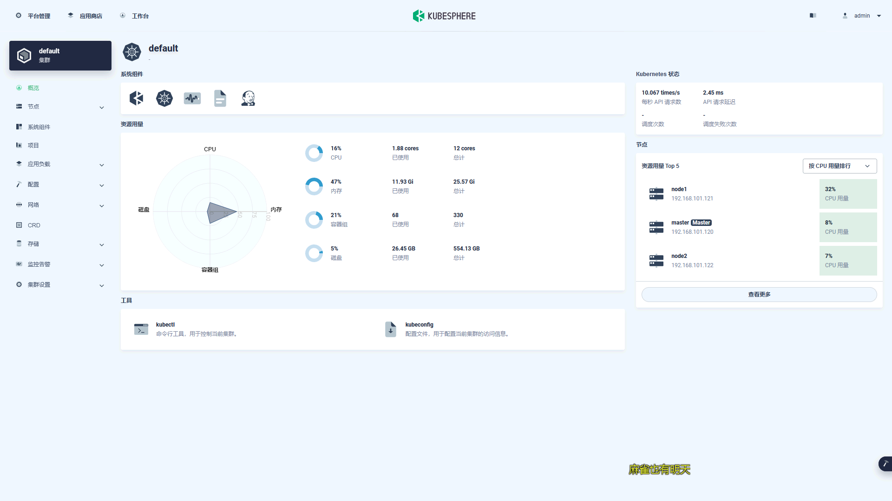


## 6）、进阶

### A、多租户系统


-------

#### 架构

KubeSphere 的多租户系统分**三个**层级，即集群、企业空间和项目。KubeSphere 中的项目等同于 Kubernetes 的命名空间。

可以在一个 KubeSphere 集群中创建多个企业空间，每个企业空间下可以创建多个项目。

在本步骤中，您将创建一个用户 `user-manager`，并赋予users-manager角色，然后使用 `user-manager` 创建新用户。

---------------

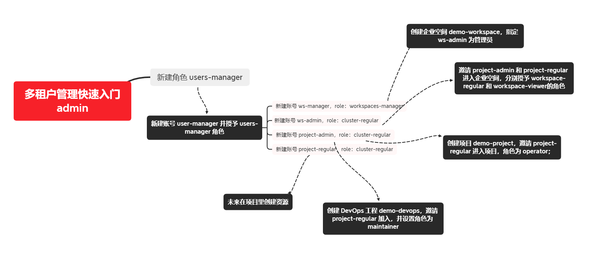

https://kubesphere.com.cn/docs/quick-start/create-workspace-and-project/

| 内置角色             | 描述                                                         |
| -------------------- | ------------------------------------------------------------ |
| `workspaces-manager` | 企业空间管理员，管理平台所有企业空间。                       |
| `users-manager`      | 用户管理员，管理平台所有用户。                               |
| `platform-regular`   | 平台普通用户，在被邀请加入企业空间或集群之前没有任何资源操作权限。 |
| `platform-admin`     | 平台管理员，可以管理平台内的所有资源。                       |

#### 1、使用 admin 创建平台管理用户 `user-manager`

使用 admin 创建一个用户 `user-manager`，并赋予users-manager角色，

#### 2、登录 `user-manager` 创建新用户。

| 帐户            | 角色               | 描述                                                         |
| --------------- | ------------------ | ------------------------------------------------------------ |
| ws-manager      | workspaces-manager | 创建和管理所有企业空间。                                     |
| ws-admin        | platform-regular   | 管理指定企业空间中的所有资源（用于邀请新成员加入该企业空间） |
| project-admin   | platform-regular   | 创建和管理项目以及 DevOps 项目，并邀请新成员加入项目         |
| project-regular | platform-regular   | project-regular 将由 project-admin 邀请至项目或 DevOps 项目。该帐户将用于在指定项目中创建工作负载、流水线和其他资源 |

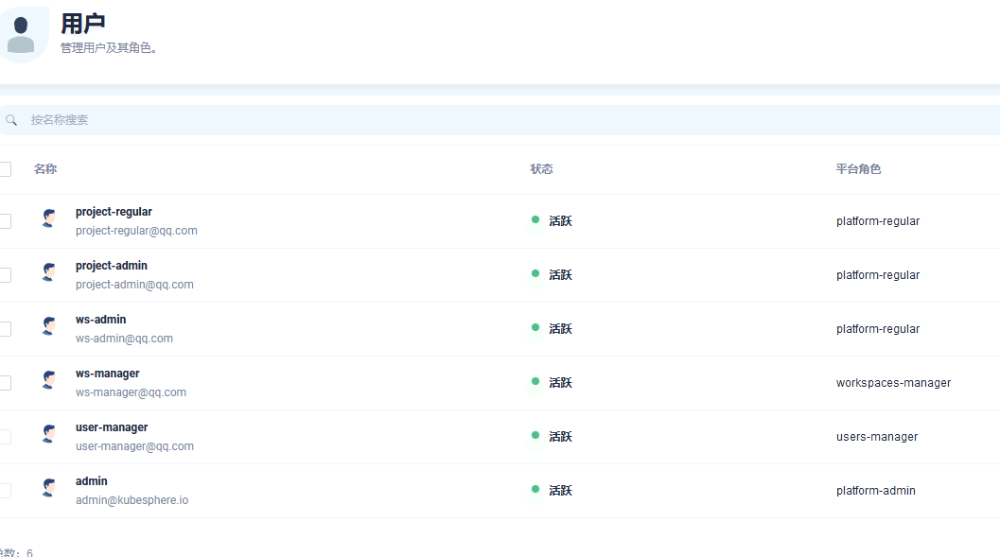

#### 3、使用 ws-manager 创建企业空间 `cps007`

使用 ws-manager 创建一个企业空间(cps007)，指定ws-admin为管理员；

以 ws-admin 身份重新登录。在**企业空间设置**中，选择**企业空间成员**，然后点击**邀请**。邀请 `project-admin` 和 `project-regular` 进入企业空间，分别授予 `workspace-self-provisioner` 和 `workspace-viewer` 角色


| 帐户              | 角色                         | 描述                                                         |
| ----------------- | ---------------------------- | ------------------------------------------------------------ |
| `ws-admin`        | `workspace-admin`            | 管理指定企业空间中的所有资源（在此示例中，此帐户用于邀请新成员加入企业空间）。 |
| `project-admin`   | `workspace-self-provisioner` | 创建和管理项目以及 DevOps 项目，并邀请新成员加入项目。       |
| `project-regular` | `workspace-viewer`           | `project-regular` 将由 `project-admin` 邀请至项目或 DevOps 项目。该帐户将用于在指定项目中创建工作负载、流水线和其他资源。 |

#### 4、使用 project-admin 创建项目&网关

使用 project-admin 创建项目（demo-project）；在**项目设置** > **项目成员**中，邀请 `project-regular` 至该项目，并授予该用户 `operator` 角色。

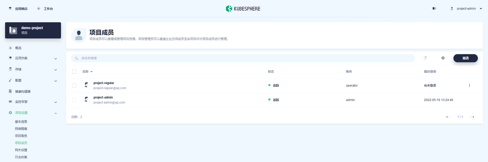

使用 project-admin 创建网关


#### 5、使用 project-admin 创建 DevOps 工程

使用 project-admin 创建 DevOps 工程（demo-devops）

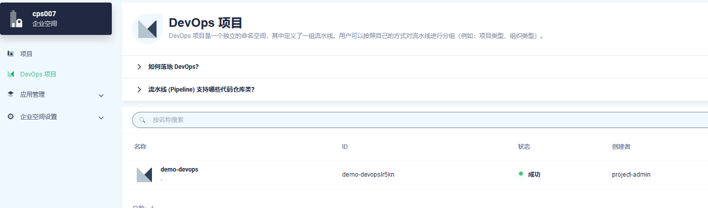

点击**邀请**授予 `project-regular` 用户 `operator` 的角色，允许其创建流水线和凭证。

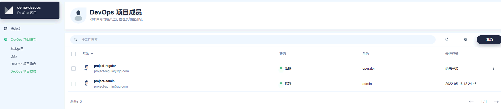

`project-regular` 帐户还将用于演示如何在项目或 DevOps 项目中创建应用程序和资源。

### B、使用 project-regular 帐户登录 workspaces 创建密钥、创建容器、外网访问

https://kubesphere.com.cn/docs/quick-start/wordpress-deployment/

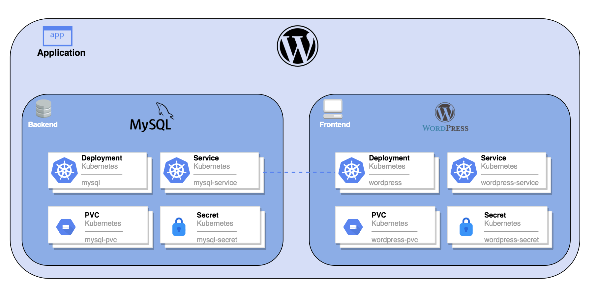

-------------

您需要准备一个 `project regular` 帐户，并在一个项目中赋予该帐户 `operator` 角色（该用户已被邀请参加该项目）。

#### 步骤 1：创建密钥

##### 创建 MySQL 密钥

环境变量 `WORDPRESS_DB_PASSWORD` 是连接到 WordPress 数据库的密码。在此步骤中，您需要创建一个密钥来保存将在 MySQL Pod 模板中使用的环境变量。

1、访问 `demo-project` 的详情页并导航到**配置**。在**保密字典**中，点击右侧的**创建**。

2、输入基本信息（mysql-secret）选择**类型**为 **Opaque（默认）**，然后点击**添加数据**来添加键值对。

> Key：MYSQL_ROOT_PASSWORD 和 Value：123456，点击右下角 √ 进行确认。

##### 创建 WordPress 密钥

按照以上相同的步骤创建一个名为 wordpress-secret 的 WordPress 密钥，Key：WORDPRESS_DB_PASSWORD 和 Value：123456

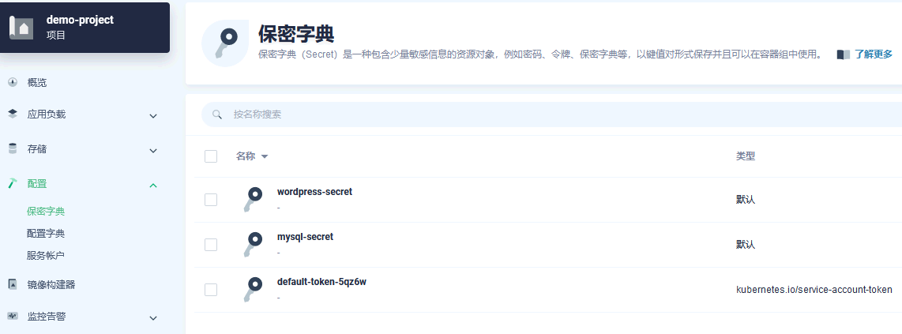

#### 步骤 2：创建存储卷

1、访问**存储**下的**存储卷**，点击**创建**。

2、输入卷的基本信息 wordpress-pvc


3、在**存储卷设置**中，需要选择一个可用的**存储类型**，并设置**访问模式**和**存储卷容量**。您可以直接使用默认值，点击**下一步**继续。

##### 访问模式:

RWO (ReadWriteOnce)：单个节点读写

ROX (ReadOnlyMany)：多节点只读

RWX (ReadWriteMany)：多节点读写

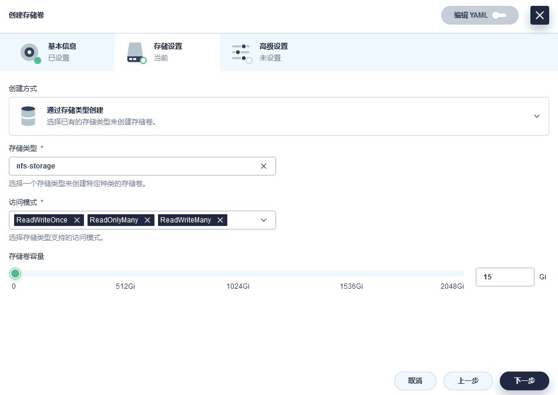

4、在**高级设置**中，您无需添加额外的配置，点击**创建**完成即可。

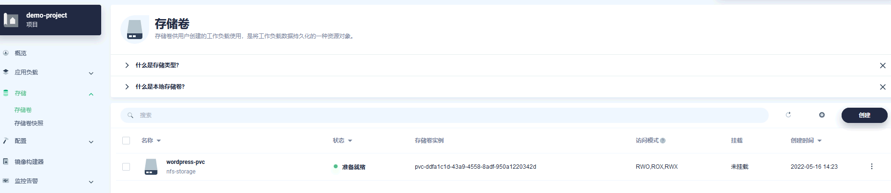


#### 步骤3：创建docker私有仓库

1、进入保密字典页面，设置保密字典的名称（例如 `ali-registry-secret`），然后点击**下一步**。

2、配置镜像仓库信息

将**类型**设置为 **镜像仓库信息**。要在创建应用负载时使用私有仓库中的镜像，您需要配置以下字段：

- **仓库地址**：镜像仓库的地址，其中包含创建应用负载时需要使用的镜像。
- **用户名**：登录镜像仓库所需的用户名。
- **密码**：登录镜像仓库所需的密码。
- **邮箱**（可选）：您的邮箱地址。

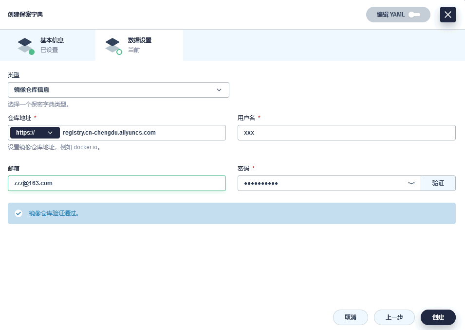


#### 步骤4：创建应用程序

##### 添加 MySQL 后端组件

1、导航到**应用负载**下的**应用**，选择**自制应用** > **创建**。

2、输入基本信息（例如，在应用名称一栏输入 `wordpress`），然后点击**下一步**。


3、在**服务设置**中，点击**创建服务**以在应用中设置组件。

4、设置组件的服务类型为**有状态服务**。

5、输入有状态服务的名称（例如 **mysql**）并点击**下一步**。

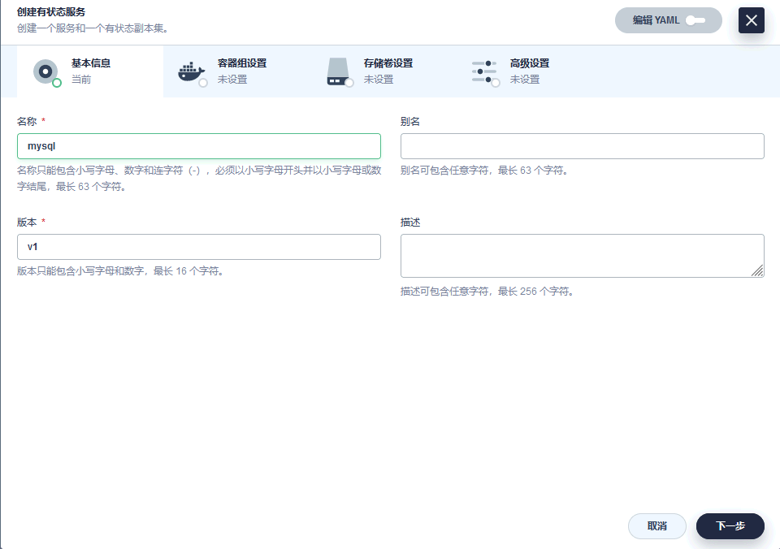

6、在**容器组设置**中，点击**添加容器**。

7、在搜索框中输入 mysql:5.7，按下 **回车键**，然后点击 **使用默认端口**。

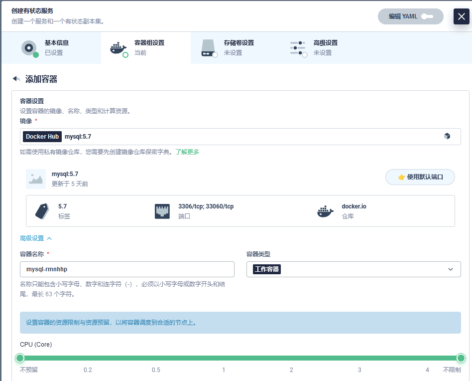


8、向下滚动到**环境变量**，点击**引用配置文件或密钥**。输入名称 MYSQL_ROOT_PASSWORD，然后选择资源 mysql-secret 和前面步骤中创建的密钥 MYSQL_ROOT_PASSWORD，完成后点击 **√** 保存配置，最后点击**下一步**继续。

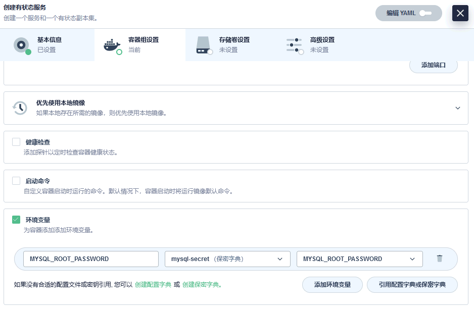

9、选择**存储卷设置**中的**添加存储卷模板**，输入**存储卷名称** (`mysql`) 和**挂载路径**（模式：`读写`，路径：`/var/lib/mysql`）的值。

完成后，点击 **√** 保存设置并点击**下一步**继续。


10、在**高级设置**中，可以直接点击**添加**，也可以按需选择其他选项。

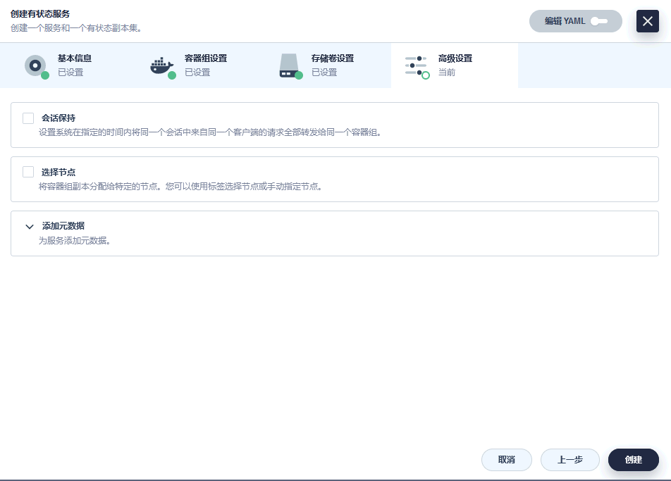

11、现在，MySQL 组件已经添加完成。

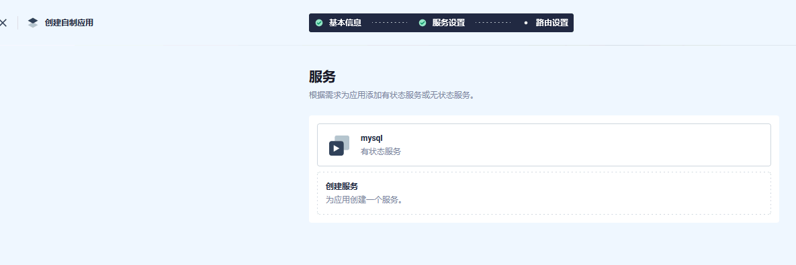

##### 添加 WordPress 前端组件

1、再次点击**创建服务**，选择**无状态服务**。输入名称 `wordpress` 并点击**下一步**。

2、与上述步骤类似，点击**添加容器**，在搜索栏中输入 `wordpress:4.8-apache` 并按下**回车键**，然后点击**使用默认端口**。

3、向下滚动到**环境变量**，点击**引用配置文件或密钥**。这里需要添加两个环境变量，请根据以下截图输入值：

- 对于 `WORDPRESS_DB_PASSWORD`，请选择在步骤 1 中创建的 `wordpress-secret` 和 `WORDPRESS_DB_PASSWORD`。
- 点击**添加环境变量**，分别输入 Key：`WORDPRESS_DB_HOST` 和 Value:`mysql`。

> 警告：对于此处添加的第二个环境变量，该值必须与上面的第5步中创建 MySQL 有状态服务设置的名称完全相同。否则，WordPress 将无法连接到 MySQL 对应的数据库。

点击 **√** 保存配置，再点击**下一步**继续。

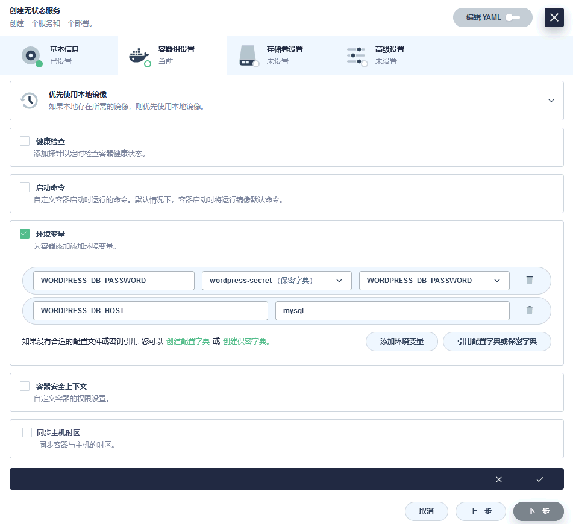

3、在**存储卷设置**中，点击**挂载存储卷**，并 **选择存储卷**。

4、选择上一步创建的 `wordpress-pvc`，将模式设置为`读写`，并输入挂载路径 `/var/www/html`。点击 **√** 保存，再点击**下一步**继续。


5、在**高级设置**中，可以直接点击**添加**创建服务，也可以按需选择其他选项。

6、现在，前端组件也已设置完成。点击**下一步**继续。

7、您可以**路由设置**中设置路由规则（应用路由 Ingress），也可以直接点击**创建**。

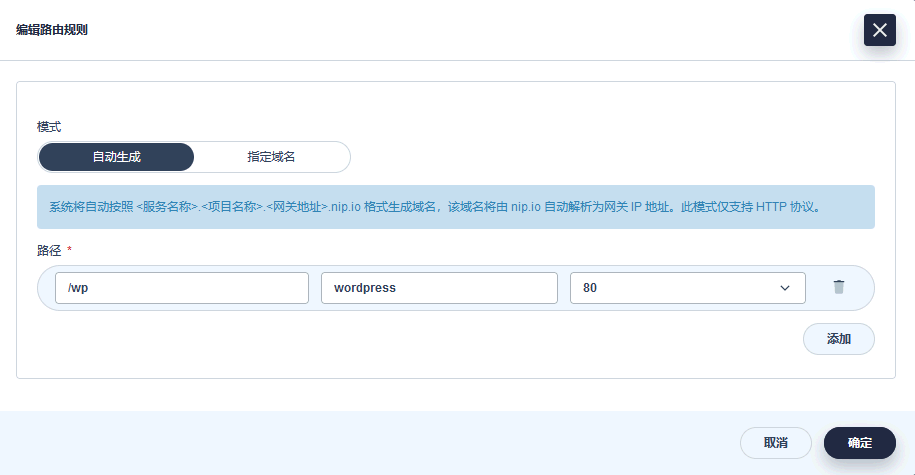

8、创建后，应用将显示在应用列表中。

#### 步骤 4：验证资源

>在**工作负载**中，分别检查**部署**和**有状态副本集**中 `wordpress-v1` 和 `mysql-v1` 的状态。如果它们的运行状态为**运行中**，就意味着 WordPress 已经成功创建。

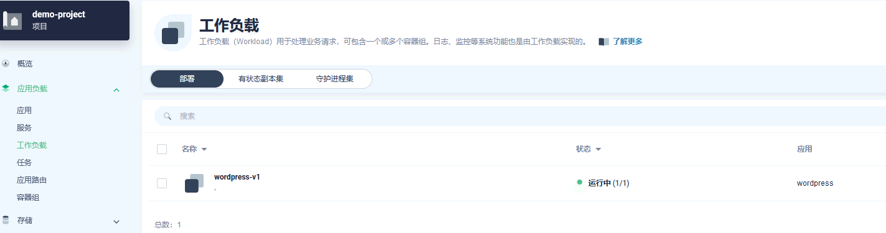

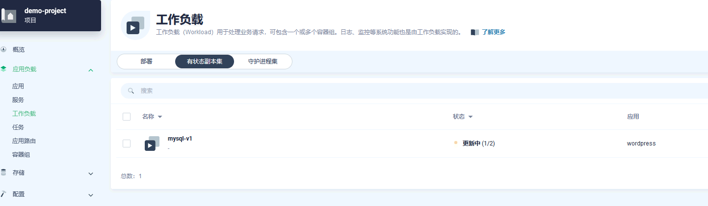


#### 步骤 5：通过 NodePort 访问 WordPress

1、若要在集群外访问服务，请首先导航到**服务**。点击 `wordpress` 右侧的三个点后，选择**编辑外部访问**。

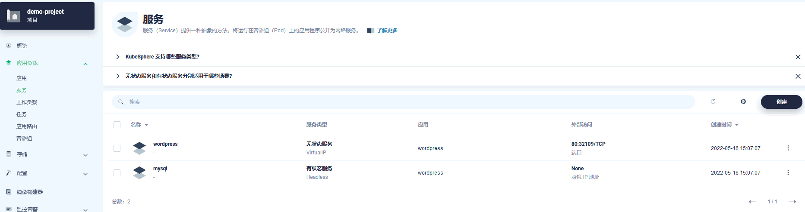

2、在**访问方式**中选择 `NodePort`，然后点击**确定**。

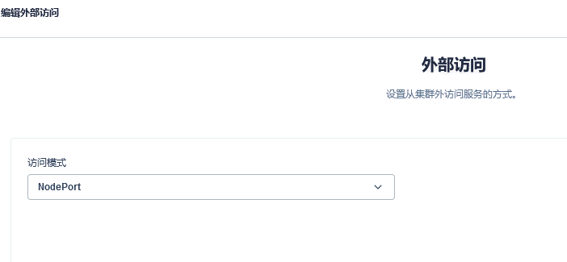

3、点击服务进入详情页，可以在**端口**处查看暴露的端口。

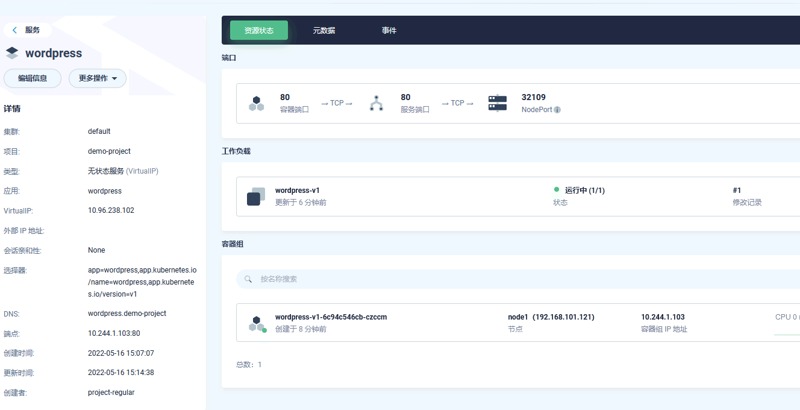

4、通过 `{Node IP}:{NodePort}` 访问此应用程序，可以看到下图：

http://192.168.101.120:32109、http://ks.k8s.com:32109/

### C、DevOps


### D、流水线


### E、

### F、

### G、


# 三、K8S部署软件

如何部署

可以使用kubesphere，快速搭建MySQL.环境。

- 有状态服务抽取配置为ConfigMap

- 有状态服务必须使用pvc 持久化数据

- 服务集群内访问使用DNS 提供的稳定域名


## 1）、安装软件 MySQL、redis、mq）

### MySQL


### redis


### mq


## 2）、部署（MySQL、redis、es、mq、nacos、zipkin、sentinel、商城应用）


## 3）、创建dockerfile

## 4）、

## 5）、

# 四、流水线

## 1）、gitee拉取代码

## 2）、

## 3）、

## 4）、


