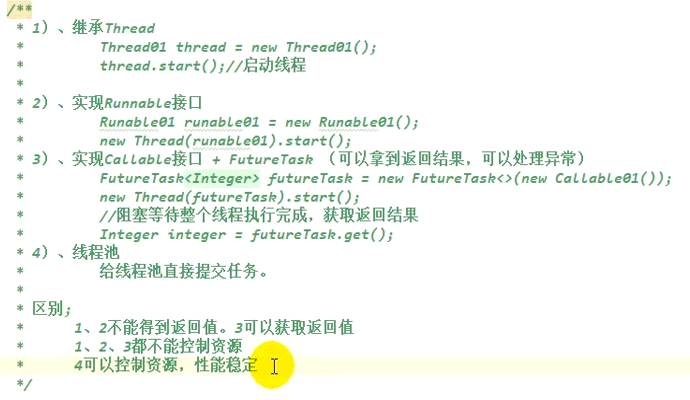

# 1 异步 CompletableFuture

## 1.1 线程



前3种不用。

## 1.2 CompletableFuture

###  A、**.completedFuture** 返回一个新的 CompletableFuture，它已经用给定的值完成了。
### B、**.supplyAsync** 返回一个新的 CompletableFuture，它由在给定执行器中运行的任务异步完成，其值是通过调用给定供应商获得的
### C、**.runAsync** 返回一个新的 CompletableFuture，它在运行给定操作后由 {@link} 中运行的任务异步完成。


### **简单实例**：

### 1.2.1 方法完成后的处理

```java
public void demo4() throws ExecutionException, InterruptedException{
   System.out.println("main......start.....");
   //    service.execute(new Runable01());
   //    Future<Integer> submit = service.submit(new Callable01());
   //    submit.get();

   //    CompletableFuture<Void> future = CompletableFuture.runAsync(() -> {
   //       System.out.println("当前线程："+Thread.currentThread().getId());
   //       int i = 10/2;
   //       System.out.println("运行结果："+i);
   //    }, service);

   /*
    * 方法完成后的处理
    */
   CompletableFuture<Integer> future = CompletableFuture.supplyAsync(() -> {
      System.out.println("当前线程："+Thread.currentThread().getId());
      int i = 10/0;
      System.out.println("运行结·果："+i);
      return i;
   }, service).whenComplete((res, exception) -> {
      //虽然能得到异常信息，但是没法修改返回数据
      System.out.println("异步任务成功完成了...结果是："+res+"异常是："+exception);
   }).exceptionally(throwable -> {
      //可以感知异常，同时返回默认值
      return 10;
   });

   System.out.println("main......end....."+future.get());
}
```

### 1.2.2 方法执行完，后端处理 （supplyAsync）

```java
public void demo5() throws ExecutionException, InterruptedException{
   System.out.println("main......start.....");

   /*
    * 方法执行完后端处理
    */
   CompletableFuture<Integer> future = CompletableFuture.supplyAsync(() -> {
      System.out.println("当前线程："+Thread.currentThread().getId());
      int i = 10/2;
      System.out.println("运行结果："+i);
      return i;
   }, service).handle((result, thr) -> {
      if(result != null){
         System.out.println("异步任务成功完成了...结果是："+result);
         return result*2;
      }
      if(thr != null){
         System.out.println("异步任务成功完成了...异常是："+thr);
         return 0;
      }
      return 0;
   });
   System.out.println("main......end....."+future.get());
}
```

### 1.2.3 线程串行化

```java
CompletableFuture<U> thenApply(Function<? super T,? extends U> fn)
CompletableFuture<U> thenApplyAsync(Function<? super T,? extends U> fn)
CompletableFuture<U> thenApplyAsync(Function<? super T,? extends U> fn,Executor executor)
------------------------------------------------------------------        
CompletableFuture<Void> thenAccept(Consumer<? super T> action)
CompletableFuture<Void> thenAcceptAsync(Consumer<? super T> action)
CompletableFuture<Void> thenAcceptAsync(Consumer<? super T> action,Executor executor)
------------------------------------------------------------------ 
CompletableFuture<Void> thenRun(Runnable action)
CompletableFuture<Void> thenRunAsync(Runnable action)
CompletableFuture<Void> thenRunAsync(Runnable action,Executor executor
```

#### **thenApply** 方法：当一个线程依赖另一个线程时，获取上一个任务返回的结果，并返回当前任务的返回值。

#### **thenAccept** 方法：消费处理结果。接收任务的处理结果，并消费处理，无返回结果。

#### **thenRun** 方法：只要上面的任务执行完成，就开始执行*thenRun*,只是处理完任务后，执行*thenRun*的后续操作。

#### 实例


```java
	/**
	 * 线程池-线程串行化
	 * 1、thenRunL：不能获取上一步的执行结果
	 * 2、thenAcceptAsync：能接受上一步结果，但是无返回值
	 * 3、thenApplyAsync：能接受上一步结果，有返回值
	 */
	@Test
	public void demo6() throws ExecutionException, InterruptedException{
		System.out.println("main......start.....");

		CompletableFuture<Void> future2 = CompletableFuture.supplyAsync(() -> {
			System.err.println("当前线程："+Thread.currentThread().getId());
			int i = 10/2;
			System.err.println("运行结果："+i);
			return i;
		}, service).thenAcceptAsync(res -> {
			System.err.println("能接受上一步结果，但是无返回值，任务2启动了..."+res);
		}, service);

		CompletableFuture<String> future3 = CompletableFuture.supplyAsync(() -> {
			System.out.println("当前线程："+Thread.currentThread().getId());
			int i = 10/2;
			System.out.println("运行结果："+i);
			return i;
		}, service).thenApplyAsync(res -> {
			System.out.println("能接受上一步结果，有返回值，任务2启动了..."+res);
			return "Hello+"+res;
		}, service);

		System.err.println("future2....end..."+future2.get());
		System.out.println("future3....end..."+future3.get());
	}

	@Test
	public void demo6_1() throws ExecutionException, InterruptedException{
		System.out.println("main......start.....");

		CompletableFuture<String> future1 = CompletableFuture.completedFuture("service");

		CompletableFuture<Integer> future2 = CompletableFuture.supplyAsync(() -> {
			System.err.println("future2当前线程："+Thread.currentThread().getId());
			int i = 10/2;
			System.err.println("future2运行结果："+i);
			return i;
		}, ThreadTests.service);

		CompletableFuture<Void> future3 = CompletableFuture.runAsync(() -> {
			System.err.println("future3当前线程："+Thread.currentThread().getId());
			int i = 10/2;
			System.err.println("future3运行结果："+i);
		}, ThreadTests.service);

		System.err.println("future1....end..."+future1.get());
		System.err.println("future2....end..."+future2.get());
		System.out.println("future3....end..."+future3.get());
	}
```

### 1.2.4 两任务组合

#### A、所有线程池都要完成

##### runAfterBothAsync、thenAcceptBothAsync、thenCombineAsync

```java
		CompletableFuture<Integer> future01 = CompletableFuture.supplyAsync(() -> {
			System.out.println("任务1线程:"+Thread.currentThread().getId());
			int i = 1014;
			System.out.println("任务1结束:");
			return i;
		}, executor);

		CompletableFuture<String> future02 = CompletableFuture.supplyAsync(() -> {
			System.out.println("任务2线程:"+Thread.currentThread().getId());
			try{
				Thread.sleep(20000);
				System.out.println("任务2结束:");
			}catch(InterruptedException e){
				e.printStackTrace();
			}
			return "Hello-02";
		}, executor);

//		future01.runAfterBothAsync(future02, () -> {
//			System.out.println("任务3开始----");
//		}, executor);
		future01.thenAcceptBothAsync(future02, (f1, f2) -> {
			System.out.println("任务3开始之前---f1:"+f1+"--f2>"+f2);
		}, executor);

		CompletableFuture<String> future03 = future01.thenCombineAsync(future02, (f1, f2) -> {
			return "任务3结束f1:"+f1+"--f2"+f2;
		}, executor);
		System.out.println(future03.get());
```

#### B、线程池只要一个完成

##### **applyToEither**：两个任务有一个执行完成，获取它的返回值，处理任务并有新的返回值。

##### **appl**acceptEither**：两个任务有一个执行完成，获取它的返回值，处理任务，没有新的返回值。

##### **appl**runAfterEither**：两个任务有一个执行完成，不需要获取future的结果，处理任务，没有返回值。

 * applyToEitherAsync: 感知结果，自己有返回值
 * acceptEitherAsync: 感知结果，自己没有返回值
 * runAfterEitherAsync: 不感知结果，自己没有返回值

```java
------------------------------------------------------
    CompletableFuture<U> applyToEither(
        CompletionStage<? extends T> other, Function<? super T, U> fn)
CompletableFuture<U> applyToEitherAsync(
        CompletionStage<? extends T> other, Function<? super T, U> fn)    
CompletableFuture<U> applyToEitherAsync(
        CompletionStage<? extends T> other, Function<? super T, U> fn,
        Executor executor) 
------------------------------------------------------
CompletableFuture<Void> acceptEither(
        CompletionStage<? extends T> other, Consumer<? super T> action)
CompletableFuture<Void> acceptEitherAsync(
        CompletionStage<? extends T> other, Consumer<? super T> action)
CompletableFuture<Void> acceptEitherAsync(
        CompletionStage<? extends T> other, Consumer<? super T> action,
        Executor executor)
------------------------------------------------------
CompletableFuture<Void> runAfterEither(CompletionStage<?> other,
                                                  Runnable action)
CompletableFuture<Void> runAfterEitherAsync(CompletionStage<?> other,
                                                  Runnable action)
CompletableFuture<Void> runAfterEitherAsync(CompletionStage<?> other,
                                                  Runnable action,
                                                  Executor executor) 

```


```java
CompletableFuture<Integer> future01 = CompletableFuture.supplyAsync(() -> {
			System.out.println("任务1线程:"+Thread.currentThread().getId());
			int i = 1014;
			System.out.println("任务1结束:");
			return i;
		}, executor);

CompletableFuture<String> future02 = CompletableFuture.supplyAsync(() -> {
			System.out.println("任务2线程:"+Thread.currentThread().getId());
			try{
				Thread.sleep(20000);
				System.out.println("任务2结束:");
			}catch(InterruptedException e){
				e.printStackTrace();
			}
			return "Hello-02";
		}, executor);

//runAfterEitherAsync: 不感知结果，自己没有返回值
future01.runAfterEitherAsync(future02, () -> {
   System.out.println("任务3开始...之前的结果:");
}, executor);
//void accept(T t); .
//acceptEitherAsync: 感知结果，自己没有返回值
future01.acceptEitherAsync(future02, (res) -> {
   System.out.println("任务3开始...之前的结果:"+res);
}, executor);
//applyToEitherAsync: 感知结果，自己有返回值
CompletableFuture<String> future = future01.applyToEitherAsync(future02, res -> {
   System.out.println("任务3开始...之前的结果:"+res);
   return res.toString()+"->哈哈";
}, executor);
System.out.println("main....end...."+future.get());
```

## 业务实用场景

订单+购物车模块

```java
//获取当前线程请求头信息(解决Feign异步调用丢失请求头问题)
RequestAttributes requestAttributes = RequestContextHolder.getRequestAttributes();


//开启第一个异步任务：远程查询所有的收获地址列表
CompletableFuture<Void> addressFuture = CompletableFuture.runAsync(() -> {
    //每一个线程都来共享之前的请求数据
    RequestContextHolder.setRequestAttributes(requestAttributes);
   ...业务逻辑...
}, threadPoolExecutor);


//开启第二个异步任务：远程查询购物车所有选中的购物项：查询商品库存信息
CompletableFuture<Void> cartInfoFuture = CompletableFuture.runAsync(() -> {
    //每一个线程都来共享之前的请求数据
    RequestContextHolder.setRequestAttributes(requestAttributes);
   ...业务逻辑...
}, threadPoolExecutor).thenRunAsync(() -> {
   ...业务逻辑...
}, threadPoolExecutor);


//所有线程池完成
CompletableFuture.allOf(addressFuture, cartInfoFuture).get();
return orderConfirmVo;
```


