# ansible 运维自动化工具

[ansible 中文指南](http://ansible.com.cn/docs/intro.html)

[本节示例文件 提取码：do11](https://pan.baidu.com/s/1caV7Qv_ICAYxprFyEba7sg)

虚拟机主机分配

8+2+200G

控制端-admin：192.168.0.118

被控制端-n1：192.168.0.8

被控制端-n2：192.168.0.9

被控制端-n3：192.168.0.10

```
vi /etc/selinux/config

把 SELINUX=enforce   改成 disabled
```


## 一、安装

依赖

```shell
查看 epel-release 版本：yum list | grep epel-release

yum install -y epel-release.noarch
yum install -y python2
yum install -y python3

yum -y clean all && yum -y makecache && yum -y update && yum -y repolist all
```

只需要在主控制端安装：`yum install -y ansible`   yum remove -y ansible

### 目录结构

安装目录如下(yum安装)：

配置文件目录：/etc/ansible/【hosts、ansible、roles】

执行文件目录：/usr/bin/ansible*

Lib库依赖目录：/usr/lib/pythonX.X/site-packages/ansible/

Help文档目录：/usr/share/doc/ansible-X.X.X/

Man文档目录：/usr/share/man/man1/

### 赋予普通用户权限

将a用户添加到root组：usermod -aG root a

赋予a用户对ansible的权限管理：chmod -R 755 /etc/ansible

赋予a用户对ansible的所属组管理：chown -R root:a  /etc/ansible

## 二、概念 

ansible是新出现的自动化运维工具，基于Python开发，集合了众多运维工具（puppet、chef、func、fabric）的优点，实现了批量系统配置、批量程序部署、批量运行命令等功能。


### 特点

1. 部署简单，只需在主控端部署Ansible环境，被控端无需做任何操作；
2. 默认使用SSH协议对设备进行管理；
3. 有大量常规运维操作模块，可实现日常绝大部分操作；
4. 配置简单、功能强大、扩展性强；
5. 支持API及自定义模块，可通过Python轻松扩展；
6. 通过Playbooks来定制强大的配置、状态管理；
7. 轻量级，无需在客户端安装agent，更新时，只需在操作机上进行一次更新即可；
8. 提供一个功能强大、操作性强的Web管理界面和REST API接口——AWX平台。


### 架构图

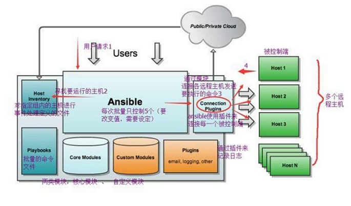

### 主要模块

`Ansible`：Ansible核心程序。

 `HostInventory`：记录由Ansible管理的主机信息，包括端口、密码、ip等。

 `Playbooks`：“剧本”YAML格式文件，多个任务定义在一个文件中，定义主机需要调用哪些模块来完成的功能。

 `CoreModules`：**核心模块**，主要操作是通过调用核心模块来完成管理任务。

 `CustomModules`：自定义模块，完成核心模块无法完成的功能，支持多种语言。

 `ConnectionPlugins`：连接插件，Ansible和Host通信使用


###  任务执行

#### ansible 任务执行模式

Ansible 系统由控制主机对被管节点的操作方式可分为两类，即`adhoc`和`playbook`：

- ad-hoc模式(点对点模式)
   　使用单个模块，支持批量执行单条命令。ad-hoc 命令是一种可以快速输入的命令，而且不需要保存起来的命令。**就相当于bash中的一句话shell。**
- playbook模式(剧本模式)
   　是Ansible主要管理方式，也是Ansible功能强大的关键所在。**playbook通过多个task集合完成一类功能**，如Web服务的安装部署、数据库服务器的批量备份等。可以简单地把playbook理解为通过组合多条ad-hoc操作的配置文件。


#### 任务流程

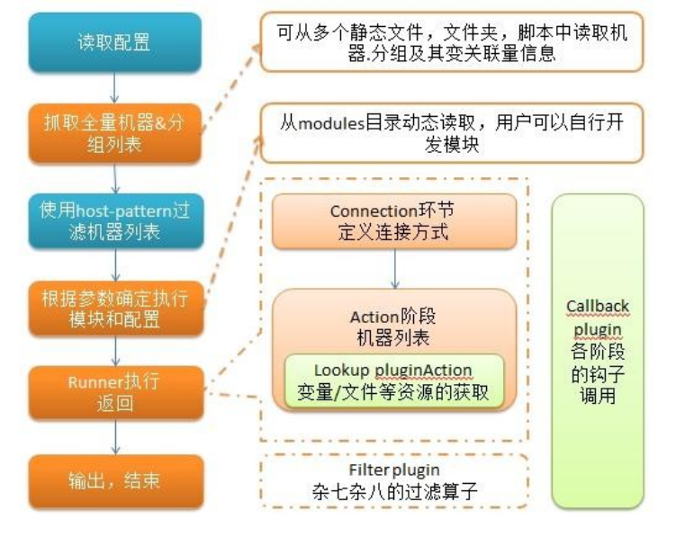

简单理解就是Ansible在运行时， 首先读取`ansible.cfg`中的配置， 根据规则获取`Inventory`中的管理主机列表， 并行的在这些主机中执行配置的任务， 最后等待执行返回的结果。


#### 命令执行过程

1. 加载自己的配置文件，默认`/etc/ansible/ansible.cfg`；
2. 查找对应的主机配置文件，找到要执行的主机或者组；
3. 加载自己对应的模块文件，如 command；
4. 通过ansible将模块或命令生成对应的临时py文件(python脚本)， 并将该文件传输至远程服务器；
5. 对应执行用户的家目录的`.ansible/tmp/XXX/XXX.PY`文件；
6. 给文件 +x 执行权限；
7. 执行并返回结果；
8. 删除临时py文件，`sleep 0`退出；


## 三、配置

### 配置文件查找顺序

ansible与我们其他的服务在这一点上有很大不同，这里的配置文件查找是从多个地方找的，顺序如下：

1. 检查环境变量`ANSIBLE_CONFIG`指向的路径文件(export ANSIBLE_CONFIG=/etc/ansible.cfg)；
2. `~/.ansible.cfg`，检查当前目录下的ansible.cfg配置文件；
3. `/etc/ansible.cfg`检查etc目录的配置文件。

### ansible 配置文件

ansible 的配置文件为`/etc/ansible/ansible.cfg`，ansible 有许多参数，下面我们列出一些常见的参数：

```ini
inventory = /etc/ansible/hosts		#这个参数表示资源清单inventory文件的位置
library = /usr/share/ansible		#指向存放Ansible模块的目录，支持多个目录方式，只要用冒号（：）隔开就可以
forks = 5		#并发连接数，默认为5
sudo_user = root		#设置默认执行命令的用户
remote_port = 22		#指定连接被管节点的管理端口，默认为22端口，建议修改，能够更加安全
host_key_checking = False		#设置是否检查SSH主机的密钥，值为True/False。关闭后第一次连接不会提示配置实例
timeout = 60		#设置SSH连接的超时时间，单位为秒
log_path = /var/log/ansible.log		#指定一个存储ansible日志的文件（默认不记录日志）
```

### ansuble 主机清单 inventory

vim /etc/ansible/hosts

在配置文件中，里面保存的是一些 ansible 需要连接管理的主机列表。我们可以来看看他的定义方式：

[root@admin ~]# vim /etc/ansible/hosts

```shell
mail.example.com
192.168.0.120

# 自定义主机与组
[web]
foo.example.com
192.168.0.8
192.168.0.121
## 端口号不是默认设置时
bar.example.com:2088
## 一组相似的 hostname
www[001:006].example.com


[db]
192.168.0.122
two.example.com
## 主机范围
db-[a:f].example.com


# 静态IP地址,希望设置一些别名,但不是在系统的 host 文件中设置,又或者你是通过隧道在连接
# 通过 “jumper” 别名,会连接 192.168.1.50:5555
jumper ansible_ssh_port=5555 ansible_ssh_host=192.168.1.50
```

**方括号 []** 是组名,用于对系统进行分类,便于对不同系统进行个别的管理.

一个系统可以属于不同的组,比如一台服务器可以同时属于 webserver组 和 dbserver组.这时属于两个组的变量都可以为这台主机所用


## 四、ansible 常用命令

### ansible 命令集

`/usr/bin/ansible`　　Ansibe AD-Hoc 临时命令执行工具，常用于临时命令的执行

`/usr/bin/ansible-doc` 　　Ansible 模块功能查看工具

`/usr/bin/ansible-galaxy`　　下载/上传优秀代码或Roles模块 的官网平台，基于网络的

`/usr/bin/ansible-playbook`　　Ansible 定制自动化的任务集编排工具

`/usr/bin/ansible-pull`　　Ansible远程执行命令的工具，拉取配置而非推送配置（使用较少，海量机器时使用，对运维的架构能力要求较高）

`/usr/bin/ansible-vault`　　Ansible 文件加密工具

`/usr/bin/ansible-console`　　Ansible基于Linux Consoble界面可与用户交互的命令执行工具

其中，我们比较常用的是`/usr/bin/ansible`和`/usr/bin/ansible-playbook`。


## 五、ansible

```css
ansible <host-pattern> [-f forks] [-m module_name] [-a args]
```

也可以通过`ansible -h`来查看帮助，下面我们列出一些比较常用的选项，并解释其含义：

> `-a MODULE_ARGS`　　　#模块的参数，如果执行默认COMMAND的模块，即是命令参数，如： “date”，“pwd”等等
>  `-k`，`--ask-pass`		#ask for SSH password。登录密码，提示输入SSH密码而不是假设基于密钥的验证
>  `--ask-su-pass`			#ask for su password。su切换密码
>  `-K`，`--ask-sudo-pass`			#ask for sudo password。提示密码使用sudo，sudo表示提权操作
>  `--ask-vault-pass`		#ask for vault password。假设我们设定了加密的密码，则用该选项进行访问
>  `-B SECONDS`		#后台运行超时时间
>  `-C`				#模拟运行环境并进行预运行，可以进行查错测试
>  `-c CONNECTION`			#连接类型使用
>  `-f FORKS`			#并行任务数，默认为5
>  `-i INVENTORY`		#指定主机清单的路径，默认为`/etc/ansible/hosts`
>  `--list-hosts`		#查看有哪些主机组
>  `-m MODULE_NAME`		#执行模块的名字，默认使用 command 模块，所以如果是只执行单一命令可以不用 -m参数
>  `-o`		#压缩输出，尝试将所有结果在一行输出，一般针对收集工具使用
>  `-S`		#用 su 命令
>  `-R SU_USER`		#指定 su 的用户，默认为 root 用户
>  `-s`		#用 sudo 命令
>  `-U SUDO_USER`		#指定 sudo 到哪个用户，默认为 root 用户
>  `-T TIMEOUT`		#指定 ssh 默认超时时间，默认为10s，也可在配置文件中修改
>  `-u REMOTE_USER`		#远程用户，默认为 root 用户


### 自己配置

```
# 自定义主机与组
[web]
192.168.0.[8:10]
```

主机连通性测试：ansible web -m ping

会出现ping不通

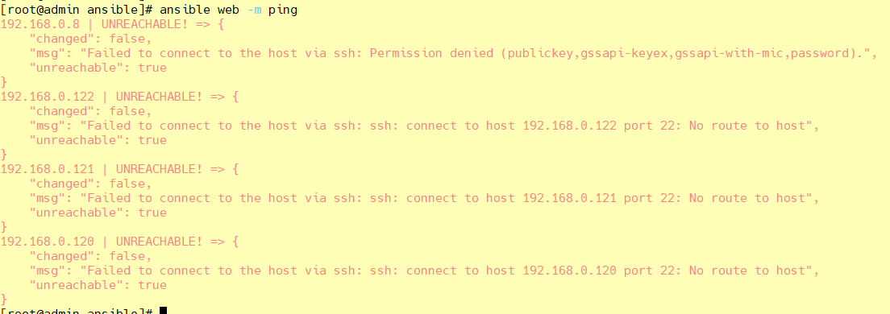

### SSH免密登录

参考：https://blog.csdn.net/qq_42476834/article/details/124766896

```shell
#1.生成私钥(主-被控制端最好都要生成)
[root@admin ~]# ssh-keygen -t rsa
#2.向主机分发私钥
[root@admin ~]# ssh-copy-id root@192.168.0.8	ssh-copy-id a@192.168.0.8
[root@admin ~]# ssh-copy-id root@192.168.0.9	ssh-copy-id a@192.168.0.9
[root@admin ~]# ssh-copy-id root@192.168.0.10	ssh-copy-id a@192.168.0.10

校验：
ssh root@192.168.0.8 		ssh a@192.168.0.8
ssh root@192.168.0.9 		ssh a@192.168.0.9
ssh root@192.168.0.10 		ssh a@192.168.0.10
```

查看192.168.0.8用户ssh目录 authorized_keys

> ssh-rsa  xxx/ph8H3i2mKHscP root@admin


### 主机连通性测试

```shell
[root@admin ansible]# ansible web -m ping
192.168.0.8 | SUCCESS => {
    "ansible_facts": {
        "discovered_interpreter_python": "/usr/bin/python"
    },
    "changed": false,
    "ping": "pong"
}
192.168.0.10 | SUCCESS => {
    "ansible_facts": {
        "discovered_interpreter_python": "/usr/bin/python"
    },
    "changed": false,
    "ping": "pong"
}
192.168.0.9 | SUCCESS => {
    "ansible_facts": {
        "discovered_interpreter_python": "/usr/bin/python"
    },
    "changed": false,
    "ping": "pong"
}

```


### command 模块（直接在远程主机上执行命令，并将结果返回本主机）

```shell
[root@admin ansible]# ansible web -m command -a 'ss -ntl'
192.168.0.8 | CHANGED | rc=0 >>
State      Recv-Q Send-Q Local Address:Port               Peer Address:Port
LISTEN     0      100    127.0.0.1:25                       *:*
LISTEN     0      128          *:111                      *:*
LISTEN     0      128          *:22                       *:*
LISTEN     0      100      [::1]:25                    [::]:*
LISTEN     0      128       [::]:111                   [::]:*
LISTEN     0      128       [::]:22                    [::]:*
192.168.0.10 | CHANGED | rc=0 >>
State      Recv-Q Send-Q Local Address:Port               Peer Address:Port
LISTEN     0      100    127.0.0.1:25                       *:*
LISTEN     0      128          *:111                      *:*
LISTEN     0      128          *:22                       *:*
LISTEN     0      100      [::1]:25                    [::]:*
LISTEN     0      128       [::]:111                   [::]:*
LISTEN     0      128       [::]:22                    [::]:*
192.168.0.9 | CHANGED | rc=0 >>
State      Recv-Q Send-Q Local Address:Port               Peer Address:Port
LISTEN     0      128          *:22                       *:*
LISTEN     0      100    127.0.0.1:25                       *:*
LISTEN     0      128          *:111                      *:*
LISTEN     0      128       [::]:22                    [::]:*
LISTEN     0      100      [::1]:25                    [::]:*
LISTEN     0      128       [::]:111                   [::]:*
```

命令模块接受命令名称，后面是空格分隔的列表参数。给定的命令将在所有选定的节点上执行。它不会通过shell进行处理，比如 \$HOME 和操作如 "<"，">"，"|"，";"，"&" 工作（需要使用（shell）模块实现这些功能）。

**注意**：该命令不支持`| 管道命令`。

该模块下常用的几个命令：

> chdir　　　　　　    # 在执行命令之前，先切换到该目录
>
> executable 				# 切换shell来执行命令，需要使用命令的绝对路径
>
> free_form 			　	# 要执行的Linux指令，一般使用Ansible的-a参数代替。
>
> creates 					　# 一个文件名，当这个文件存在，则该命令不执行,可以用来做判断
>
> removes 					# 一个文件名，这个文件不存在，则该命令不执行

#### chdir 在执行命令之前，先切换到该目录

```shell
[root@admin ~]# ansible web -m command -a 'chdir=/root/ ls -all'
192.168.0.8 | CHANGED | rc=0 >>
总用量 28
dr-xr-x---.  7 root root  204 7月  28 13:19 .
dr-xr-xr-x. 17 root root  224 7月  28 11:04 ..
-rw-------.  1 root root 1614 7月  28 11:05 anaconda-ks.cfg
drwx------.  3 root root   17 7月  28 13:19 .ansible
-rw-------.  1 root root  540 7月  28 13:29 .bash_history
-rw-r--r--.  1 root root   18 12月 29 2013 .bash_logout
-rw-r--r--.  1 root root  176 12月 29 2013 .bash_profile
-rw-r--r--.  1 root root  176 12月 29 2013 .bashrc
drwxr-xr-x.  3 root root   18 7月  28 11:06 .cache
drwxr-xr-x.  3 root root   18 7月  28 11:06 .config
-rw-r--r--.  1 root root  100 12月 29 2013 .cshrc
drwxr-----.  3 root root   19 7月  28 11:18 .pki
drwx------.  2 root root   61 7月  28 13:12 .ssh
-rw-r--r--.  1 root root  129 12月 29 2013 .tcshrc
....
```

#### creates（存在，不执行ls，不存在，执行ls）

```shell
# 存在，不执行ls
[root@admin ~]# ansible web -m command -a 'creates=/root/test.png ls'
192.168.0.8 | SUCCESS | rc=0 >>
skipped, since /root/test.png exists

# 不存在，执行ls
[root@admin ~]# ansible web -m command -a 'creates=/root/test1.png ls'
192.168.0.8 | CHANGED | rc=0 >>
anaconda-ks.cfg
test.png
```

#### removes（存在，执行ls、不存在，不执行ls）

```shell
# 存在，执行ls
[root@admin ~]# ansible web -m command -a 'removes=/root/test.png ls'
192.168.0.8 | CHANGED | rc=0 >>
anaconda-ks.cfg
test.png

# 不存在，不执行ls
[root@admin ~]# ansible web -m command -a 'removes=/root/test1.png ls'
192.168.0.8 | SUCCESS | rc=0 >>
skipped, since /root/test1.png does not exist
```


### Shell 模块

shell模块可以在远程主机上调用shell解释器运行命令，支持shell的各种功能，例如管道等。

```shell
[root@admin ~]# ansible web -m shell -a 'cat /etc/passwd |grep "root"'
192.168.0.8 | CHANGED | rc=0 >>
root:x:0:0:root:/root:/bin/bash
operator:x:11:0:operator:/root:/sbin/nologin
......
```


### copy 模块

将文件复制到远程主机，同时支持给定内容生成文件和修改权限等。

相关选项如下：

> `src`　　　　#本地文件。可以是绝对路径，也可以是相对路径。如果路径是一个目录，则会递归复制，用法类似于"rsync"
>
> `content`　　　#用于替换"src"，可以直接指定文件的值
>
> `dest`　　　　#必选项，将源文件复制到的远程主机的**绝对路径**
>
> `backup`　　　#当文件内容发生改变后，在覆盖之前把源文件备份，备份文件包含时间信息
>
> `directory_mode`　　　　#递归设定目录的权限，默认为系统默认权限
>
> `force`　　　　#当目标主机包含该文件，但内容不同时，设为"yes"，表示强制覆盖；设为"no"，表示目标主机的目标位置不存在该文件才复制。默认为"yes"
>
> `others`　　　　#所有的 file 模块中的选项可以在这里使用

#### 复制文件（src、dest）

```shell
[root@admin ~]# ll
总用量 8
-rw-------. 1 root root 2174 5月  10 14:10 anaconda-ks.cfg
-rwxrwxrwx  1 root root 1960 5月  10 19:32 first.sh

[root@admin ~]# ansible web -m copy -a 'src=./first.sh dest=/root/first.sh'
192.168.0.8 | CHANGED => {
    "ansible_facts": {
        "discovered_interpreter_python": "/usr/bin/python"
    },
    "changed": true,
    "checksum": "23f3ef0aebb2a24b97c6617c3fe8a190dc1befed",
    "dest": "/root/first.sh",
    "gid": 0,
    "group": "root",
    "md5sum": "749f84620ba675946859e0d5a8c68ec5",
    "mode": "0644",
    "owner": "root",
    "secontext": "system_u:object_r:admin_home_t:s0",
    "size": 1960,
    "src": "/root/.ansible/tmp/ansible-tmp-1658988228.09-12252-115055636503998/source",
    "state": "file",
    "uid": 0
}

远程查看：
[root@admin ~]# ansible web -m shell -a 'ls -all /root/first.sh'
192.168.0.8 | CHANGED | rc=0 >>
-rw-r--r--. 1 root root 1960 7月  28 14:03 /root/first.sh
```

#### 给定内容生成文件（content），并制定权限（mode）

```shell
ansible web -m copy -a 'src=/root/ds.txt dest=/root/ds.txt mode=777'
[root@admin ~]# ansible web -m copy -a 'content="I am admin666 to copy test\n" dest=/root/ds.txt mode=777'
192.168.0.8 | CHANGED => {
    "ansible_facts": {
        "discovered_interpreter_python": "/usr/bin/python"
    },
    "changed": true,
    "checksum": "f1027296960724e4f07c7f6d695e2a9d59a41fc6",
    "dest": "/root/ds.txt",
    "gid": 0,
    "group": "root",
    "md5sum": "ebe73ae34d327b8966e3a20fafd80eda",
    "mode": "0777",
    "owner": "root",
    "secontext": "system_u:object_r:admin_home_t:s0",
    "size": 27,
    "src": "/root/.ansible/tmp/ansible-tmp-1658988702.62-14114-156810509219572/source",
    "state": "file",
    "uid": 0
}

```

查看文件

```shell
[root@admin ~]# ansible web -m shell -a 'ls -all /root/ds.txt'
192.168.0.8 | CHANGED | rc=0 >>
-rwxrwxrwx. 1 root root 27 7月  28 14:11 /root/ds.txt

[root@admin ~]# ansible web -m shell -a 'cat /root/ds.txt'
192.168.0.8 | CHANGED | rc=0 >>
I am admin666 to copy test
```


#### 覆盖备份（backup）

```shell
[root@admin ~]# ansible web -m copy -a 'content="I am admin666 to backup test\n" backup=yes dest=/root/ds.txt mode=777'
192.168.0.8 | SUCCESS => {
    "ansible_facts": {
        "discovered_interpreter_python": "/usr/bin/python"
    },
    "changed": false,
    "checksum": "f1027296960724e4f07c7f6d695e2a9d59a41fc6",
    "dest": "/root/ds.txt",
    "gid": 0,
    "group": "root",
    "mode": "0777",
    "owner": "root",
    "path": "/root/ds.txt",
    "secontext": "system_u:object_r:admin_home_t:s0",
    "size": 27,
    "state": "file",
    "uid": 0
}

```

查看文件

```shell
[root@admin ~]# ansible web -m shell -a 'ls /root/'
192.168.0.8 | CHANGED | rc=0 >>
anaconda-ks.cfg
ds.txt
ds.txt.13370.2022-07-28@14:20:20~
first.sh
test.png

[root@admin ~]# ansible web -m shell -a 'cat /root/ds.txt'
192.168.0.8 | CHANGED | rc=0 >>
I am admin666 to backup test
```


### file 模块（文件管理）

主要用于设置文件的属性，比如创建文件、创建链接文件、删除文件等。

常见的命令：

> `force`　　#需要在两种情况下强制创建软链接，一种是源文件不存在，但之后会建立的情况下；另一种是目标软链接已存在，需要先取消之前的软链，然后创建新的软链，有两个选项：yes|no
>
> `group`　　#定义文件/目录的属组。后面可以加上`mode`：定义文件/目录的权限
>
> `owner`　　#定义文件/目录的属主。后面必须跟上`path`：定义文件/目录的路径
>
> `recurse`　　#递归设置文件的属性，只对目录有效，后面跟上`src`：被链接的源文件路径，只应用于`state=link`的情况
>
> `dest`　　#被链接到的路径，只应用于`state=link`的情况
>
> `state`　　#状态，有以下选项：
>
> > `directory`：如果目录不存在，就创建目录
> >
> > `file`：即使文件不存在，也不会被创建 
> >
> > `link`：创建软链接
> >
> > `hard`：创建硬链接 
> >
> > `touch`：如果文件不存在，则会创建一个新的文件，如果文件或目录已存在，则更新其最后修改时间 
> >
> > `absent`：删除目录、文件或者取消链接文件

#### 创建目录

```shell
[root@admin ~]# ansible web -m file -a 'path=/root/app state=directory'
192.168.0.8 | CHANGED => {
    "ansible_facts": {
        "discovered_interpreter_python": "/usr/bin/python"
    },
    "changed": true,
    "gid": 0,
    "group": "root",
    "mode": "0755",
    "owner": "root",
    "path": "/root/app",
    "secontext": "unconfined_u:object_r:admin_home_t:s0",
    "size": 6,
    "state": "directory",
    "uid": 0
}


[root@admin ~]# ansible web -m shell -a 'ls -l /root'
192.168.0.8 | CHANGED | rc=0 >>
总用量 16
-rw-------. 1 root root 1614 7月  28 11:05 anaconda-ks.cfg
drwxr-xr-x. 2 root root    6 7月  28 14:28 app
-rwxrwxrwx. 1 root root   29 7月  28 14:20 ds.txt
-rw-r--r--. 1 root root   26 7月  28 14:19 ds.txt.13370.2022-07-28@14:20:20~
-rw-r--r--. 1 root root 1960 7月  28 14:03 first.sh
-rw-r--r--. 1 root root    0 7月  28 13:44 test.png
```


#### 创建链接文件

为test.jpg创建链接

link：创建软链接

hard：创建硬链接 

force：需要在两种情况下强制创建软链接，一种是源文件不存在，但之后会建立的情况下；另一种是目标软链接已存在，需要先取消之前的软链，然后创建新的软链，有两个选项：yes|no

```shell

[root@admin ~]# ansible web -m file -a 'path=/root/test2.png src=/root/test.png state=link'
192.168.0.8 | CHANGED => {
    "ansible_facts": {
        "discovered_interpreter_python": "/usr/bin/python"
    },
    "changed": true,
    "dest": "/root/test2.png",
    "gid": 0,
    "group": "root",
    "mode": "0777",
    "owner": "root",
    "secontext": "unconfined_u:object_r:admin_home_t:s0",
    "size": 14,
    "src": "/root/test.png",
    "state": "link",
    "uid": 0
}
[root@admin ~]# ansible web -m file -a 'path=/root/test3.png src=/root/test.png state=hard'
192.168.0.8 | CHANGED => {
    "ansible_facts": {
        "discovered_interpreter_python": "/usr/bin/python"
    },
    "changed": true,
    "dest": "/root/test3.png",
    "gid": 0,
    "group": "root",
    "mode": "0644",
    "owner": "root",
    "secontext": "unconfined_u:object_r:admin_home_t:s0",
    "size": 0,
    "src": "/root/test.png",
    "state": "hard",
    "uid": 0
}


[root@admin ~]# ansible web -m shell -a 'ls -l /root/'
192.168.0.8 | CHANGED | rc=0 >>
lrwxrwxrwx. 1 root root   14 7月  28 14:39 test2.png -> /root/test.png
-rw-r--r--. 2 root root    0 7月  28 13:44 test3.png
-rw-r--r--. 2 root root    0 7月  28 13:44 test.png
```


#### 删除文件

```shell
[root@admin ~]# ansible web -m file -a 'path=/root/test3.png state=absent'
192.168.0.8 | CHANGED => {
    "ansible_facts": {
        "discovered_interpreter_python": "/usr/bin/python"
    },
    "changed": true,
    "path": "/root/test3.png",
    "state": "absent"
}


[root@admin ~]# ansible web -m shell -a 'ls -l /root/test3.png'
192.168.0.8 | FAILED | rc=2 >>
ls: 无法访问/root/test3.png: 没有那个文件或目录non-zero return code
```


### fetch 模块（复制远程文件到本地主机）

用于从远程某主机获取（复制）文件到本地。

> `dest`：用来存放文件的目录
>
> `src`：在远程拉取的文件，并且必须是一个**file**，不能是**目录**

```shell
[root@admin ~]# ansible web -m fetch -a 'src=/root/ds.txt dest=/root'
192.168.0.8 | CHANGED => {
    "changed": true,
    "checksum": "dbd48461fe5fff10ea97f688511ba74a292ab6f9",
    "dest": "/root/192.168.0.8/root/ds.txt",
    "md5sum": "9a282b66af8d46bceabdcd71173fc67d",
    "remote_checksum": "dbd48461fe5fff10ea97f688511ba74a292ab6f9",
    "remote_md5sum": null
}

[root@admin ~]# ls -l /root/192.168.0.8/root/ds.txt
-rwxr-xr-x 1 root root 29 7月  28 14:46 /root/192.168.0.8/root/ds.txt
```

我们可以在本机上查看一下文件是否复制成功。要注意，文件保存的路径是我们设置的接收目录下的`被管制主机ip`目录下


### cron 模块（计划任务）

用于管理`cron`计划任务的。
 　其使用的语法跟我们的`crontab`文件中的语法一致，同时，可以指定以下选项：

> `day=` #日应该运行的工作( 1-31, *, */2, )
>
> `hour=` # 小时 ( 0-23, *, */2, )
>
> `minute=` #分钟( 0-59, *, */2, )
>
> `month=` # 月( 1-12, *, /2, )
>
> `weekday=` # 周 ( 0-6 for Sunday-Saturday,, )
>
> `job=` #指明运行的命令是什么
>
> `name=` #定时任务描述
>
> `reboot` # 任务在重启时运行，不建议使用，建议使用special_time
>
> `special_time` #特殊的时间范围，参数：reboot（重启时），annually（每年），monthly（每月），weekly（每周），daily（每天），hourly（每小时）
>
> `state` #指定状态，present表示添加定时任务，也是默认设置，absent表示删除定时任务
>
> `user` # 以哪个用户的身份执行

#### ① 添加计划任务

```shell
[root@admin ~]# ansible web -m cron -a 'name="ntp 每 5 分钟更新一次" minute=*/5 job="/sbin/ntpdate 172.17.0.1 &> /dev/null"'
192.168.0.8 | CHANGED => {
    "ansible_facts": {
        "discovered_interpreter_python": "/usr/bin/python"
    },
    "changed": true,
    "envs": [],
    "jobs": [
        "ntp 每 5 分钟更新一次"
    ]
}
```

查看计划任务列表

```shell
[root@admin ~]# ansible web -m shell -a 'crontab -l'
192.168.0.8 | CHANGED | rc=0 >>
#Ansible: ntp 每 5 分钟更新一次
*/5 * * * * /sbin/ntpdate 172.17.0.1 &> /dev/null


[root@admin ~]# ansible web -m shell -a 'ls -l /sbin/ntpdate'
192.168.0.8 | CHANGED | rc=0 >>
-rwxr-xr-x. 1 root root 110160 6月  23 2020 /sbin/ntpdate
```


#### ② 删除计划任务

查看计划任务列表

```shell
[root@admin ~]# ansible web -m shell -a 'crontab -l'
192.168.0.8 | CHANGED | rc=0 >>
#Ansible: ntp 每 5 分钟更新一次
*/5 * * * * /sbin/ntpdate 172.17.0.1 &> /dev/null
```

删除

```shell
[root@admin ~]# ansible web -m cron -a 'name="df everyday" hour=15 job="df -lh >> /tmp/disk_total &> /dev/null" state=absent'
192.168.0.8 | SUCCESS => {
    "ansible_facts": {
        "discovered_interpreter_python": "/usr/bin/python"
    },
    "changed": false,
    "envs": [],
    "jobs": [
        "ntp 每 5 分钟更新一次"
    ]
}
```

删除完成后，我们再查看一下现有的计划任务确认一下：

```perl

[root@admin ~]# ansible web -m shell -a 'crontab -l'
192.168.0.8 | CHANGED | rc=0 >>
#Ansible: ntp 每 5 分钟更新一次
*/5 * * * * /sbin/ntpdate 172.17.0.1 &> /dev/null

```


### yum 模块（用于软件的安装）

顾名思义，该模块主要用于软件的安装。
 　其选项如下：

> `name=`　　#所安装的包的名称
>
> `state=`　　#`present`--->安装， `latest`--->安装最新的, `absent`---> 卸载软件。
>
> `update_cache`　　#强制更新yum的缓存
>
> `conf_file`　　#指定远程yum安装时所依赖的配置文件（安装本地已有的包）。
>
> `disable_pgp_check`　　#是否禁止GPG checking，只用于`present`or `latest`。
>
> `disablerepo`　　#临时禁止使用yum库。 只用于安装或更新时。
>
> `enablerepo`　　#临时使用的yum库。只用于安装或更新时。


```shell

[root@admin ~]#  ansible web -m yum -a 'name=htop state=present'
192.168.0.8 | CHANGED => {
    "ansible_facts": {
        "discovered_interpreter_python": "/usr/bin/python"
    },
    "changed": true,
    "changes": {
        "installed": [
            "htop"
        ]
    },
    "msg": "",
    "rc": 0,
    "results": [
        "Loaded plugins: fastestmirror, langpacks\nLoading mirror speeds from cached hostfile\n * base: ftp.sjtu.edu.cn\n * epel: ftp.riken.jp\n * extras: mirror.lzu.edu.cn\n * updates: ftp.sjtu.edu.cn\nResolving Dependencies\n--> Running transaction check\n---> Package htop.x86_64 0:2.2.0-3.el7 will be installed\n--> Finished Dependency Resolution\n\nDependencies Resolved\n\n================================================================================\n Package         Arch              Version                Repository       Size\n================================================================================\nInstalling:\n htop            x86_64            2.2.0-3.el7            epel            103 k\n\nTransaction Summary\n================================================================================\nInstall  1 Package\n\nTotal download size: 103 k\nInstalled size: 218 k\nDownloading packages:\nRunning transaction check\nRunning transaction test\nTransaction test succeeded\nRunning transaction\n  Installing : htop-2.2.0-3.el7.x86_64                                      1/1 \n  Verifying  : htop-2.2.0-3.el7.x86_64                                      1/1 \n\nInstalled:\n  htop.x86_64 0:2.2.0-3.el7                                                     \n\nComplete!\n"
    ]
}
```


### service 模块（服务程序的管理）

该模块用于服务程序的管理。
 　其主要选项如下：

> `arguments` #命令行提供额外的参数
>
> `enabled` #设置开机启动。
>
> `name=` #服务名称
>
> `runlevel` #开机启动的级别，一般不用指定。
>
> `sleep` #在重启服务的过程中，是否等待。如在服务关闭以后等待2秒再启动。(定义在剧本中。)
>
> `state` #有四种状态，分别为：`started`--->启动服务， `stopped`--->停止服务， `restarted`--->重启服务， `reloaded`--->重载配置

#### ① 开启服务并设置自启动

```shell
[root@admin ~]# ansible web -m service -a 'name=nginx state=started enabled=true' 
192.168.0.8 | SUCCESS => {
    "changed": true, 
    "enabled": true, 
    "name": "nginx", 
    "state": "started", 
    ……
}
```

端口是否打开：

```shell
[root@admin ~]# ansible web -m shell -a 'ss -ntl'
192.168.0.8 | SUCCESS | rc=0 >>
State      Recv-Q Send-Q Local Address:Port               Peer Address:Port              
LISTEN     0      128          *:80                       *:*                                 
```

可以看出我们的80端口已经打开。

#### ② 关闭服务

```shell
[root@admin ~]# ansible web -m service -a 'name=nginx state=stopped'
192.168.0.8 | SUCCESS => {
    "changed": true, 
    "name": "nginx", 
    "state": "stopped", 
	……
}
```

来查看一下端口：

```shell
[root@admin ~]# ansible web -m shell -a 'ss -ntl | grep 80'
192.168.0.8 | FAILED | rc=1 >>
non-zero return code
```


### user 模块（管理用户账号）

该模块主要是用来管理用户账号。

其主要选项如下：

> `comment`　　# 用户的描述信息
>
> `createhome`　　# 是否创建家目录
>
> `force`　　# 在使用state=absent时, 行为与userdel –force一致.
>
> `group`　　# 指定基本组
>
> `groups`　　# 指定附加组，如果指定为(groups=)表示删除所有组
>
> `home`　　# 指定用户家目录
>
> `move_home`　　# 如果设置为home=时, 试图将用户主目录移动到指定的目录
>
> `name`　　# 指定用户名
>
> `non_unique`　　# 该选项允许改变非唯一的用户ID值
>
> `password`　　# 指定用户密码
>
> `remove`　　# 在使用state=absent时, 行为是与userdel –remove一致
>
> `shell`　　# 指定默认shell
>
> `state`　　# 设置帐号状态，不指定为创建，指定值为absent表示删除
>
> `system`　　# 当创建一个用户，设置这个用户是系统用户。这个设置不能更改现有用户
>
> `uid`　　# 指定用户的uid


#### ① 添加一个用户并指定其 uid

```smalltalk
[root@admin ~]# ansible web -m user -a 'name=a2 uid=11111'
192.168.0.8 | CHANGED => {
    "ansible_facts": {
        "discovered_interpreter_python": "/usr/bin/python"
    },
    "changed": true,
    "comment": "",
    "create_home": true,
    "group": 11111,
    "home": "/home/a2",
    "name": "a2",
    "shell": "/bin/bash",
    "state": "present",
    "system": false,
    "uid": 11111
}
```

添加完成，我们可以去查看一下：

```shell
[root@admin ~]# ansible web -m shell -a 'cat /etc/passwd |grep a2'
192.168.0.8 | CHANGED | rc=0 >>
a2:x:11111:11111::/home/a2:/bin/bash
```

#### ② 删除用户

```dart
[root@admin ~]# ansible web -m user -a 'name=a2 state=absent'
192.168.0.8 | CHANGED => {
    "ansible_facts": {
        "discovered_interpreter_python": "/usr/bin/python"
    },
    "changed": true,
    "force": false,
    "name": "a2",
    "remove": false,
    "state": "absent"
}

```

一样的，删除之后，我们去看一下：

```shell
[root@admin ~]# ansible web -m shell -a 'cat /etc/passwd |grep a2'
192.168.0.8 | FAILED | rc=1 >>
non-zero return code
```

发现已经没有这个用户了。

### group 模块（添加或删除组）

该模块主要用于添加或删除组。

常用的选项如下：

> `gid=`　　#设置组的GID号
>
> `name=`　　#指定组的名称
>
> `state=`　　#指定组的状态，默认为创建，设置值为`absent`为删除
>
> `system=`　　#设置值为`yes`，表示创建为系统组


 #### ① 创建组

```dart
[root@admin ~]# ansible web -m group -a 'name=a2 gid=12222'
192.168.0.8 | CHANGED => {
    "ansible_facts": {
        "discovered_interpreter_python": "/usr/bin/python"
    },
    "changed": true,
    "gid": 12222,
    "name": "dd",
    "state": "present",
    "system": false
}

```

创建过后，我们来查看一下：

```makefile
[root@admin ~]# ansible web -m shell -a 'cat /etc/group | grep 12222'
192.168.0.8 | CHANGED | rc=0 >>
a2:x:12222:

```

可以看出，我们的组已经创建成功了。
 #### ② 删除组

```shell
[root@admin ~]# ansible web -m group -a 'name=a2 state=absent'
192.168.0.8 | CHANGED => {
    "ansible_facts": {
        "discovered_interpreter_python": "/usr/bin/python"
    },
    "changed": true,
    "name": "a2",
    "state": "absent"
}

```

照例查看一下：

```shell
[root@admin ~]# ansible web -m shell -a 'cat /etc/group | grep 12222'
192.168.0.8 | FAILED | rc=1 >>
non-zero return code

```

已经没有这个组的相关信息了。

### script 模块（将本机的脚本sh在被管理端的机器上运行）

该模块用于将本机的脚本在被管理端的机器上运行。

该模块直接指定脚本的路径即可，我们通过例子来看一看到底如何使用的：

首先，我们写一个脚本，并给其加上执行权限：

```bash
[root@admin ~]# vim /root/df.sh

#!/bin/bash

date >> /root/disk_total.log
df -lh >> /root/disk_total.log
	
[root@admin ~]# chmod +x /root/df.sh 
```

然后，我们直接运行命令来实现在被管理端执行该脚本：

```swift
[root@admin ~]# ansible web -m script -a '/root/df.sh'
192.168.0.8 | CHANGED => {
    "changed": true,
    "rc": 0,
    "stderr": "Shared connection to 192.168.0.8 closed.\r\n",
    "stderr_lines": [
        "Shared connection to 192.168.0.8 closed."
    ],
    "stdout": "",
    "stdout_lines": []
}

```

照例查看一下文件内容：

```bash
[root@admin ~]# ansible web -m shell -a 'cat /root/disk_total.log'
192.168.0.8 | CHANGED | rc=0 >>
2022年 07月 28日 星期四 15:23:35 CST
文件系统                 容量  已用  可用 已用% 挂载点
devtmpfs                 3.8G     0  3.8G    0% /dev
tmpfs                    3.9G     0  3.9G    0% /dev/shm
tmpfs                    3.9G   12M  3.8G    1% /run
tmpfs                    3.9G     0  3.9G    0% /sys/fs/cgroup
/dev/mapper/centos-root   50G  2.9G   48G    6% /
/dev/sda1               1014M  199M  816M   20% /boot
/dev/mapper/centos-home  142G   33M  142G    1% /home
tmpfs 
```

可以看出已经执行成功了。


### setup 模块（收集被管理主机的信息）

该模块主要用于收集信息，是通过调用facts组件来实现的。

facts 组件是Ansible用于采集被管机器设备信息的一个功能，我们可以使用setup模块查机器的所有facts信息，可以使用filter来查看指定信息。整个facts信息被包装在一个JSON格式的数据结构中，ansible_facts是最上层的值。

facts 就是变量，内建变量  。每个主机的各种信息，cpu颗数、内存大小等。会存在facts中的某个变量中。调用后返回很多对应主机的信息，在后面的操作中可以根据不同的信息来做不同的操作。如redhat系列用yum安装，而debian系列用apt来安装软件。

#### ① 查看信息

```yaml
[root@admin ~]# ansible web -m setup -a 'filter="*mem*"'
192.168.0.8 | SUCCESS => {
    "ansible_facts": {
        "ansible_memfree_mb": 7068,
        "ansible_memory_mb": {
            "nocache": {
                "free": 7456,
                "used": 346
            },
            "real": {
                "free": 7068,
                "total": 7802,
                "used": 734
            },
            "swap": {
                "cached": 0,
                "free": 8063,
                "total": 8063,
                "used": 0
            }
        },
        "ansible_memtotal_mb": 7802,
        "discovered_interpreter_python": "/usr/bin/python"
    },
    "changed": false
}

```

我们可以通过命令查看一下内存的大小以确认一下是否一致：

```yaml
[root@admin ~]# ansible web -m shell -a 'free -m'


192.168.0.8 | CHANGED | rc=0 >>
              total        used        free      shared  buff/cache   available
Mem:           7802         309        7067          11         426        7247
Swap:          8063           0        8063

```

可以看出信息是一致的。

#### ② 保存信息

我们的setup模块还有一个很好用的功能就是可以保存我们所筛选的信息至我们的主机上，同时，文件名为我们被管制的主机的IP，这样方便我们知道是哪台机器出的问题。

```yaml
[root@admin ~]# ansible web -m setup -a 'filter="*mem*"' --tree /root/facts
192.168.0.8 | SUCCESS => {
    "ansible_facts": {
        "ansible_memfree_mb": 7064,
        "ansible_memory_mb": {
            "nocache": {
                "free": 7454,
                "used": 348
            },
            "real": {
                "free": 7064,
                "total": 7802,
                "used": 738
            },
            "swap": {
                "cached": 0,
                "free": 8063,
                "total": 8063,
                "used": 0
            }
        },
        "ansible_memtotal_mb": 7802,
        "discovered_interpreter_python": "/usr/bin/python"
    },
    "changed": false
}
```

然后我们可以去查看一下：

```yaml
[root@admin ~]# cd /root/facts/
[root@admin facts]#
[root@admin facts]# cat 192.168.0.8
{"ansible_facts": {"ansible_memfree_mb": 7064, "ansible_memory_mb": {"nocache": {"free": 7454, "used": 348}, "real": {"free": 7064, "total": 7802, "used": 738}, "swap": {"cached": 0, "free": 8063, "total": 8063, "used": 0}}, "ansible_memtotal_mb": 7802, "discovered_interpreter_python": "/usr/bin/python"}, "changed": false}
```


## 六、ansible-doc 

```shell
ansible-doc -l				#获取全部模块的信息
ansible-doc -s MOD_NAME		#获取指定模块的使用帮助
```

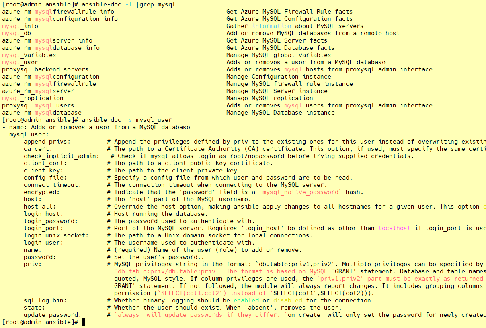


## 七、ansible-playbook 

### 简介

playbook 是 ansible 用于配置，部署，和管理被控节点的剧本。

通过 playbook 的详细描述，执行其中的一系列 tasks ，可以让远端主机达到预期的状态。playbook 就像 Ansible 控制器给被控节点列出的的一系列 to-do-list ，而被控节点必须要完成。

也可以这么理解，playbook 字面意思，即剧本，现实中由演员按照剧本表演，在Ansible中，这次由计算机进行表演，由计算机安装，部署应用，提供对外服务，以及组织计算机处理各种各样的事情。

### 使用场景

执行一些简单的任务，使用ad-hoc命令可以方便的解决问题，但是有时一个设施过于复杂，需要大量的操作时候，执行的ad-hoc命令是不适合的，这时最好使用playbook。

就像执行shell命令与写shell脚本一样，也可以理解为批处理任务，不过playbook有自己的语法格式。

使用playbook你可以方便的重用这些代码，可以移植到不同的机器上面，像函数一样，最大化的利用代码。在你使用Ansible的过程中，你也会发现，你所处理的大部分操作都是编写playbook。可以把常见的应用都编写成playbook，之后管理服务器会变得十分简单。


### 格式

**playbook由YMAL语言编写。**YMAL格式是类似于JSON的文件格式，便于人理解和阅读，同时便于书写。

以下为playbook常用到的YMAL格式：

1、文件的第一行应该以 "---" (三个连字符)开始，表明YMAL文件的开始。

2、在同一行中，#之后的内容表示注释，类似于shell，python和ruby。

3、YMAL中的列表元素以”-”开头然后紧跟着一个空格，后面为元素内容。

4、同一个列表中的元素应该保持相同的缩进。否则会被当做错误处理。

5、play中hosts，variables，roles，tasks等对象的表示方法都是键值中间以":"分隔表示，":"后面还要增加一个空格。

```
# 自定义主机与组
[web]
192.168.0.[8:10]

[mysqlServer]
192.168.0.[8:10]
```

> ansible-playbook <filename.yml> ... [options]
>
> - options: 
> - - --check -C        #只检测可能会发生的改变，但不真正执行操作
>   - --list-hosts      #列出运行任务的主机
>   - --list-tags       #列出tag
>   - --list-tasks      #列出task
>   - --limit 主机列表   #只针对主机列表中的主机执行
>   - -v -vv -vvv       #显示过程

vim mysql.yml

```yaml
---
- hosts: mysqlServer
  remote_user: root
  tasks:
  
    - name: install mysql-server package
      yum: name=mysql-server state=present
    - name: starting mysqld service
      service: name=mysql state=started
```

> `host部分`：使用 hosts 指示使用哪个主机或主机组来运行下面的 tasks ，每个 playbook 都必须指定 hosts ，hosts也**可以使用通配符格式**。主机或主机组在 inventory 清单中指定，可以使用系统默认的`/etc/ansible/hosts`，也可以自己编辑，在运行的时候加上`-i`选项，指定清单的位置即可。在运行清单文件的时候，`–list-hosts`选项会显示那些主机将会参与执行 task 的过程中。
>
>  `remote_user`：指定远端主机中的哪个用户来登录远端系统，在远端系统执行 task 的用户，可以任意指定，也可以使用 sudo，但是用户必须要有执行相应 task 的权限。
>
>  `tasks`：指定远端主机将要执行的一系列动作。tasks 的核心为 ansible 的模块，前面已经提到模块的用法。tasks 包含 `name` 和`要执行的模块`，name 是可选的，只是为了便于用户阅读，不过还是建议加上去，模块是必须的，同时也要给予模块相应的参数。


ansible-playbook 运行playbook文件

>  ansible-playbook mysql.yml

执行有三个步骤：

1、收集facts 

2、执行tasks 

3、报告结果

 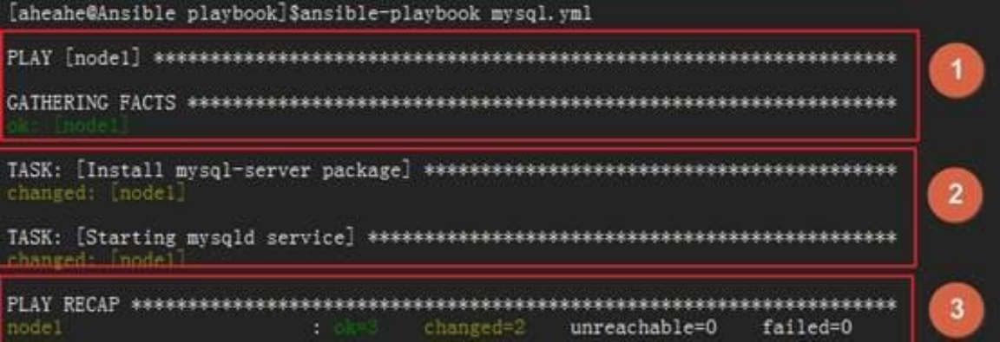


### 核心元素

Playbook的核心元素：

> `Hosts`：主机组；
>
>  `Tasks`：任务列表；
>
>  `Variables`：变量，设置方式有四种；
>
>  `Templates`：包含了模板语法的文本文件；
>
>  `Handlers`：由特定条件触发的任务；

### 基本组件

　Playbooks配置文件的基础组件：

> `Hosts`：运行指定任务的目标主机
>
> `remoute_user`：在远程主机上执行任务的用户；
>
> `sudo_user`：
>
> `tasks`：任务列表
>
> > tasks格式
> >
> > – name: TASK_NAME
> >
> > ​    module: arguments
> >
> > ​    notify: HANDLER_NAME
>
> >handlers:
> >
> >​    – name: HANDLER_NAME
> >
> >​    module: arguments

> `模块，模块参数`：
>
> > 格式：
> >  　　　(1) action: module arguments
> >  　　　(2) module: arguments
> >  　　　注意：shell和command模块后面直接跟命令，而非key=value类的参数列表；

> `handlers`：任务，在特定条件下触发；接收到其它任务的通知时被触发；

(1) 某任务的状态在运行后为changed时，可通过“notify”通知给相应的handlers；

(2) 任务可以通过“tags“打标签，而后可在ansible-playbook命令上使用-t指定进行调用；

#### ① 定义 playbook

前提：本机配置好 nginx.conf 模板

**目录结构**

```
[root@admin ansible]# tree nginx/
nginx/
├── conf
│   └── nginx.conf
├── conf.d
│   ├── ry.conf
│   └── time.txt
├── html
│   ├── 404.html
│   ├── 50x.html
│   ├── dist
│   │   ├── assets
│   │   │   ├── 401.386cda99.js
│   │   │   └── zip.f12aeb4c.svg
│   │   ├── favicon.ico
│   │   └── index.html
│   └── index.html
└── logs
```


**nginx.conf**

```yaml
#user nginx;

#工作线程数等同cpu数
worker_processes 1; 

error_log /etc/nginx/logs/error.log;
pid /run/nginx.pid;

events {
    worker_connections 1024;
}
http {
    server_tokens off;
    include       mime.types;
    default_type  application/octet-stream;
    
    log_format  mylog '{"date_time": "$year-$month-$day $hour:$minutes:$seconds",'
                      '"host": "$server_addr",'
                      '"client_ip": "$remote_addr",'
                      '"client_id": "$remote_user",'
                      '"url": "$request_uri",'
                      '"request": "$request",'
                      '"referer": "$http_referer",'
                      '"request_time": "$request_time",'
                      '"status": "$status",'
                      '"size": "$body_bytes_sent",'
                      '"info": "$http_user_agent",'
                      '"x_forwarded_for": "$http_x_forwarded_for"'
                      '}';
                      
    sendfile        on;
  	#tcp_nopush     on;
  	keepalive_timeout  65;
  
  	client_max_body_size 50m;
  	client_body_buffer_size 256k;
  	client_header_timeout 3m;
  	client_body_timeout 3m;
  	proxy_connect_timeout 300s;
  	proxy_read_timeout 300s;
  	proxy_send_timeout 300s;
  	proxy_buffer_size 64k;
  	proxy_buffers 4 32k;
  	proxy_busy_buffers_size 64k;
  	proxy_temp_file_write_size 64k;
  	proxy_ignore_client_abort on;
  	proxy_set_header Host $host;
  	proxy_set_header X-Forwarder-For $remote_addr;

    gzip  on;
    
    include /etc/nginx/conf.d/*.conf;

}
```

**ry.conf**

```
    server {
        listen       80;
        server_name  localhost;
        charset utf-8;
        #access_log  logs/host.access.log  main;
        
        location / {
            root   /etc/nginx/html;
            index  index.html index.htm;
        }
        
        error_page 404 /404.html;
        
        error_page 500 502 503 504 /50x.html;
        location = /50x.html {
            root   /etc/nginx/html;
        }
    }
    
#server {
#    listen       80;
#    server_name  www.ry8.cn;
#    charset utf-8;
#    include /etc/nginx/conf.d/time.txt;
#    access_log  /etc/nginx/logs/ry.log  mylog;

#    location / {
#        root  /etc/nginx/html/dist/;
#        index	index.html index.htm;
#        try_files $uri $uri/ /index.html;
#    }
#}
```


**ansible -> hosts**

> [web]
>
> 192.168.0.[8:10]

**playbook**

`vim /etc/ansible/playbook/i-nginx.yml`

```yaml
---
- hosts: web
  remote_user: root
  tasks:
    - name: install nginx
      yum: name=nginx state=present
    - name: copy config
      copy: src=/etc/ansible/nginx dest=/etc backup=yes
      notify: restarted nginx service
      tags: restartnginx
    - name: start nginx service
      service: name=nginx state=started enabled=true
      tags: startnginx
 
  handlers:
    - name: restarted nginx service
      service: name=nginx  state=restarted
    - name: reloaded nginx service
      service: name=nginx  state=reloaded
```

#### ② 测试安装 nginx

写完了以后，我们就可以运行了：

> ansible-playbook -C i-nginx.yml

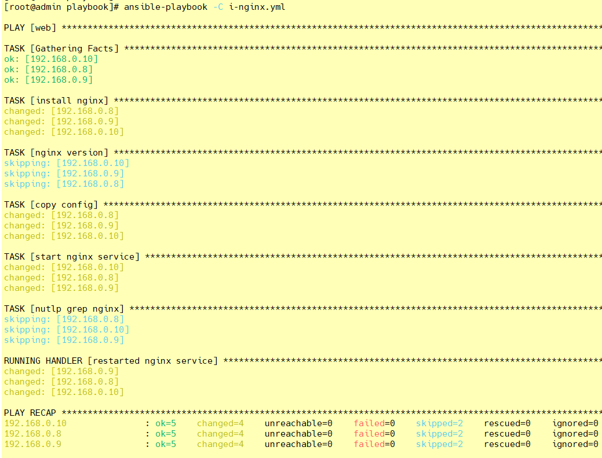

> ansible-playbook i-nginx.yml

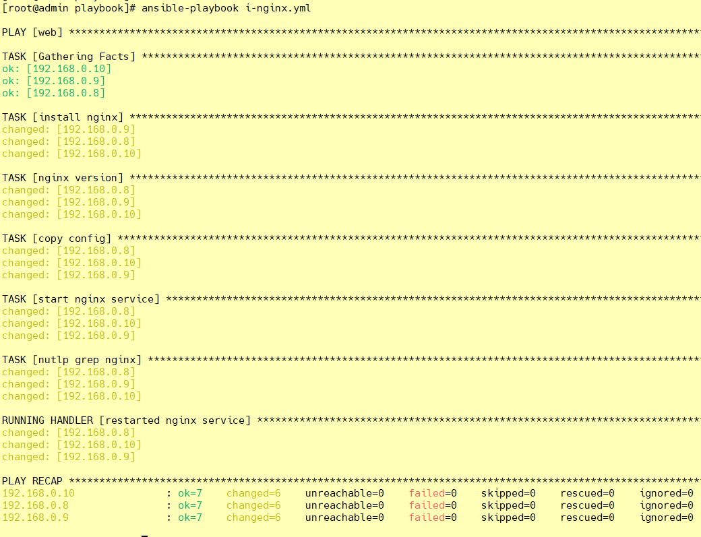


看看两台机器的端口是否开启：

```shell
[root@admin playbook]# ansible web -m shell -a 'ss -nutlp |grep nginx'
192.168.0.9 | CHANGED | rc=0 >>
tcp    LISTEN     0      128       *:80                    *:*                   users:(("nginx",pid=17874,fd=6),("nginx",pid=17873,fd=6),("nginx",pid=17872,fd=6))
tcp    LISTEN     0      128    [::]:80                 [::]:*                   users:(("nginx",pid=17874,fd=7),("nginx",pid=17873,fd=7),("nginx",pid=17872,fd=7))
192.168.0.8 | CHANGED | rc=0 >>
tcp    LISTEN     0      128       *:80                    *:*                   users:(("nginx",pid=22272,fd=6),("nginx",pid=22271,fd=6),("nginx",pid=22270,fd=6))
tcp    LISTEN     0      128    [::]:80                 [::]:*                   users:(("nginx",pid=22272,fd=7),("nginx",pid=22271,fd=7),("nginx",pid=22270,fd=7))
192.168.0.10 | CHANGED | rc=0 >>
tcp    LISTEN     0      128       *:80                    *:*                   users:(("nginx",pid=17842,fd=6),("nginx",pid=17841,fd=6),("nginx",pid=17840,fd=6))
tcp    LISTEN     0      128    [::]:80                 [::]:*                   users:(("nginx",pid=17842,fd=7),("nginx",pid=17841,fd=7),("nginx",pid=17840,fd=7))
[root@admin playbook]#
```

#### ③ 测试 start

直接引用标签。但是我们需要先把服务关闭，再来运行剧本并引用标签：

```shell
ansible web -m shell -a 'systemctl stop nginx'
ansible-playbook i-nginx.yml -t startnginx
ansible web -m shell -a 'ss -nutlp |grep nginx'
```

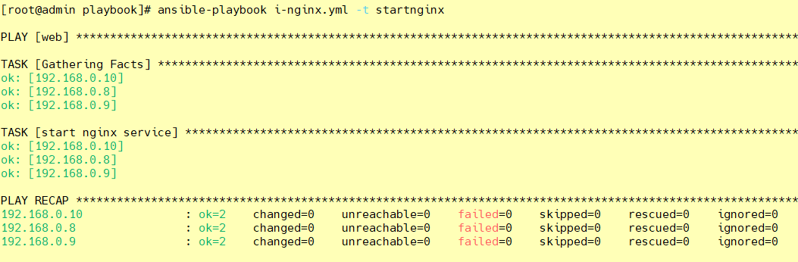


####  ④ 测试 restarted

我们还做了一个`notify`，来测试一下：

首先，它的触发条件是配置文件被改变，所以我们去把配置文件中的端口改一下：

```shell
vim /etc/ansible/nginx/conf.d/ry.conf
	listen       80;
	
ansible-playbook i-nginx.yml -t restartnginx
```

　　然后我们重新加载一下这个剧本：

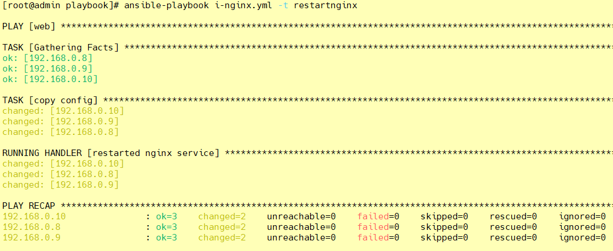


发现我们执行的就是 restart 段以及我们定义的`notify`部分。

我们来看一看我们的端口号：

> ansible web -m shell -a 'ss -ntlp | grep nginx'

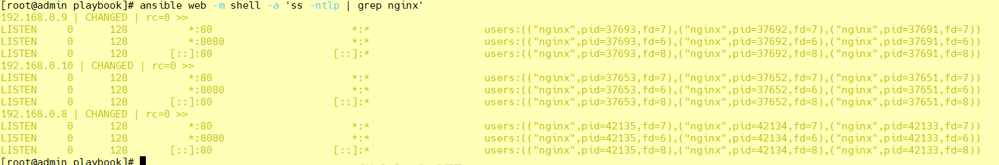

可以看出，我们的nginx端口已经变成了8080。
 　#### ⑤ 测试 reloaded

```yaml
---
- hosts: web
  remote_user: root
  tasks:
    - name: install nginx
      yum: name=nginx state=present
    - name: copy config
      copy: src=/etc/ansible/nginx dest=/etc backup=yes
      notify: reloaded nginx service
      tags: reloadednginx
    - name: start nginx service
      service: name=nginx state=started enabled=true
      tags: startnginx
 
  handlers:
    - name: restarted nginx service
      service: name=nginx  state=restarted
    - name: reloaded nginx service
      service: name=nginx  state=reloaded

```

```shell
vim /etc/ansible/nginx/conf.d/ry.conf
	listen       81;
	
ansible-playbook i-nginx.yml -t reloadednginx
```

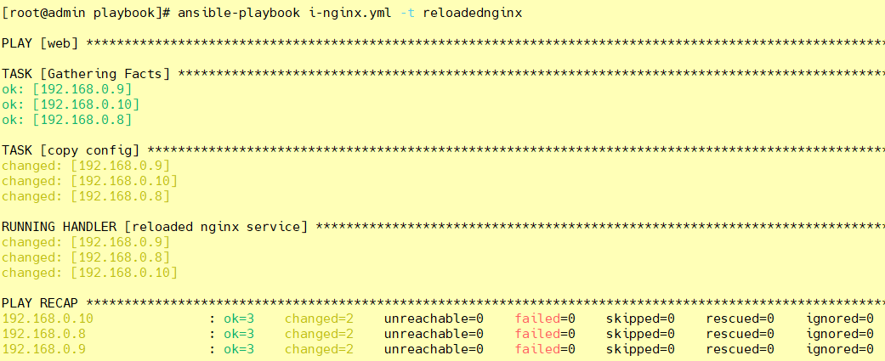

>ansible web -m shell -a 'ss -ntlp | grep nginx'

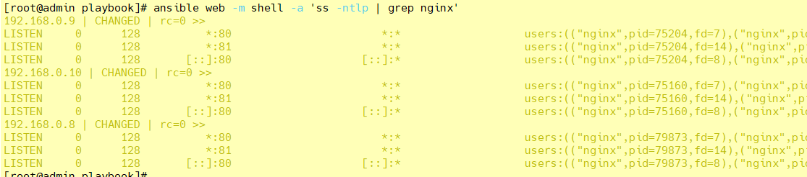


 　#### ⑥ 卸载 nginx

vim uni-nginx.yml

```yaml
---
- hosts: web
  remote_user: root
  tasks:
#    - name: stop nginx service
#      service: name=nginx state=stopped
#      tags: stopnginx
    - name: uninstall nginx
      shell: yum remove -y nginx && rm -rf /etc/nginx && ls /usr/sbin/nginx
```

`ansible-playbook uni-nginx.yml`

### variables 变量

上文中，我们说到了`variables`是变量，有四种定义方法，现在我们就来说说这四种定义方法：

#### ① facts ：可直接调用

上一篇中，我们有说到`setup`这个模块，这个模块就是通过调用facts组件来实现的。我们这里的`variables`也可以直接调用`facts`组件。
 　具体的`facters`我们可以使用`setup`模块来获取，然后直接放入我们的剧本中调用即可。

#### ② 用户自定义变量

我们也可以直接使用用户自定义变量，想要自定义变量有以下两种方式：

> 通过命令行传入

`ansible-playbook`命令的命令行中的`-e VARS, --extra-vars=VARS`，这样就可以直接把自定义的变量传入。

> 在playbook中定义变量

我们也可以直接在playbook中定义我们的变量：

```yaml
---
- hosts: web
  remote_user: root
  vars:
　　- var1: value1
　　- - var2: value2
```

#### ① 定义剧本

我们就使用全局替换把我们刚刚编辑的文件修改一下：

```shell
[root@admin ansible]# vim /etc/ansible/playbook/i-nginx.yml
```

```yaml
---
- hosts: web
  remote_user: root
  tasks:
    - name: install {{ rpmname }}
      yum: name={{ rpmname }} state=present
    - name: copy config
      copy: src=/etc/ansible/{{ rpmname }} dest=/etc backup=yes
      notify: restarted {{ rpmname }} service
      tags: restart{{ rpmname }}
    - name: start {{ rpmname }} service
      service: name={{ rpmname }} state=started enabled=true
      tags: start{{ rpmname }}
 
  handlers:
    - name: restarted {{ rpmname }} service
      service: name={{ rpmname }}  state=restarted
    - name: reloaded {{ rpmname }} service
      service: name={{ rpmname }}  state=reloaded
```


这样一来，我们的剧本就定义完成了。

#### ② 拷贝配置文件

我们想要在被监管的机器上安装什么服务的话，就直接在我们的server端上把该服务的配置文件拷贝到我们的`/tmp/`目录下。这样我们的剧本才能正常运行。

我们就以`keepalived`服务为例：

```shell
[root@admin ansible]# cp /etc/ansible/keepalived/keepalived.conf /tmp/keepalived.conf
```

#### ③ 运行剧本，变量由命令行传入

```shell
[root@admin ansible]# ansible-playbook i-nginx.yml -e rpmname=keepalived
```

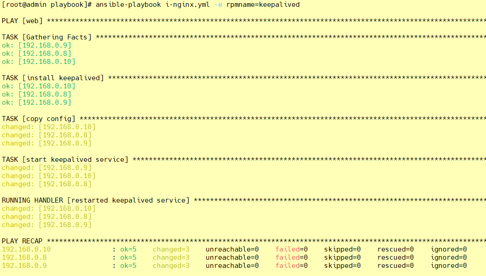


####  ④ 修改剧本，直接定义变量

同样的，我们可以直接在剧本中把变量定义好，这样就不需要在通过命令行传入了。以后想要安装不同的服务，直接在剧本里把变量修改一下即可。

```shell
[root@admin ansible]# vim /etc/ansible/playbook/i-nginx.yml
```

```yaml
---
- hosts: web
  remote_user: root
  vars: 
    - rpmname: keepalived
  tasks:
    - name: install {{ rpmname }}
      yum: name={{ rpmname }} state=present
    - name: copy config
      copy: src=/etc/ansible/{{ rpmname }} dest=/etc backup=yes
      notify: restarted {{ rpmname }} service
      tags: restart{{ rpmname }}
    - name: start {{ rpmname }} service
      service: name={{ rpmname }} state=started enabled=true
      tags: start{{ rpmname }}
 
  handlers:
    - name: restarted {{ rpmname }} service
      service: name={{ rpmname }}  state=restarted
    - name: reloaded {{ rpmname }} service
      service: name={{ rpmname }}  state=reloaded
```


####  ⑤ 运行定义过变量的剧本

我们刚刚已经把变量定义在剧本里面了。现在我们来运行一下试试看：

```shell
[root@admin ansible]# ansible-playbook i-nginx.yml
```

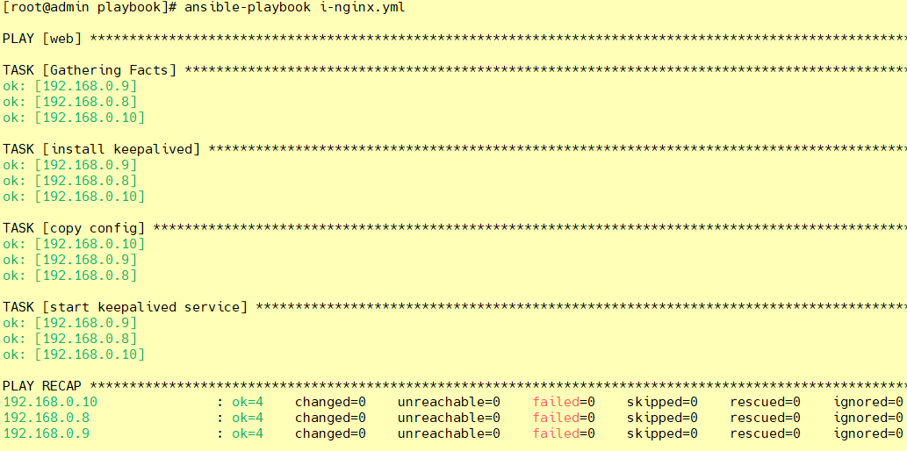


发现这样也是可以的

#### ③ 通过roles传递变量

具体的，我们下文中说到 roles 的时候再详细说明。这里是[传送带](https://www.cnblogs.com/keerya/p/8004566.html#jump)

#### ④  Host Inventory

我们也可以直接在主机清单中定义。

> 向不同的主机传递不同的变量：

```ABAP
IP/HOSTNAME varaiable=value var2=value2
```

> 向组中的主机传递相同的变量：

```ini
[web:vars]
variable=value
```

### templates 模板

模板是一个文本文件，嵌套有脚本（使用模板编程语言编写）。

`Jinja2`：Jinja2是python的一种模板语言，以Django的模板语言为原本。
 模板支持：

> 　　字符串：使用单引号或双引号；
>
> 　　数字：整数，浮点数；
>
> 　　列表：[item1, item2, ...]
>
> 　　元组：(item1, item2, ...)
>
> 　　字典：{key1:value1, key2:value2, ...}
>
> 　　布尔型：true/false
>
> 　　算术运算： +, -, *, /, //, %, **
>
> 　　比较操作： ==, !=, >, >=, <, <=
>
> 　　逻辑运算： and, or, not

通常来说，模板都是通过引用变量来运用的。

#### ① 定义模板

我们直接把之前定义的`/tmp/nginx.conf`改个名，然后编辑一下，就可以定义成我们的模板文件了：

```perl
cd /templates
vim ./nginx/conf/nginx.conf.j2 || vim ./nginx/conf.d/ry.conf.j2
	worker_processes  {{ ansible_processor_vcpus }};
	listen       {{ nginxport }};
```

#### ② 修改剧本

我们现在需要去修改剧本来定义变量：

```shell
[root@admin ansible]# vim /etc/ansible/playbook/i-nginx.yml
```

```yaml
---
- hosts: web
  remote_user: root
  vars: 
    - rpmname: nginx
      nginxport: 8888
      ansible_processor_vcpus: 1
  tasks:
    - name: install {{ rpmname }}
      yum: name={{ rpmname }} state=present
    - name: copy config
      copy: src=/etc/ansible/templates/{{ rpmname }} dest=/etc backup=yes
      notify: restarted {{ rpmname }} service
      tags: restart{{ rpmname }}
    - name: start {{ rpmname }} service
      service: name={{ rpmname }} state=started enabled=true
      tags: start{{ rpmname }}
 
  handlers:
    - name: restarted {{ rpmname }} service
      service: name={{ rpmname }}  state=restarted
    - name: reloaded {{ rpmname }} service
      service: name={{ rpmname }}  state=reloaded
```

####  ③ 运行剧本
上面的准备工作完成后，我们就可以去运行剧本了：

```shell
ansible-playbook i-nginx.yml
ansible-playbook i-nginx.yml -t restartnginx
ansible web -m shell -a 'ss -ntlp | grep nginx'
```


### 条件测试

when语句：在task中使用，jinja2的语法格式。

```vhdl
tasks:
  - name: install conf file to centos7
    template: src=files/nginx.conf.c7.j2
    when: ansible_distribution_major_version == "7"
  - name: install conf file to centos6
    template: src=files/nginx.conf.c6.j2
    when: ansible_distribution_major_version == "6"
```

循环：迭代，需要重复执行的任务；

对迭代项的引用，固定变量名为"item"，而后，要在task中使用with_items给定要迭代的元素列表；
 举例如下：

```yaml
  tasks:
    - name: unstall web packages
      yum: name={{ item }} state=absent
      with_items:
        - httpd
        - php
        - php-mysql
```

### 字典

ansible playbook 还支持字典功能。举例如下：

```yaml
    - name: install some packages
      yum: name={{ item }} state=present
      with_items:
        - nginx
        - memcached
        - php-fpm
    - name: add some groups
      group: name={{ item }} state=present
      with_items:
        - group11
        - group12
        - group13
    - name: add some users
      user: name={{ item.name }} group={{ item.group }} state=present
      with_items:
        - { name: 'user11', group: 'group11' }
        - { name: 'user12', group: 'group12' }
        - { name: 'user13', group: 'group13' }
```

### 角色订制：roles

#### ① 简介

对于以上所有的方式有个弊端就是无法实现复用假设在同时部署Web、db、ha 时或不同服务器组合不同的应用就需要写多个yml文件。很难实现灵活的调用。

roles 用于层次性、结构化地组织playbook。roles 能够根据层次型结构自动装载变量文件、tasks以及handlers等。

要使用roles只需要在playbook中使用include指令即可。简单来讲，roles就是通过分别将变量(vars)、文件(file)、任务(tasks)、模块(modules)及处理器(handlers)放置于单独的目录中，并可以便捷地include它们的一种机制。

角色一般用于基于主机构建服务的场景中，但也可以是用于构建守护进程等场景中。

#### ② 目录说明

**xxx模块下面的每个目录至少应该有一个名为main.yml的文件，其它的文件需要由main.yml进行“包含”调用；**

```tex
[root@admin roles]# tree
.
├── xxx模块
│   ├── default		# 用于设定默认变量；
│   ├── files		# 存储由 copy 或 script 等模块调用的文件；
│   ├── handlers	# 用于定义各 handler 处理器；
│   ├── meta		# 定义当前角色的特殊设定及其依赖关系；
│   ├── tasks		# 用于定义各 task;
│   ├── templates	# 模板文本；
│   └── vars		# 用于定义各 variable 变量
| ......
```

#### ③ 在roles目录下生成对应的目录结构

```shell
[root@admin ansible]# cd roles/
[root@admin roles]# ls
[root@admin roles]# mkdir -pv ./{nginx,mysql,httpd}/{files,templates,vars,tasks,handlers,meta,default}
[root@admin roles]# touch ./{nginx,mysql,httpd}/{files,templates,vars,tasks,handlers,meta,default}/main.yml
[root@admin roles]# tree
.
├── httpd
│   ├── default
│   │   └── main.yml
│   ├── files
│   │   └── main.yml
│   ├── handlers
│   │   └── main.yml
│   ├── meta
│   │   └── main.yml
│   ├── tasks
│   │   └── main.yml
│   ├── templates
│   │   └── main.yml
│   └── vars
│       └── main.yml
├── mysql
│   ├── default
│   │   └── main.yml
│   ├── files
│   │   └── main.yml
│   ├── handlers
│   │   └── main.yml
│   ├── meta
│   │   └── main.yml
│   ├── tasks
│   │   └── main.yml
│   ├── templates
│   │   └── main.yml
│   └── vars
│       └── main.yml
└── nginx
    ├── default
    │   └── main.yml
    ├── files
    │   └── main.yml
    ├── handlers
    │   └── main.yml
    ├── meta
    │   └── main.yml
    ├── tasks
    │   └── main.yml
    ├── templates
    │   └── main.yml
    └── vars
        └── main.yml
```

#### ④ 定义 tasks 任务文件

rpm包下载：

> wget http://nginx.org/packages/centos/7/x86_64/RPMS/nginx-1.22.0-1.el7.ngx.x86_64.rpm
>
> chmod -R 777 nginx-1.22.0-1.el7.ngx.x86_64.rpm

#### nginx.conf

```yaml

user nginx;

worker_processes {{ ansible_processor_vcpus }};

error_log /var/log/nginx/error.log;
pid /run/nginx.pid;

include /usr/share/nginx/modules/*.conf;

events {
    worker_connections 1024;
}

http {
    log_format  main  '$remote_addr - $remote_user [$time_local] "$request" '
                      '$status $body_bytes_sent "$http_referer" '
                      '"$http_user_agent" "$http_x_forwarded_for"';

    access_log  /var/log/nginx/access.log  main;

    sendfile            on;
    tcp_nopush          on;
    tcp_nodelay         on;
    keepalive_timeout   65;
    types_hash_max_size 4096;

    include             /etc/nginx/mime.types;
    default_type        application/octet-stream;

    include /etc/nginx/conf.d/*.conf;

    server {
        listen       {{ nginxprot }};
        listen       [::]:{{ nginxprot }};
        server_name  _;
        
        root         /usr/share/nginx/html;

        error_page 404 /404.html;
        location = /404.html {
        }

        error_page 500 502 503 504 /50x.html;
        location = /50x.html {
        }
    }
}
```

vim /etc/ansible/roles/nginx/tasks/main.yml

```yaml
- include: install.yml
- include: copy.yml
- include: start.yml
```

install.yml

```yaml
- name: install nginx
  yum: name=nginx state=present
```

copy.yml

```yaml
- name: copy config
  template: src=/etc/ansible/roles/nginx/templates/nginx.conf.j2 dest=/etc/nginx/nginx.conf mode=0777
  # notify: restarted、reloaded 这里对应的触发是 handlers 处理器
  notify: restarted nginx service
  # tags: restartnginx、reloadnginx
  tags: restartnginx
```

start.yml

```yaml
- name: start nginx service
  service: name=nginx state=started enabled=true
  tags: startnginx
```


#### ⑤ 放置我们所需要的文件到指定目录

因为我们定义的角色已经有了新的组成方式，所以我们需要把文件都放到指定的位置，这样，才能让配置文件找到这些并进行加载。

```shell
[root@admin nginx]# tree
├── default
│   └── main.yml
├── files
│   ├── main.yml
│   └── nginx-1.22.0-1.el7.ngx.x86_64.rpm
├── handlers
│   └── main.yml
├── meta
│   └── main.yml
├── tasks
│   ├── copy.yml
│   ├── install.yml
│   ├── main.yml
│   └── start.yml
├── templates
│   ├── default.conf.j2
│   ├── html
│   │   ├── 404.html
│   │   ├── 50x.html
│   │   └── index.html
│   ├── logs
│   ├── main.yml
│   ├── nginx.conf.j2
│   └── time.txt
└── vars
    └── main.yml
```

#### ⑥ 定义 vars 变量文件
我们在模板中定义的变量，也要去配置文件中加上：

```shell
[root@admin nginx]# vim ./vars/main.yml

nginxprot: 5120
ansible_processor_vcpus: 1
```

#### ⑦ 定义 handlers 文件
我们在配置文件中定义了`notify`，所以我么也需要定义`handlers`，我们来修改配置文件：

```shell
[root@admin nginx]# vim ./handlers/main.yml

- name: restarted nginx service
  service: name=nginx state=restarted
- name: reloaded nginx service
  service: name=nginx state=reloaded

```

#### ⑧ 定义 roles 剧本文件
接下来，我们就来定义剧本文件，由于大部分设置我们都单独配置在了roles里面，所以，接下来剧本就只需要写一点点内容即可：

```yaml
[root@admin roles]# vim ./roles.yml
- hosts: web
  remote_user: root
  roles:
    - nginx

```

#### ⑨ 启动服务
剧本定义完成以后，我们就可以来启动服务了：

```shell
[root@admin roles]# ansible-playbook roles.yml
```

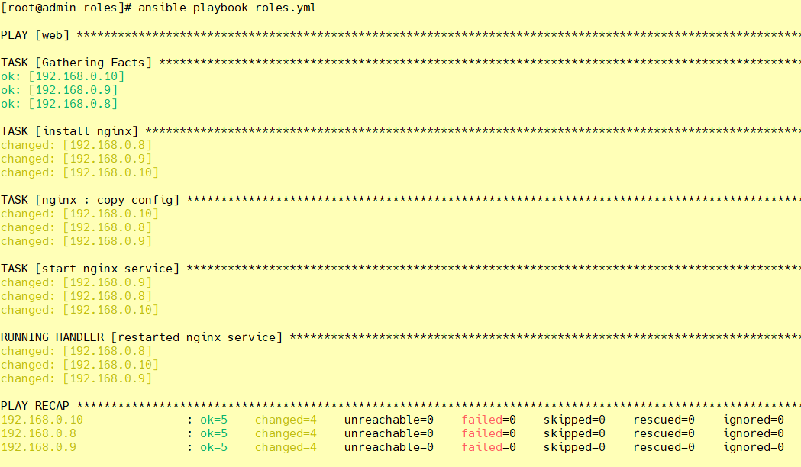

#### ⑩ 启动过后照例查看端口号：

```shell
[root@admin roles]# ansible web -m shell -a "ss -ntulp |grep 5120"

[root@admin roles]# ansible web -m shell -a "ss -ntulp |grep nginx"
```

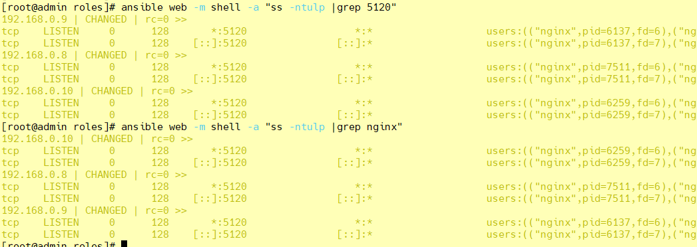

#### 11 测试修改后重新加载配置文件 - restartnginx

```shell
[root@admin nginx]# vim ./vars/main.yml

nginxprot: 5133

[root@admin nginx]# vim ./tasks/copy.yml
- name: copy config
  template: src=/etc/ansible/roles/nginx/templates/nginx.conf.j2 dest=/etc/nginx/nginx.conf mode=0777
  notify: restarted nginx service
  tags: restartnginx

[root@admin roles]# ansible-playbook roles.yml -t restartnginx
```

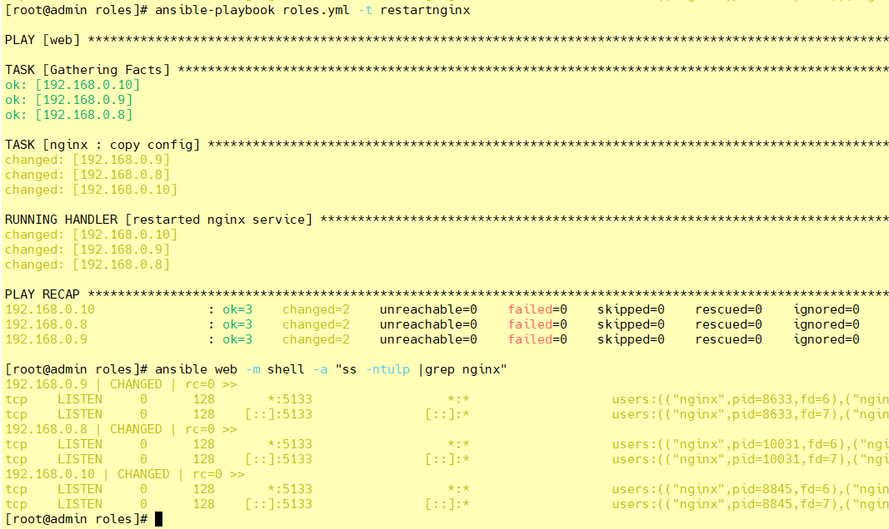


#### 12 测试修改后重新加载配置文件 - reloadnginx

```shell
[root@admin nginx]# vim ./vars/main.yml

nginxprot: 5166

[root@admin nginx]# vim ./tasks/copy.yml
- name: copy config
  template: src=/etc/ansible/roles/nginx/templates/nginx.conf.j2 dest=/etc/nginx/nginx.conf mode=0777
  notify: reloaded nginx service
  tags: reloadnginx

[root@admin roles]# ansible-playbook roles.yml -t reloadnginx
```

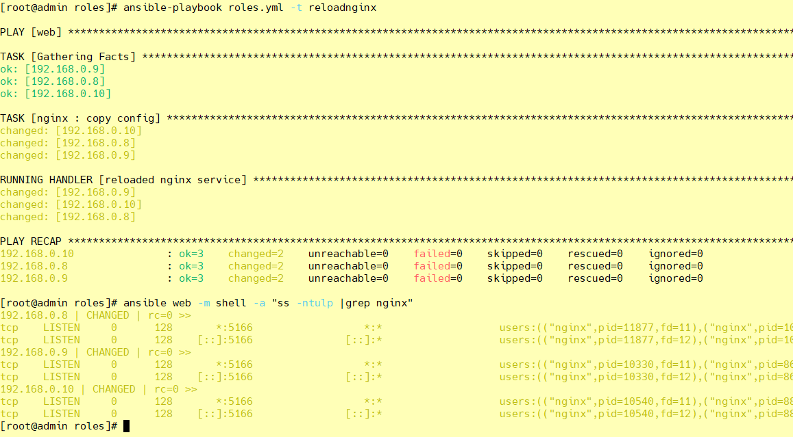


## 八、ansible-galaxy


