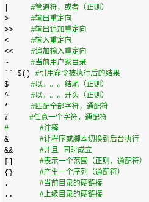
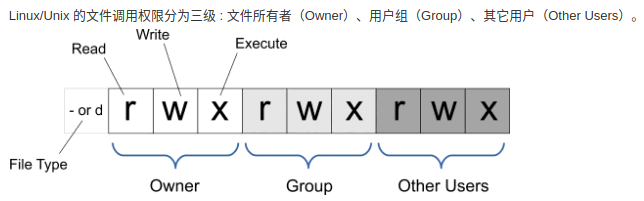

# linux笔记


## 基础命令


## 用户管理


## 文件管理

### 符号含义



echo

```shell
echo "12311" >> 01.txt 文本末尾追加
echo "4565555" > 01.txt 替换文本内容
```

tee

```shell
tee 01.txt <<-'EOF'
{
  "registry-mirrors": ["https"]
}
EOF
```

cat

```shell
# 替换全部内容
cat -s <<EOF > /home/test/k8s.conf
vm.swappiness=0
EOF

# 追加内容
cat -s <<EOF >> /home/test/k8s.conf
vm.swappiness=0
EOF
```

## 权限

### 所属组 chown

chown -R root:kong xxx.txt 文件所属组

### 文件权限 chmod



chmod -R 777 demo.txt 文件权限【读r--[4]、写-w-[2]、执行--x[1]、无---[ 0] 】


### 将用户添加到其他组 usermod

usermod -aG root kong ；将kong添加到root组


## 系统安全管理


### 防火墙

实际应用场景中防火墙是要打开的，只能开放端口来外部访问。一般是通过开放端口来实现，关闭防火墙容易导致安全问题。

**启动命令**：systemctl start firewalld；systemctl restart firewalld；systemctl status firewalld

**自动启动**：systemctl disable firewalld | systemctl enablefirewalld

**开放端口**：firewall-cmd --zone=public --add-port=3306/tcp --permanent


> --zone #作用域
> 
> --add-port=3306/tcp #添加端口，格式为：端口/通讯协议
> 
> --permanent #永久生效，没有此参数重启后失效
> 

**查看开启端口**：netstat -ntlp 或：firewall-cmd --list-ports


### deepin 防火墙

**获取更新**：sudo apt-get update

**更新系统**：sudo apt-get dist-upgrade -y

**清理更新缓存**：sudo apt-get autoclean


sudo apt-get install ufw || sudo apt install gufw

sudo ufw status：active启动，inactive未启动

sudo ufw enable

sudo ufw disable


### 端口

查看：netstat -tunlp |grep port

netstat -ntlp 或：firewall-cmd --list-ports

### 修改文件监视程序数量的系统限制

sudo echo fs.inotify.max_user_watches=524288 | sudo tee -a /etc/sysctl.conf

## 启动 java 服务

nohub java -jar xxx.jar

sh start.sh start


