# Jenkins自动化部署

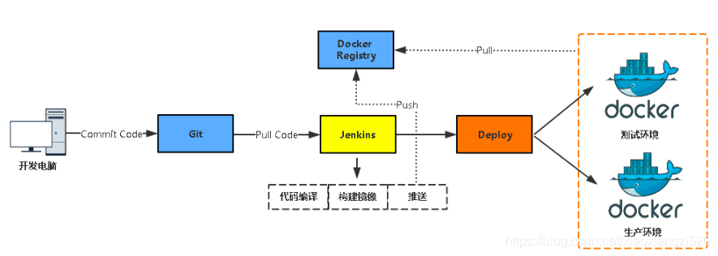

> 开发push代码到git，触发jenkins自动pull代码，通过maven编译、打包，然后通过执行shell脚本使docker构建镜像并push到私服（或者阿里云）仓库，此操作完成后jenkins服务器上再执行SSH命令登录到部署服务器，docker从仓库（私服）拉取镜像，启动容器。整个操作流程完成。

## 通过 docker 安装 2.363

[自动化部署 参考](https://blog.csdn.net/xiaoxiangzi520/article/details/88842200)

[设置docker快捷键](https://blog.csdn.net/qq_42476834/article/details/117373828)

[docker.hub](https://hub.docker.com/r/jenkins/jenkins)

### 安装

```bash
docker pull jenkins/jenkins:latest
docker pull jenkins/jenkins:lts-jdk17
docker pull jenkins/jenkins:lts-centos7
docker pull jenkins/jenkins:2.363
docker pull jenkins/jenkins:2.363-jdk17
docker pull jenkins/jenkins:2.363-centos7

docker tag jenkins/jenkins:2.363-centos7 registry.cn-chengdu.aliyuncs.com/jinfang/jenkins:2.363-centos7

docker push registry.cn-chengdu.aliyuncs.com/jinfang/jenkins:2.363-centos7
```

```shell
mkdir -p /data/jenkins_home
chmod 777 /data/jenkins_home
```

```shell
docker run -d -p 8888:8080 -p 50000:50000 \
--restart always \
-v /data/jenkins_home:/var/jenkins_home \
-v /etc/localtime:/etc/localtime \
--name jenkins registry.cn-chengdu.aliyuncs.com/jinfang/jenkins:latest
```

```shell
docker run -d -p 8889:8080 -p 50001:50000 \
--restart always \
-v /data/jenkins_jdk17:/var/jenkins_home \
-v /etc/localtime:/etc/localtime \
--name jenkins-jdk17 registry.cn-chengdu.aliyuncs.com/jinfang/jenkins:2.363-jdk17
```


> ansible web -m shell -a 'docker pull registry.cn-chengdu.aliyuncs.com/jinfang/jenkins:latest'

访问：http://192.168.0.8:8889

-----

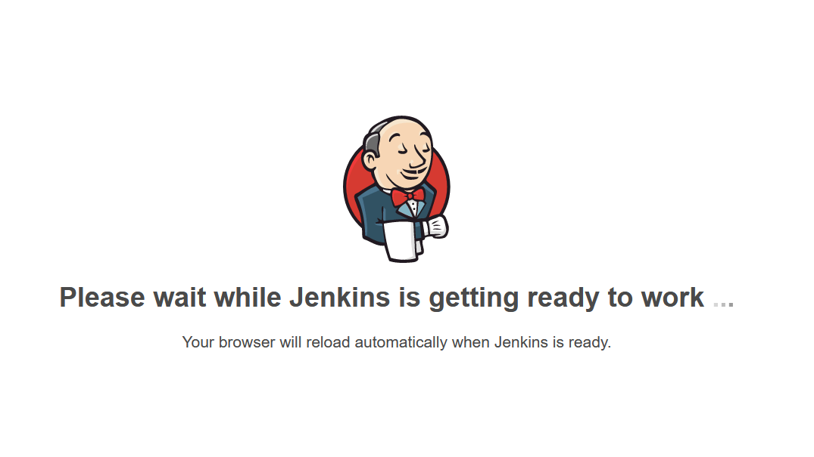

-----

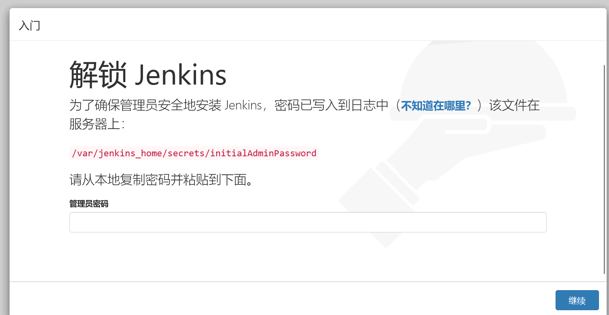

----

### 查看管理员密码

docker logs jenkins

```shell

*************************************************************
*************************************************************
*************************************************************

Jenkins initial setup is required. An admin user has been created and a password generated.
Please use the following password to proceed to installation:

62fc38a29bf840ee8c5fcf746ad9f574

This may also be found at: /var/jenkins_home/secrets/initialAdminPassword

*************************************************************
*************************************************************
*************************************************************
```

> 62fc38a29bf840ee8c5fcf746ad9f574

### 配置国内站点加速

vim /data/jenkins_home/hudson.model.UpdateCenter.xml

https://updates.jenkins.io/update-center.json

换为

https://updates.jenkins-zh.cn/update-center.json

https://mirrors.tuna.tsinghua.edu.cn/jenkins/updates/update-center.json

https://mirrors.huaweicloud.com/jenkins/updates/update-center.json

```xml
<?xml version='1.1' encoding='UTF-8'?>
<sites>
  <site>
    <id>default</id>
    <url>https://mirrors.huaweicloud.com/jenkins/updates/update-center.json</url>
  </site>
</sites>
```

其实国内的配置内容使用的下载更新地址也是 *Jenkins* 官方默认下载的地址，所以还得编辑 `updates/default.json`

```
sed -i 's#https://updates.jenkins.io/download#https://mirrors.huaweicloud.com/jenkins#g' default.json

sed -i 's#http://www.google.com#https://www.baidu.com#g' default.json
```

国内常用的镜像地址：

| 来源       | 地址                                            |
|----------|-----------------------------------------------|
| tencent  | https://mirrors.cloud.tencent.com/jenkins/    |
| huawei   | https://mirrors.huaweicloud.com/jenkins/      |
| tsinghua | https://mirrors.tuna.tsinghua.edu.cn/jenkins/ |
| ustc     | https://mirrors.ustc.edu.cn/jenkins/          |
| bit      | http://mirror.bit.edu.cn/jenkins/             |

也可以在管理界面进行设置

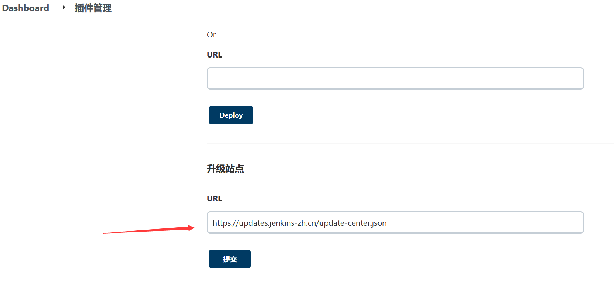

重启服务：docker restart jenkins

查看配置： `[root@n1 jenkins_home]# cat updates/default.json`


### 安装插件

二选一即可

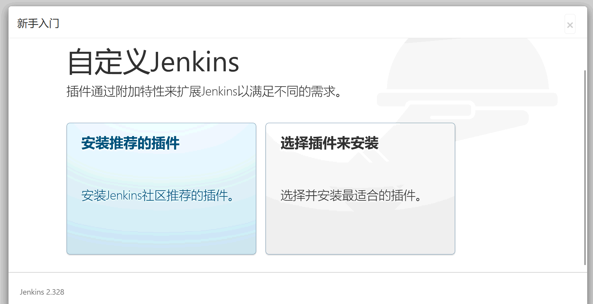

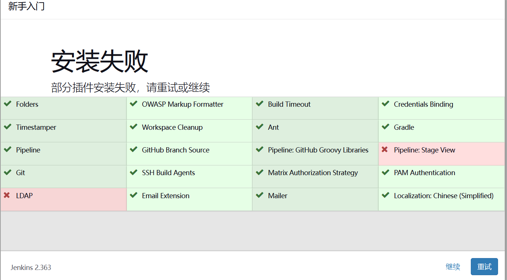


### 安装自动化构建和部署所需的插件

所需插件：Maven Integration、Pipeline Maven Integration、Gitlab、SSH、Publish Over SSH、gitee、github、Deploy to container、Docker、Docker Commons、docker-build-step

​		

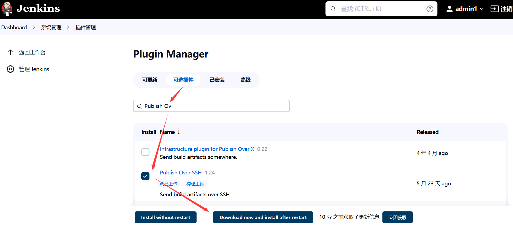

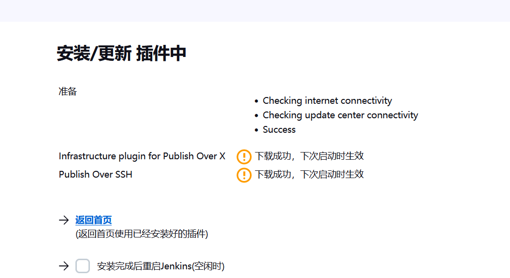


### 创建用户

admin	admin123456

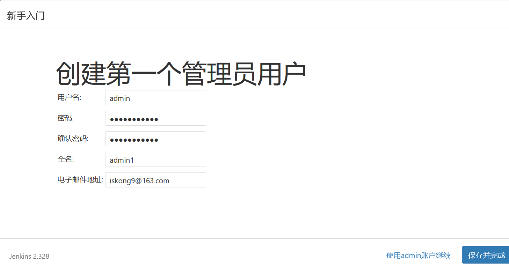


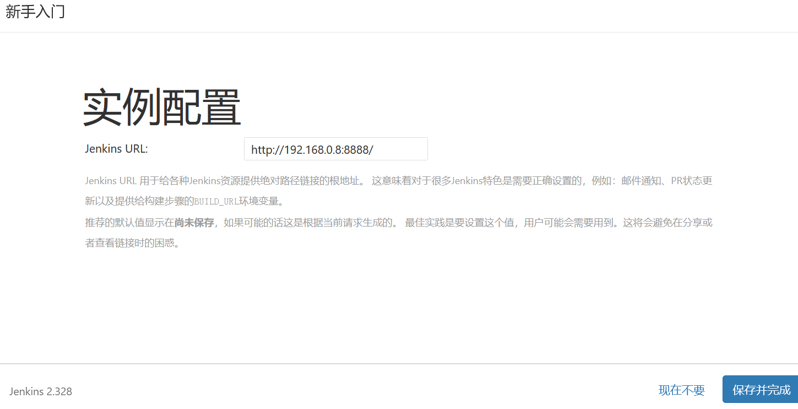

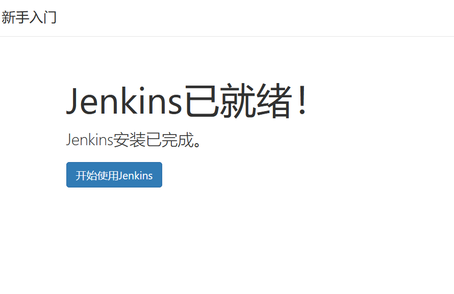

-----------------

## 通过 war 安装 2.346.3

下载地址：[huawei源](https://mirrors.huaweicloud.com/jenkins/war/2.346/jenkins.war)、[官网 2.346.3](https://get.jenkins.io/war-stable/2.346.3/jenkins.war)

安装（提取码：1234）： [java各个版本下载](https://pan.baidu.com/s/17pkHcX7YrssnEVctveHbHQ)、[maven3.8](https://pan.baidu.com/s/1ch1_sjFDvvgY52-niYEBFw)、[tomcat](https://pan.baidu.com/s/1TQgpdHz6p38k6QxPsBDhrQ)、yum install -y git

### 安装 JDK

tar -zxvf jdk-17_linux-x64_bin.tar.gz -C /usr/java/

vim /etc/profile

```bash
export JAVA_HOME=/usr/java/jdk-17.0.4/

export PATH=$JAVA_HOME/bin:$PATH
```

### 安装 tomcat

tar -zxvf apache-tomcat-9.0.65.tar.gz

`vim /data/apache-tomcat-9.0.65/conf/server.xml`

```xml
    <Connector port="8080" protocol="HTTP/1.1"
               connectionTimeout="20000"
               redirectPort="8443" URIEncoding="UTF-8" />
```


### 安装 maven

tar -zxvf apache-maven-3.8.6-bin.tar.gz

`vim /etc/profile`

```bash
export JAVA_HOME=/usr/java/jdk-17.0.4/
export M2_HOME=/data/apache-maven-3.8.6

export PATH=$JAVA_HOME/bin:${M2_HOME}/bin:$PATH
```

`source /etc/profile`

```bash
[root@n1 apache-maven-3.8.6]# mvn -v

Apache Maven 3.8.6 (84538c9988a25aec085021c365c560670ad80f63)
Maven home: /data/apache-maven-3.8.6
Java version: 17.0.4, vendor: Oracle Corporation, runtime: /usr/java/jdk-17.0.4
Default locale: zh_CN, platform encoding: UTF-8
OS name: "linux", version: "3.10.0-1160.71.1.el7.x86_64", arch: "amd64", family: "unix"

[root@n1 soft]# java -version
java version "17.0.4" 2022-07-19 LTS
Java(TM) SE Runtime Environment (build 17.0.4+11-LTS-179)
Java HotSpot(TM) 64-Bit Server VM (build 17.0.4+11-LTS-179, mixed mode, sharing)
```

### tomcat 启动jenkins

`java -jar jenkins.war httpPort=8889`

把war放到 tomcat里运行 cp -R ../soft/jenkins2.346.3.war ./webapps/

`./bin/startup.sh`

http://192.168.0.8:8889/jenkins/


## 通过 yum 安装 2.346.3

```
sudo wget -O /etc/yum.repos.d/jenkins.repo https://pkg.jenkins.io/redhat-stable/jenkins.repo

sudo rpm --import https://pkg.jenkins.io/redhat-stable/jenkins.io.key

```

```
yum install fontconfig java-17-openjdk

yum -y install jenkins
```

```
[root@n1 jenkins_jdk17]# jenkins --version
2.346.3
```

```
systemctl enable jenkins
```

```
systemctl start jenkins
```

```
systemctl status jenkins
```


## 自动部署项目（springBoot+maven+gitee）

### 添加凭证


http://192.168.0.8:8889/gitee-project/drj


