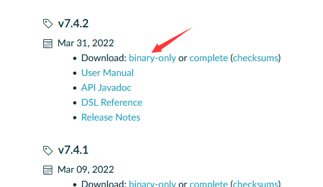
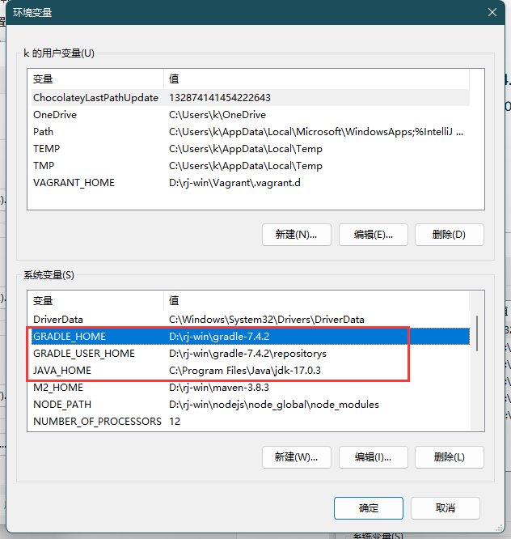
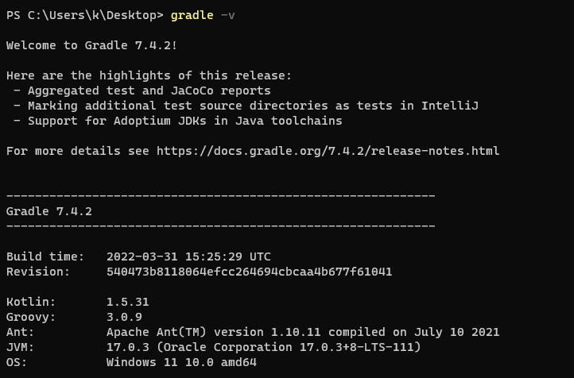
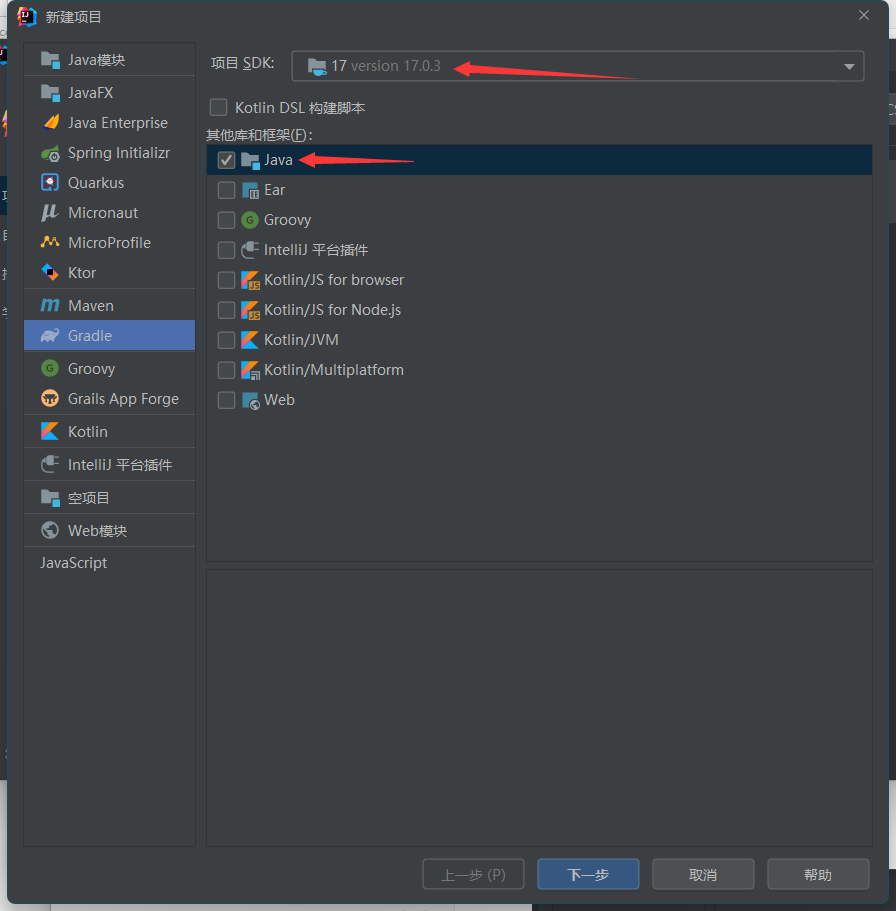
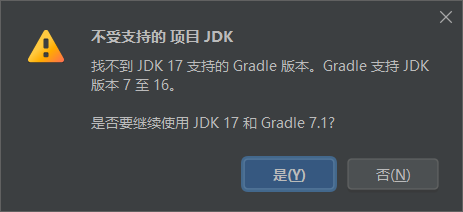
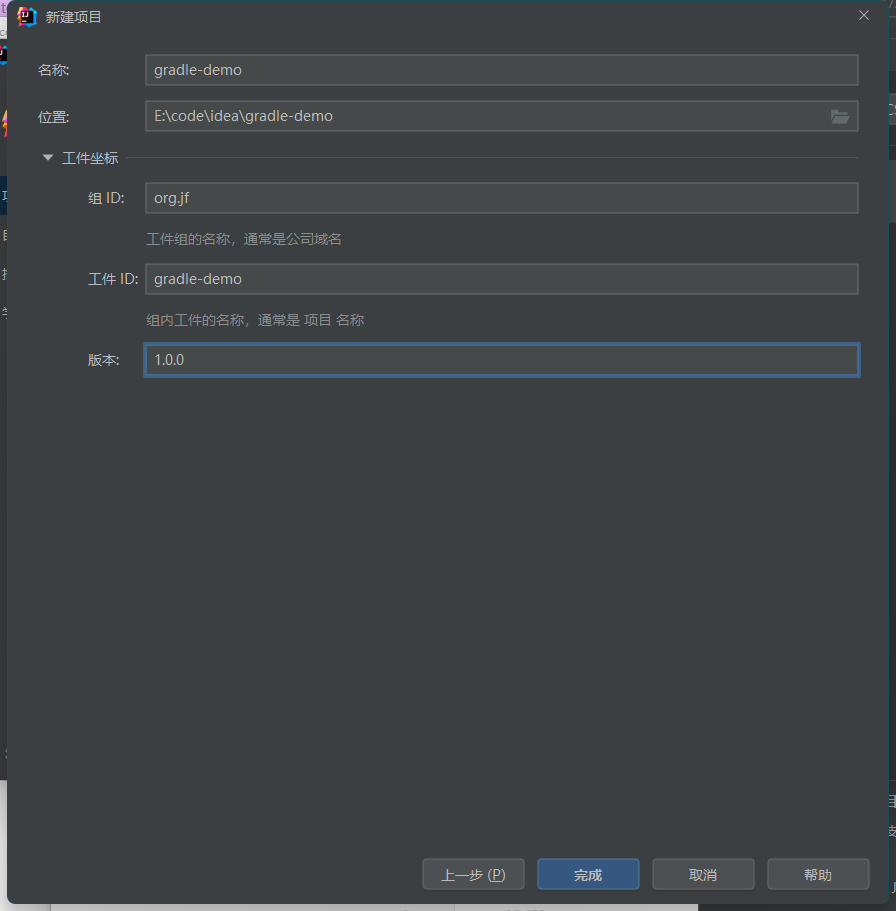

# gradle 使用笔记

## 技术选型

| 名称   | 版本                                                         |
| ------ | ------------------------------------------------------------ |
| JDK    | 17.0.3                                                       |
| Gradle | 7.4.2，<a target="_blank" href="https://docs.gradle.org/7.4.2/userguide/userguide.pdf">PDF 文档</a> |
| Groovy | 1.5.8 - 3.0.9                                                |
| Kotlin | 1.3.72 - 1.5.31                                              |
| IDEA   | 2021.2.2                                                     |

## jdk对应版本

| Java version | First Gradle version to support it |
| ------------ | ---------------------------------- |
| 8            | 2.0                                |
| 9            | 4.3                                |
| 10           | 4.7                                |
| 11           | 5.0                                |
| 12           | 5.4                                |
| 13           | 6.0                                |
| 14           | 6.3                                |
| 15           | 6.7                                |
| 16           | 7.0                                |
| 17           | 7.3                                |


## 下载与配置

<a target="_blank" href="https://gradle.org">首页</a>、<a target="_blank" href="https://gradle.org/releases/">下载页</a>

选择 `7.4.2` 版本



window配置

新建`系统环境变量`




配置gradle本地仓库：`D:\rj-win\gradle-7.4.2\init.d\init.gradle`

```properties
allprojects {
    repositories {
        maven { url 'file:///D:/rj-win/gradle-7.4.2/repositorys'}
        mavenLocal()
        maven { name "Alibaba" ; url "https://maven.aliyun.com/repository/public" }
        maven { name "Bstek" ; url "http://nexus.bsdn.org/content/groups/public/" }
        mavenCentral()
    }

    buildscript { 
        repositories { 
            maven { name "Alibaba" ; url 'https://maven.aliyun.com/repository/public' }
            maven { name "Bstek" ; url 'http://nexus.bsdn.org/content/groups/public/' }
            maven { name "M2" ; url 'https://plugins.gradle.org/m2/' }
        }
    }
}
```
重启系统并校验 CMD：gradle -v




## 与maven比较

Gradle是：

- 大型项目更快
- 无限制可定制 `==` 更陡峭的学习曲线
- 使用Groovy或Kotlin代替XML

而Maven是：

- 普遍采用
- 对于较小项目更简单
- 带有XML和尖括号

## Groovy 的优点

简要介绍一下Groovy。Groovy是一种JVM语言，它可以编译为与Java相同的字节码，并且可以与Java类无缝地互操作。Groovy是Java的向后兼容超集，这意味着Groovy可以透明地与Java库和代码交互。但是，它还增加了许多新功能：可选的键入，函数式编程，运行时灵活性以及许多元编程内容。它还极大地清理了Java中许多冗长的代码格式。Groovy尚未成为主流的开发语言，但是它已经在测试（由于其简化的语法和元编程功能）和构建系统中占据了一席之地。

## 创建项目 Gradle





选择 `是`

下一步，设置 `组`、`工件`、`版本`



### 报错：

```bash
Unsupported Java. 
Your build is currently configured to use Java 17.0.3 and Gradle 7.1.

Possible solution:
 - Use Java 16 as Gradle JVM: Open Gradle settings 
 - Open Gradle wrapper settings, change `distributionUrl` property to use compatible Gradle version and reload the project
```

### 重新修改gradle版本

`gradle -> wrapper -> gradle-wrapper.properties`

```properties
distributionUrl=https\://services.gradle.org/distributions/gradle-7.1-bin.zip
```

改为：

```properties
distributionUrl=https\://services.gradle.org/distributions/gradle-7.4.2-bin.zip
```


## 创建项目 Gradle+Kotlin


## 核心文件

### build.gradle

类似于maven的pom文件、依赖配置

```yml
//添加构建插件
plugins {
    id 'java'
}

group 'org.jf'
version '1.0.0'
sourceCompatibility = 17

//项目依赖关系的仓库地址
repositories {
    maven { url 'file:///D:/rj-win/gradle-7.4.2/repositorys'}
    mavenLocal()
    maven { name "Alibaba" ; url "https://maven.aliyun.com/repository/public" }
    maven { name "Bstek" ; url "http://nexus.bsdn.org/content/groups/public/" }
    mavenCentral()
}

//项目依赖
dependencies {
    testImplementation 'org.junit.jupiter:junit-jupiter-api:5.7.0'
    testRuntimeOnly 'org.junit.jupiter:junit-jupiter-engine:5.7.0'
}

//测试依赖
test {
    useJUnitPlatform()
}

//指定jdk版本
java {
    toolchain {
        languageVersion = JavaLanguageVersion.of(17)
    }
}

// 配置运行构建脚本的要求
buildscript { 
    // 设置自定义属性
    ext {  
       springBootVersion = '2.6.6' 
    }  
    // 解决buildscript块中的依赖项时，检查Maven Central中的依赖项
    repositories {  
        maven { url 'file:///D:/rj-win/gradle-7.4.2/repositorys'}
        mavenLocal()
        maven { name "Alibaba" ; url "https://maven.aliyun.com/repository/public" }
        maven { name "Bstek" ; url "http://nexus.bsdn.org/content/groups/public/" }
        mavenCentral()
    }  
    // 我们需要spring boot插件来运行构建脚本
    dependencies {  
       classpath("org.springframework.boot:spring-boot-gradle-plugin:${springBootVersion}")  
    }  
} 
```

### settings.gradle

项目的gradle配置，里面包含了创建的各子模块.

```properties
rootProject.name = 'gradle-demo'
include 'gradle-demo-pro1'
include 'gradle-demo-mybatis-plus'
include 'gradle-demo-jdbc'
```


### gradle -> wrapper -> gradle-wrapper.properties

gradle服务核心配置

```properties
distributionBase=GRADLE_USER_HOME
distributionPath=wrapper/dists
distributionUrl=https\://services.gradle.org/distributions/gradle-7.4.2-bin.zip
zipStoreBase=GRADLE_USER_HOME
zipStorePath=wrapper/dists
```

### gradle.properties

gradle环境参数配置

```properties
version=1.0.0

org.gradle.caching=true
org.gradle.parallel=true
org.gradle.jvmargs=-Xmx2g -Dfile.encoding=UTF-8

#groovyVersion=xxx
kotlinVersion=xxx
tomcatVersion=10.0.22

kotlin.stdlib.default.dependency=false
```


## 语法

### build.gradle 配置信息格式

Groovy 

```properties
implementation 'xxx'
```

Kotlin

```properties
implementation("org.codehaus.groovy:groovy-all:2.4.15")
```


