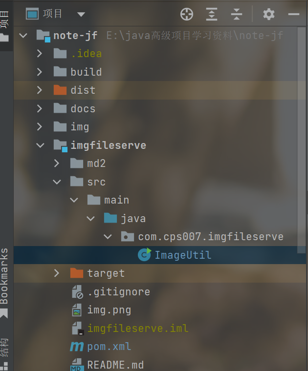
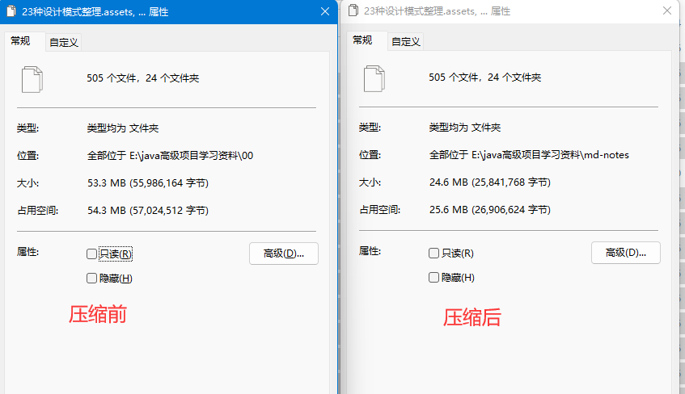

## 使用说明

1、从 [gitee](https://gitee.com/cps007/imgfileserve) 仓库下载到本地（与md文件的父级目录同级放置）



2、亦可随便放置本项目位置，但是需要在 `ImageUtil[PROJECT_PATH、MD_PATH]` 
这两个变量设置为自己的系统目录

例如：

```text
PROJECT_PATH = "E:\\java高级项目学习资料\\note-jf";
MD_PATH = "\\mddocs";
```

## 处理结果



```text
git init
git add -A
git commit -m "init commit"
git remote add origin https://gitee.com/cps007/imgfileserve.git
git push -u origin "master"
```
