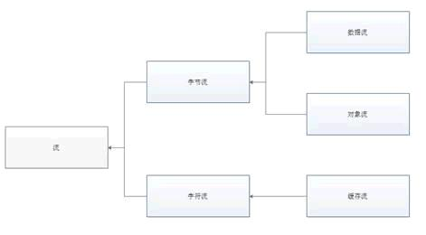
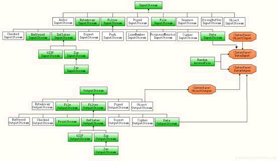
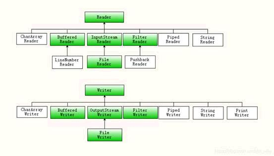
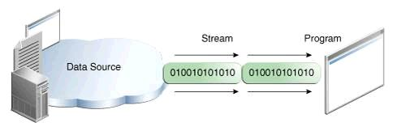
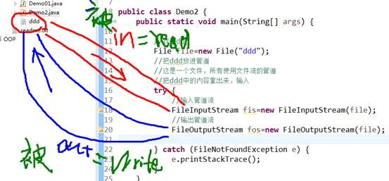
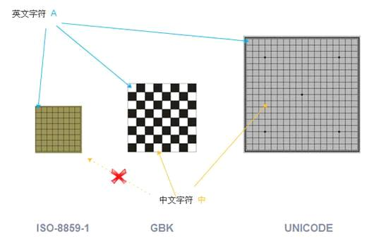
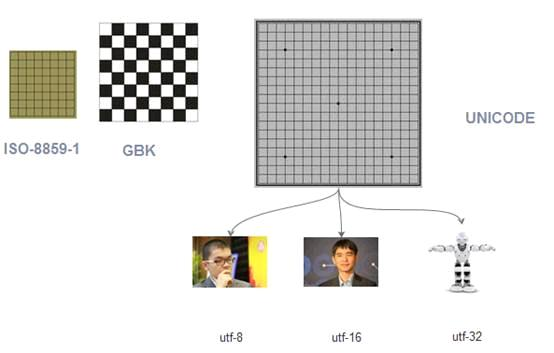

## 分类

1、字节类，

2、字符类

java输入/输出流体系中常用的流的分类表

|  分类   | 字节输入流                    | 字节输出流                     | 字符输入流               | 字符输出流               |
|:-----:|--------------------------|---------------------------|---------------------|---------------------|
| 抽象基类  | InputStream              | OutputStream              | Reader              | Writer              |
| 访问文件  | **FileInputStream**      | **FileOutputStream**      | **FileReader**      | **FileWriter**      |
| 访问数组  | **ByteArrayInputStream** | **ByteArrayOutputStream** | **CharArrayReader** | **CharArrayWriter** |
| 访问管道  | **PipedInputStream**     | **PipedOutputStream**     | **PipedReader**     | **PipedWriter**     |
| 访问字符串 |                          |                           | **StringReader**    | **StringWriter**    |
|  缓冲流  | BufferedInputStream      | BufferedOutputStream      | BufferedReader      | BufferedWriter      |
|  转换流  |                          |                           | InputStreamReader   | OutputStreamWriter  |
|  对象流  | ObjectInputStream        | ObjectOutputStream        |                     |                     |
| 抽象基类  | FilterInputStream        | FilterOutputStream        | FilterReader        | FilterWriter        |
|  打印流  |                          | PrintStream               |                     | PrintWriter         |
| 推回输入流 | PushbackInputStream      |                           | PushbackReader      |                     |
|  特殊流  | DataInputStream          | DataOutputStream          |                     |                     |

## 文件输入流

如下代码，就建立了一个文件输入流，这个流可以用来把数据从硬盘的文件，读取到JVM(内存)

 目前代码只是建立了流，还没有开始读取

 

## 文件输出流

参考文件输入流的建立，建立一个文件输出流

 

 

## 步骤 2 : 常见编码  

工作后经常接触的编码方式有如下几种：
 **ISO-8859-1 ASCII** 数字和西欧字母
 **GBK GB2312 BIG5** 中文
 **UNICODE** (统一码，万国码)

 其中
 ISO-8859-1 包含 ASCII
 GB2312 是简体中文，BIG5是繁体中文，GBK同时包含简体和繁体以及日文。
 UNICODE 包括了所有的文字，无论中文，英文，藏文，法文，世界所有的文字都包含其中

 