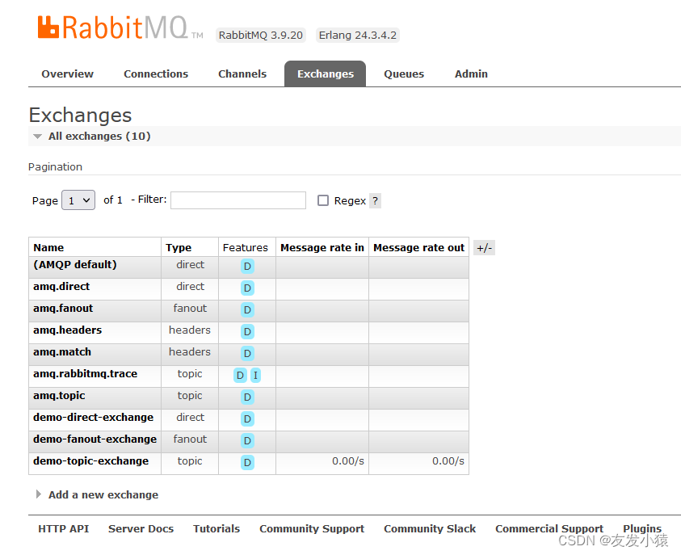
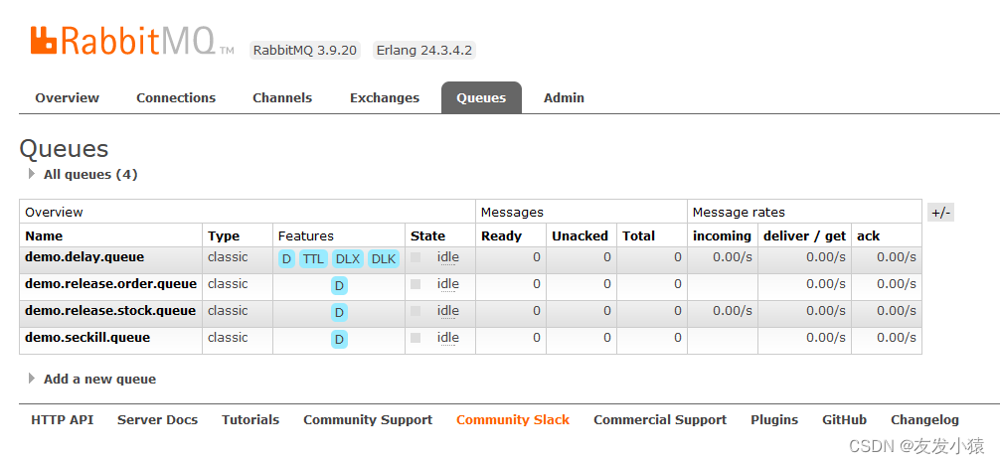
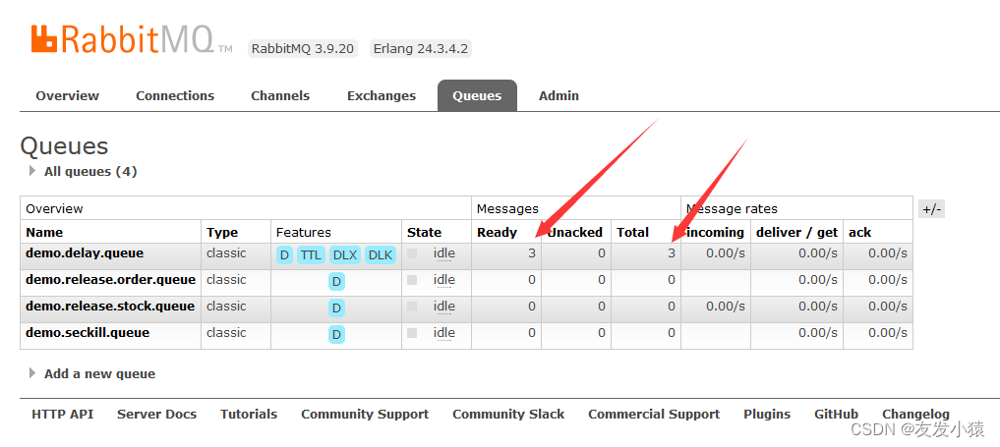
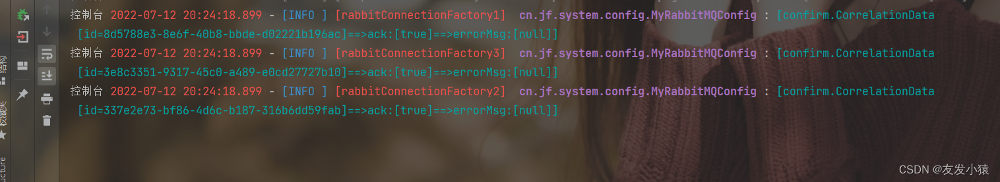
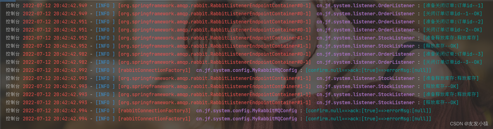
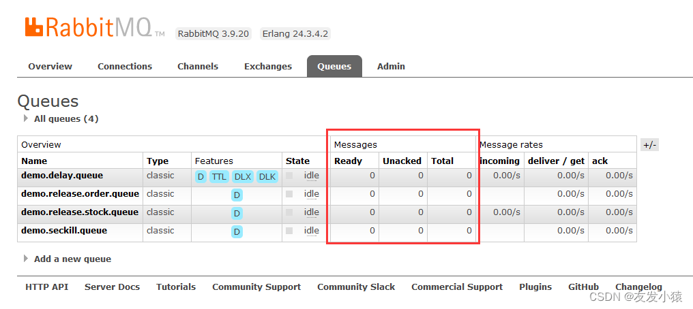

# RabbitMQ

https://www.rabbitmq.com/

## 1、简介、安装配置

### 1.2、概念

Publisher、message、虚拟机VHost、broker、Exchange、binding、Queue、Connection(长连接)、Consumer

### 1.3、docker 安装

https://www.rabbitmq.com/networking.html

### 1.4、运行机制

### 1.5、Exchange类型：点对点（direct、header）、订阅（fanout、topic）

目前用：direct、fanout、topid

#### direct 点对点，精准匹配（完全匹配、单播模式）

#### fanout 订阅：广播模式

#### topic 订阅：订阅模式

### 1.6、测试：创建交换机、队列、绑定 binding

#### 创建交换机

-----------

#### 创建队列

#### 绑定binding

### 1.7、实例

#### 创建 交换机：

exchange.direct、exchange.fanout、exchange.topic

#### 创建 消息队列：

队列: kong、kong.emps、kong.news、kong004.news

#### direct 绑定 binding

exchange.direct: -> kong、kong.emps、kong.news、kong004.news

##### 发消息

##### 读消息

-------

Ack Mode（确认模式：）: Nack message requeue true（Nack 消息重新排队，true查看后不会清除消息队列，false反之）Automatic ack（自动确认）、Reject requeue true|false（拒绝重新排队，true查看后不会清除消息队列，false反之）、

#### fanout 绑定 binding

exchange.fanout: -> kong、kong.emps、kong.news、kong004.news

##### 发消息

##### 读消息

查看初始化交换机

查看初始化队列

--------------

模拟创建订单：http://127.0.0.1:9210/jf-system-dev/mq/sendOrderMessage

查看订单消息投递到订单延迟队列情况

1分钟后，查看处理结果

