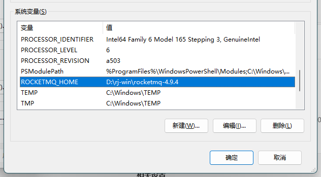
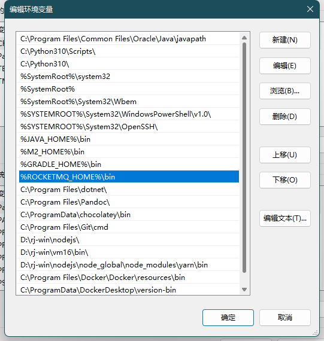
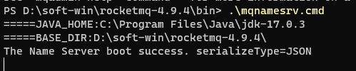
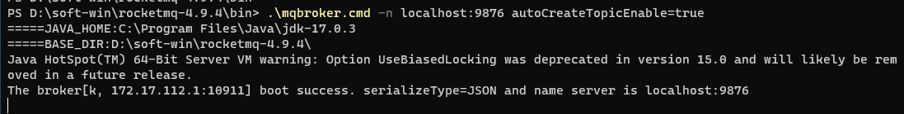
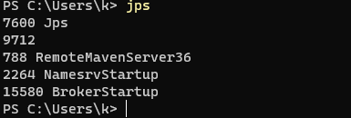

# RocketMQ

https://rocketmq.apache.org 

https://github.com/apache/rocketmq

https://github.com/apache/rocketmq/tree/master/docs/cn

https://gitee.com/MFork/rocketmq/tree/develop/docs/cn

## 1、概念

### 部署模式

| 部署模式                        | 定义                                                                                          | 优点                                                           | 缺点                                              | 其他                                                                                                                                  |
|-----------------------------|:--------------------------------------------------------------------------------------------|:-------------------------------------------------------------|:------------------------------------------------|:------------------------------------------------------------------------------------------------------------------------------------|
| 单 master 模式                 | 也就是只有一个 master 节点，称不上是集群，一旦这个 master 节点宕机，那么整个服务就不可用，适合个人学习使用。                              | -                                                            | -                                               | -                                                                                                                                   |
| 多 master 模式                 | 多个 master 节点组成集群，单个 master 节点宕机或者重启对应用没有影响。                                                 | 所有模式中性能最高                                                    | 单个 master 节点宕机期间，未被消费的消息在节点恢复之前不可用，消息的实时性就受到影响。 | 使用同步刷盘可以保证消息不丢失，同时 Topic 相对应的 queue 应该分布在集群中各个节点，而不是只在某各节点上，否则，该节点宕机会对订阅该 topic 的应用造成影响。                                            |
| 多 master 多 slave **异步**复制模式 | 在多 master 模式的基础上，每个 master 节点都有至少一个对应的 slave。master 节点可读可写，但是 slave 只能读不能写，类似于 mysql 的主备模式。 | 在 master 宕机时，消费者可以从 slave 读取消息，消息的实时性不会受影响，性能几乎和多 master 一样。 | 使用异步复制的同步方式有可能会有消息丢失的问题。                        | -                                                                                                                                   |
| 多 master 多 slave **同步**双写模式 | 同多 master 多 slave 异步复制模式类似，区别在于 master 和 slave 之间的数据同步方式。                                   | 同步双写的同步模式能保证数据不丢失。                                           | 发送单个消息 RT 会略长，性能相比异步复制低10%左右。                   | 刷盘策略：同步刷盘和异步刷盘（指的是节点自身数据是同步还是异步存储）  同步方式：同步双写和异步复制（指的一组 master 和 slave 之间数据的同步）  **注意**：要保证数据可靠，需采用同步刷盘和同步双写的方式，但性能会较其他方式低。 |

### 基本概念

RocketMQ主要由 Producer、Broker、Consumer 三部分组成，其中Producer 负责生产消息，Consumer  负责消费消息，Broker 负责存储消息。Broker 在实际部署过程中对应一台服务器，每个 Broker  可以存储多个Topic的消息，每个Topic的消息也可以分片存储于不同的 Broker。Message Queue  用于存储消息的物理地址，每个Topic中的消息地址存储于多个 Message Queue 中。ConsumerGroup 由多个Consumer 实例构成。

| 概念                       | 说明      | 其他                                                                                                                          |
|--------------------------|---------|-----------------------------------------------------------------------------------------------------------------------------|
| Producer                 | 消息生产者   | 负责生产消息，一般由业务系统负责生产消息。一个消息生产者会把业务应用系统里产生的消息发送到broker服务器。RocketMQ提供多种发送方式，同步发送、异步发送、顺序发送、单向发送。同步和异步方式均需要Broker返回确认信息，单向发送不需要。 |
| Producer Group           | 消息生产者分组 | -                                                                                                                           |
| Broker                   | 消息代理服务器 | 消息中转角色，负责存储消息、转发消息。代理服务器在RocketMQ系统中负责接收从生产者发送来的消息并存储、同时为消费者的拉取请求作准备。代理服务器也存储消息相关的元数据，包括消费者组、消费进度偏移和主题和队列消息等。               |
| Consumer                 | 消息消费者   | 负责消费消息，一般是后台系统负责异步消费。一个消息消费者会从Broker服务器拉取消息、并将其提供给应用程序。从用户应用的角度而言提供了两种消费形式：拉取式消费、推动式消费。                                     |
| Consumer Group           | 消费者分组   | -                                                                                                                           |
| Topic                    | 主题      | 表示一类消息的集合，每个主题包含若干条消息，每条消息只能属于一个主题，是RocketMQ进行消息订阅的基本单位。                                                                    |
| Message（Queue）           | 消息      | 消息系统所传输信息的物理载体，生产和消费数据的最小单位，每条消息必须属于一个主题。RocketMQ中每个消息拥有唯一的Message ID，且可以携带具有业务标识的Key。系统提供了通过Message ID和Key查询消息的功能。         |
| Tag                      | 标签      | 为消息设置的标志，用于同一主题下区分不同类型的消息。                                                                                                  |
| Name Server              | 名字服务    | 名称服务充当路由消息的提供者。生产者或消费者能够通过名字服务查找各主题相应的Broker IP列表。多个Namesrv实例组成集群，但相互独立，没有信息交换。                                             |
| Pull Consumer            | 拉取式消费   | Consumer消费的一种类型，应用通常主动调用Consumer的拉消息方法从Broker服务器拉消息、主动权由应用控制。一旦获取了批量消息，应用就会启动消费过程。                                          |
| Push Consumer            | 推动式消费   | Consumer消费的一种类型，该模式下Broker收到数据后会主动推送给消费端，该消费模式一般**实时性**较高。                                                                  |
| Clustering               | 集群消费    | 集群消费模式下,相同Consumer Group的每个Consumer实例平均分摊消息。                                                                                |
| Broadcasting             | 广播消费    | 广播消费模式下，相同Consumer Group的每个Consumer实例都接收全量的消息。                                                                              |
| Normal Ordered Message   | 普通顺序消息  | 普通顺序消费模式下，消费者通过同一个消息队列（ Topic 分区，称作 Message Queue） 收到的消息是有顺序的，不同消息队列收到的消息则可能是无顺序的。                                          |
| Strictly Ordered Message | 严格顺序消息  | 严格顺序消息模式下，消费者收到的所有消息均是有顺序的。                                                                                                 |

## 2、特性

### 配置环境变量

ROCKETMQ_HOME="D:\rocketmq"、NAMESRV_ADDR="localhost:9876"

